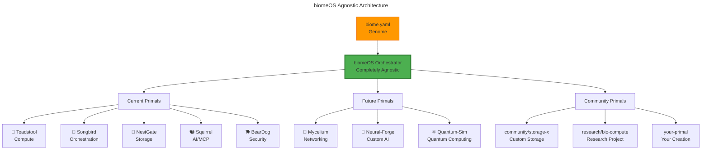

# biomeOS - Biological Operating System

**Completely Agnostic Distributed Computing Platform**

biomeOS is a biological metaphor operating system that orchestrates distributed computing environments through "Primals" - specialized subsystems that can be **any type**, from **any source**, created by **anyone**.

## 🧬 **Core Philosophy**

biomeOS is **completely agnostic** about what Primals exist. The system can orchestrate:

- **Current Primals**: Toadstool, Songbird, NestGate, Squirrel, BearDog
- **Future Primals**: Mycelium (networking), Neural-Forge (AI), Quantum-Sim (quantum computing)
- **Community Primals**: Third-party extensions, research projects, custom implementations
- **Any Primal**: Anything that implements the Primal trait

## 🌱 **Architecture**



## 📋 **biome.yaml - Universal Manifest**

The `biome.yaml` manifest can describe **any** ecosystem:

```yaml
metadata:
  name: "my-custom-biome"
  version: "1.0.0"

primals:
  # Current Primals
  compute:
    primal_type: "toadstool"
    version: ">=1.0.0"
    config:
      # Whatever toadstool needs
      
  # Future Primals (don't exist yet)
  networking:
    primal_type: "mycelium"
    version: ">=1.0.0"
    config:
      # Whatever mycelium will need
      
  # Community Primals
  custom_ai:
    primal_type: "community/neural-forge"
    version: "^1.2.0"
    config:
      # Whatever the community primal needs
      
  # Your Own Primal
  your_service:
    primal_type: "your-company/your-primal"
    version: ">=2.0.0"
    config:
      # Whatever your primal needs
```

## 🔧 **Creating Your Own Primal**

Anyone can create a Primal by implementing the `Primal` trait:

```rust
use biomeos_core::{Primal, PrimalFactory, Capability};

struct YourPrimal {
    id: PrimalId,
    // Your primal's data
}

#[async_trait]
impl Primal for YourPrimal {
    fn primal_type(&self) -> PrimalType {
        "your-company/your-primal".to_string()
    }
    
    fn capabilities(&self) -> Vec<Capability> {
        vec![
            Capability {
                name: "your.capability".to_string(),
                version: "1.0.0".to_string(),
                description: "Does something awesome".to_string(),
                parameters: HashMap::new(),
            }
        ]
    }
    
    async fn start(&mut self) -> BiomeResult<()> {
        // Start your service
        Ok(())
    }
    
    // Implement other required methods...
}

// Register your primal factory
struct YourPrimalFactory;

#[async_trait]
impl PrimalFactory for YourPrimalFactory {
    async fn create_primal(&self, config: PrimalConfig) -> BiomeResult<Box<dyn Primal>> {
        Ok(Box::new(YourPrimal::new(config)?))
    }
}
```

Then register it with biomeOS:

```rust
orchestrator.register_primal_factory(
    "your-company/your-primal".to_string(),
    Box::new(YourPrimalFactory),
).await;
```

## 🚀 **Getting Started**

### 1. Install biomeOS

```bash
cargo install biomeos
```

### 2. Create a biome.yaml

```bash
biomeos init my-biome
```

### 3. Deploy your biome

```bash
biomeos deploy biome.yaml
```

### 4. Monitor your ecosystem

```bash
biomeos status
```

## 📦 **Core Components**

### **biomeos-core**
- Universal Primal trait and types
- Capability system
- Resource management
- Health monitoring

### **biomeos-manifest**
- Agnostic biome.yaml parsing
- Validation and schema checking
- Primal discovery and resolution

### **biomeos-orchestrator**
- Universal Primal orchestration
- Lifecycle management
- Service discovery integration
- Networking and monitoring

### **biomeos-api**
- REST API for biome management
- WebSocket real-time updates
- GraphQL introspection

## 🌍 **Ecosystem Integration**

biomeOS integrates with the broader ecosystem:

- **Kubernetes**: Deploy biomes as custom resources
- **Docker**: Package Primals as containers
- **WASM**: Run Primals in WebAssembly sandboxes
- **Service Mesh**: Integrate with Istio, Linkerd, etc.
- **Monitoring**: Prometheus, Grafana, Jaeger integration
- **CI/CD**: GitHub Actions, GitLab CI, etc.

## 🔐 **Security Model**

- **Zero Trust**: Every Primal must authenticate
- **Capability-Based**: Primals can only access declared capabilities
- **Sandboxing**: Primals run in isolated environments
- **Encryption**: All inter-Primal communication encrypted
- **Audit Trail**: Complete activity logging

## 📊 **Monitoring & Observability**

- **Real-time Metrics**: Resource usage, performance, health
- **Distributed Tracing**: Track requests across Primals
- **Log Aggregation**: Centralized logging from all Primals
- **Alerting**: Smart alerts based on biome health
- **Dashboards**: Beautiful web-based monitoring

## 🤝 **Community**

- **Discord**: [Join our Discord](https://discord.gg/biomeos)
- **GitHub**: [Contribute code](https://github.com/biomeos/biomeos)
- **Forums**: [Discuss ideas](https://forum.biomeos.org)
- **Marketplace**: [Find Primals](https://marketplace.biomeos.org)

## 📝 **License**

MIT OR Apache-2.0

## 🙏 **Acknowledgments**

Built on the shoulders of giants:
- The Rust ecosystem
- Tokio async runtime
- Serde serialization
- The broader distributed systems community

---

**biomeOS**: Where distributed systems grow like living organisms 🌱 