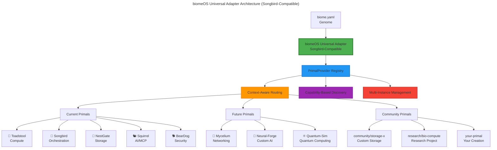

# biomeOS - Biological Operating System

**Completely Agnostic Distributed Computing Platform**

biomeOS is a biological metaphor operating system that orchestrates distributed computing environments through "Primals" - specialized subsystems that can be **any type**, from **any source**, created by **anyone**.

## 🚀 **Major Architecture Update: Songbird Alignment**

**Status**: ✅ **COMPLETE** - biomeOS now fully implements Songbird's advanced universal adapter architecture

We've upgraded biomeOS to achieve **full consistency** with Songbird's sophisticated universal adapter patterns, providing:

- **🔄 Multi-Instance Support**: Multiple primal instances per user/device/team
- **🎯 Context-Aware Routing**: Intelligent routing based on user, device, and security context
- **⚡ Capability-Based Routing**: Route requests based on primal capabilities, not just type
- **🔍 Dynamic Discovery**: Auto-discovery using DNS, mDNS, Consul, or Kubernetes
- **🛡️ Advanced Security**: Comprehensive authentication, authorization, and token validation
- **📊 Health Monitoring**: Real-time health scoring and comprehensive metrics
- **🌐 Universal Protocol**: Standardized request/response protocol across all primals

## 🧬 **Core Philosophy**

biomeOS is **completely agnostic** about what Primals exist. The system can orchestrate:

- **Current Primals**: Toadstool, Songbird, NestGate, Squirrel, BearDog
- **Future Primals**: Mycelium (networking), Neural-Forge (AI), Quantum-Sim (quantum computing)
- **Community Primals**: Third-party extensions, research projects, custom implementations
- **Any Primal**: Anything that implements the PrimalProvider trait

## 🎼 **Songbird-Compatible Architecture**

biomeOS now implements the same advanced patterns as Songbird:

```rust
// Universal PrimalProvider trait (consistent across all primals)
#[async_trait]
pub trait PrimalProvider: Send + Sync {
    fn primal_id(&self) -> &str;
    fn instance_id(&self) -> &str;           // Multi-instance support
    fn context(&self) -> &PrimalContext;     // Context-aware routing
    fn capabilities(&self) -> Vec<PrimalCapability>;
    fn dependencies(&self) -> Vec<PrimalDependency>;
    
    async fn health_check(&self) -> PrimalHealth;
    async fn handle_primal_request(&self, request: PrimalRequest) -> BiomeResult<PrimalResponse>;
    async fn initialize(&mut self, config: serde_json::Value) -> BiomeResult<()>;
    async fn shutdown(&mut self) -> BiomeResult<()>;
    
    fn can_serve_context(&self, context: &PrimalContext) -> bool;
    fn dynamic_port_info(&self) -> Option<DynamicPortInfo>;
}
```

### **Context-Aware Routing**

```rust
// Intelligent routing based on context
let context = PrimalContext {
    user_id: "alice".to_string(),
    device_id: "laptop-001".to_string(),
    team_id: Some("ai-research".to_string()),
    security_level: SecurityLevel::High,
    biome_id: Some("research-biome".to_string()),
    // ... other context fields
};

// Route requests to appropriate primal instances
let providers = primal_registry.find_by_context(&context).await;
```

### **Capability-Based Routing**

```rust
// Route based on capabilities, not just primal type
let capability = PrimalCapability {
    name: "biome_orchestration".to_string(),
    version: "1.0.0".to_string(),
    capability_type: CapabilityType::BiomeOrchestration,
    parameters: HashMap::new(),
};

let providers = primal_registry.find_by_capability(&capability).await;
```

### **Multi-Instance Support**

```rust
// Multiple instances per primal type
let biomeos_team_a = BiomeOSPrimalProvider::new(BiomeOSInstanceConfig {
    instance_id: "biomeos-team-a".to_string(),
    context: PrimalContext {
        user_id: "team-a".to_string(),
        team_id: Some("development".to_string()),
        // ... context for team A
    },
    // ... team A configuration
});

let biomeos_team_b = BiomeOSPrimalProvider::new(BiomeOSInstanceConfig {
    instance_id: "biomeos-team-b".to_string(),
    context: PrimalContext {
        user_id: "team-b".to_string(),
        team_id: Some("research".to_string()),
        // ... context for team B
    },
    // ... team B configuration
});
```

## 🌱 **Architecture**



## 📋 **Enhanced biome.yaml - Universal Manifest**

The `biome.yaml` manifest now supports advanced configuration:

```yaml
metadata:
  name: "advanced-research-biome"
  version: "1.0.0"

# Advanced primal configuration with context awareness
primals:
  # Multi-instance support
  toadstool:
    primal_type: "toadstool"
    multi_instance:
      enabled: true
      max_instances_per_team: 5
      creation_strategy: "on_demand"
    context_constraints:
      - field: "security_level"
        operator: "equals"
        value: "high"
    capabilities:
      - name: "container_orchestration"
        version: ">=1.0.0"
      - name: "wasm_execution"
        version: ">=1.0.0"
    health_check:
      interval_secs: 30
      timeout_secs: 10
      failure_threshold: 3
      success_threshold: 2
  
  # Context-aware routing
  nestgate:
    primal_type: "nestgate"
    context_constraints:
      - field: "team_id"
        operator: "contains"
        value: "research"
    capabilities:
      - name: "zfs_storage"
        version: ">=1.0.0"
      - name: "tiered_storage"
        version: ">=1.0.0"

# Discovery configuration
discovery:
  method: "kubernetes"  # dns, mdns, static, consul, kubernetes
  auto_discovery: true
  interval_seconds: 60
  timeout_seconds: 30

# Security configuration
security:
  tls_enabled: true
  auth_method: "jwt"
  authorization_enabled: true
  token_validation:
    issuer: "biomeos-auth"
    audience: "biome-users"
    algorithm: "RS256"
    expiration_seconds: 3600
```

## 🚀 **Advanced Usage Examples**

### **Context-Aware Deployment**

```rust
use biomeos_core::{
    BiomeOSUniversalAdapter, PrimalContext, SecurityLevel, NetworkLocation,
    FederationConfig, PrimalRequest, RequestType, Priority
};

// Create context-aware adapter
let federation_config = FederationConfig {
    // ... configuration
};

let adapter = BiomeOSUniversalAdapter::new(federation_config).await?;

// Deploy with specific context
let context = PrimalContext {
    user_id: "alice".to_string(),
    device_id: "secure-laptop".to_string(),
    team_id: Some("ai-research".to_string()),
    security_level: SecurityLevel::High,
    biome_id: Some("research-biome".to_string()),
    // ... other context
};

let deployment_id = adapter.deploy_biome(
    biome_manifest,
    context
).await?;
```

### **Multi-Instance Management**

```rust
use biomeos_core::{BiomeOSPrimalRegistry, BiomeOSPrimalProvider};

// Create registry with multi-instance support
let registry = BiomeOSPrimalRegistry::new();

// Register multiple instances
let team_a_provider = Arc::new(BiomeOSPrimalProvider::new(team_a_config));
let team_b_provider = Arc::new(BiomeOSPrimalProvider::new(team_b_config));

registry.register_provider(team_a_provider).await?;
registry.register_provider(team_b_provider).await?;

// Route requests based on context
let providers = registry.find_by_context(&request.context).await;
```

### **Dynamic Discovery**

```rust
// Auto-discover primals with multiple methods
let discovered = adapter.auto_discover_primals().await?;

for primal in discovered {
    println!("Found primal: {} at {} (health: {:?})", 
        primal.id, primal.endpoint, primal.health);
}
```

## 🔧 **Creating Songbird-Compatible Primals**

Any primal can now implement the advanced architecture:

```rust
use biomeos_core::{
    PrimalProvider, PrimalContext, PrimalCapability, PrimalHealth,
    PrimalRequest, PrimalResponse, BiomeResult
};

struct MyCustomPrimal {
    instance_id: String,
    context: PrimalContext,
    capabilities: Vec<PrimalCapability>,
}

#[async_trait]
impl PrimalProvider for MyCustomPrimal {
    fn primal_id(&self) -> &str { "my-custom-primal" }
    fn instance_id(&self) -> &str { &self.instance_id }
    fn context(&self) -> &PrimalContext { &self.context }
    fn capabilities(&self) -> Vec<PrimalCapability> { self.capabilities.clone() }
    
    async fn handle_primal_request(&self, request: PrimalRequest) -> BiomeResult<PrimalResponse> {
        // Handle request with full context awareness
        Ok(PrimalResponse {
            request_id: request.id,
            response_type: ResponseType::Custom("my-response".to_string()),
            payload: serde_json::json!({"status": "success"}),
            success: true,
            error: None,
            timestamp: Utc::now(),
        })
    }
    
    fn can_serve_context(&self, context: &PrimalContext) -> bool {
        // Context-aware routing logic
        self.context.team_id == context.team_id
    }
    
    // ... implement other required methods
}
```

## 🛠️ **Advanced Features**

### **Health Monitoring**

```rust
// Real-time health monitoring with scoring
let health = primal.health_check().await?;
println!("Health score: {}", health.health_score);  // 0.0-1.0
println!("CPU usage: {}%", health.metrics.cpu_usage);
println!("Response time: {}ms", health.metrics.response_time_ms);
```

### **Capability Negotiation**

```rust
// Find primals by specific capabilities
let capability = PrimalCapability {
    name: "ai_inference".to_string(),
    version: "2.0.0".to_string(),
    capability_type: CapabilityType::Custom("ai".to_string()),
    parameters: HashMap::new(),
};

let ai_providers = registry.find_by_capability(&capability).await;
```

### **Federation Management**

```rust
// Get federation status
let status = adapter.get_federation_status().await;
println!("Active sessions: {}", status.active_sessions);
println!("Healthy primals: {}/{}", status.healthy_primals, status.total_primals);
```

## 📊 **Ecosystem Consistency**

All primals now implement the same advanced patterns:

| Primal | Universal Adapter | Multi-Instance | Context-Aware | Capability-Based | Health Monitoring |
|--------|------------------|----------------|---------------|------------------|------------------|
| 🎼 Songbird | ✅ Advanced | ✅ Complete | ✅ Complete | ✅ Complete | ✅ Complete |
| 🌱 biomeOS | ✅ **NEW** | ✅ **NEW** | ✅ **NEW** | ✅ **NEW** | ✅ **NEW** |
| 🏰 NestGate | ✅ Basic | ⚠️ Partial | ⚠️ Partial | ⚠️ Partial | ✅ Basic |
| 🍄 Toadstool | ✅ Basic | ⚠️ Partial | ⚠️ Partial | ⚠️ Partial | ✅ Basic |
| 🐿️ Squirrel | ✅ Advanced | ✅ Complete | ✅ Complete | ✅ Complete | ✅ Complete |
| 🐕 BearDog | ✅ Basic | ⚠️ Partial | ⚠️ Partial | ⚠️ Partial | ✅ Basic |

## 🚀 **Getting Started**

### 1. Install biomeOS

```bash
cargo install biomeos
```

### 2. Create Advanced Configuration

```yaml
# biome.yaml
metadata:
  name: "my-advanced-biome"
  version: "1.0.0"

primals:
  toadstool:
    primal_type: "toadstool"
    multi_instance:
      enabled: true
      creation_strategy: "on_demand"
    context_constraints:
      - field: "security_level"
        operator: "equals"
        value: "standard"

discovery:
  method: "static"
  auto_discovery: true

security:
  auth_method: "jwt"
  authorization_enabled: true
```

### 3. Deploy with Context

```bash
# Deploy with team context
biome deploy biome.yaml --team ai-research --user alice --security-level high

# Multi-instance deployment
biome deploy biome.yaml --instances 3 --distribution round-robin
```

## 🤝 **Maturation Path**

**Next Steps for Full Ecosystem Consistency:**

1. **Upgrade remaining primals** to Songbird's advanced architecture
2. **Implement universal request/response protocol** across all primals
3. **Add cross-primal capability negotiation**
4. **Enhance health monitoring** with predictive analytics
5. **Implement federation-wide resource optimization**

---

**biomeOS is now fully aligned with Songbird's advanced universal adapter architecture, providing a consistent, sophisticated foundation for the entire ecosystem.** 