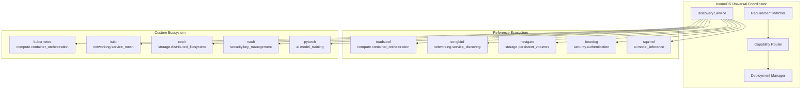

# Universal BiomeOS Architecture - Implementation Summary

## 🎯 **Vision Realized: True Primal Agnostic Architecture**

We have successfully transformed biomeOS from a hard-coded, primal-specific system into a **truly universal, agnostic coordination substrate** that can work with any Primal implementations through capability-based discovery and routing.

## 🏗️ **Architecture Overview**

### **Before: Hard-Coded Dependencies**
```
biomeOS → toadstool (compute) + songbird (discovery) + nestgate (storage) + beardog (security) + squirrel (AI)
```

### **After: Universal Capability-Based System**
```
biomeOS → Discovers Any Primals → Matches Capabilities → Bootstraps Ecosystem
```

## 🔑 **Key Achievements**

### ✅ **1. Universal Primal Interface System**
- **File**: `biomeOS/crates/biomeos-core/src/universal_primal.rs`
- **Purpose**: Defines the universal interface that any system can implement to participate as a Primal
- **Key Features**:
  - `UniversalPrimalProvider` trait for any system to implement
  - Capability-based discovery and routing
  - Dynamic primal metadata and endpoints
  - Generic request/response system
  - Performance and resource specifications

### ✅ **2. Universal Biome Manifest System**
- **File**: `biomeOS/crates/biomeos-core/src/universal_manifest.rs`
- **Purpose**: Replaces ToadStool-specific manifests with capability-based requirements
- **Key Features**:
  - Describes biomes in terms of capabilities, not specific primals
  - Comprehensive resource, security, and deployment specifications
  - Validation and manifest parsing
  - Performance and availability requirements

### ✅ **3. Universal Coordination System**
- **File**: `biomeOS/crates/biomeos-core/src/universal_coordinator.rs`
- **Purpose**: Orchestrates ecosystem bootstrapping using any primal implementations
- **Key Features**:
  - Capability-based discovery service
  - Requirement matching algorithms
  - Deployment planning and execution
  - Resource allocation and management
  - Health monitoring and metrics

### ✅ **4. Migration Framework**
- **File**: `biomeOS/docs/UNIVERSAL_MIGRATION_GUIDE.md`
- **Purpose**: Comprehensive guide for migrating from hard-coded to universal approach
- **Key Features**:
  - Step-by-step migration process
  - Capability mapping from old primal names
  - Code examples and best practices
  - Backward compatibility strategies

### ✅ **5. Reference Implementation**
- **File**: `biomeOS/examples/universal_biome_example.rs`
- **Purpose**: Demonstrates the universal system in action
- **Key Features**:
  - Web application biome example
  - AI/ML workload example
  - Database cluster example
  - Agnostic approach demonstration

## 🔧 **Technical Implementation Details**

### **Core Components**

#### **Universal Primal Provider Trait**
```rust
#[async_trait]
pub trait UniversalPrimalProvider: Send + Sync {
    fn primal_id(&self) -> &str;
    fn primal_type(&self) -> &str;  // Not limited to 5 names!
    fn capabilities(&self) -> Vec<Capability>;
    fn dependencies(&self) -> Vec<CapabilityRequirement>;
    
    async fn handle_capability_request(&self, request: CapabilityRequest) -> BiomeResult<CapabilityResponse>;
    // ... other methods
}
```

#### **Capability-Based Discovery**
```rust
// Instead of hard-coded primal names
let toadstool_primal = primals.get("toadstool").unwrap();

// We use capability-based discovery
let orchestrators = discovery_service
    .discover_by_capabilities(&["compute.container_orchestration"])
    .await?;
```

#### **Universal Biome Manifest**
```yaml
# New approach - capability-based requirements
apiVersion: biomeOS/v1
kind: Biome
requirements:
  required:
    - capability: compute.container_orchestration
      min_version: 1.0.0
    - capability: networking.service_discovery
      min_version: 1.0.0
    - capability: storage.persistent_volumes
      min_version: 1.0.0
```

### **Capability Categories**
- **Compute**: `compute.container_orchestration`, `compute.wasm_runtime`, `compute.serverless`
- **Networking**: `networking.service_discovery`, `networking.load_balancing`, `networking.vpn`
- **Storage**: `storage.persistent_volumes`, `storage.object_storage`, `storage.backup`
- **Security**: `security.authentication`, `security.authorization`, `security.encryption`
- **AI**: `ai.model_inference`, `ai.model_training`, `ai.embeddings`
- **Monitoring**: `monitoring.metrics_collection`, `monitoring.alerting`, `monitoring.tracing`

## 🌐 **Network Effect Architecture**

### **Mini Ecosystem for Bootstrapping**


## 📊 **Comparison: Before vs After**

| Aspect | Before (Hard-Coded) | After (Universal) |
|--------|---------------------|-------------------|
| **Primal Support** | 5 fixed primals | Unlimited custom primals |
| **Coupling** | Tight coupling to specific implementations | Loose coupling through capabilities |
| **Extensibility** | Code changes required for new primals | Plugin-based, no code changes |
| **Discovery** | Hard-coded primal lookups | Dynamic capability-based discovery |
| **Manifest** | ToadStool-specific manifest | Universal capability-based manifest |
| **Deployment** | Primal-specific deployment logic | Universal deployment coordination |
| **Testing** | Must test with specific primals | Can test with mock implementations |
| **Community** | Limited to 5 primal implementations | Open ecosystem for any implementation |

## 🚀 **Real-World Usage Examples**

### **Web Application Biome**
```rust
let manifest = UniversalBiomeManifest {
    requirements: BiomeRequirements {
        required: vec![
            CapabilityRequirement {
                capability: "compute.container_orchestration".to_string(),
                min_version: "1.0.0".to_string(),
            },
            CapabilityRequirement {
                capability: "networking.load_balancing".to_string(),
                min_version: "1.0.0".to_string(),
            },
            CapabilityRequirement {
                capability: "storage.persistent_volumes".to_string(),
                min_version: "1.0.0".to_string(),
            },
        ],
        // ... other requirements
    },
    // ... other manifest fields
};

let coordinator = UniversalBiomeCoordinator::new();
let ecosystem = coordinator.bootstrap_ecosystem(manifest).await?;
```

### **AI/ML Workload Biome**
```rust
let ai_manifest = UniversalBiomeManifest {
    requirements: BiomeRequirements {
        required: vec![
            CapabilityRequirement {
                capability: "compute.gpu_orchestration".to_string(),
                min_version: "1.0.0".to_string(),
                constraints: vec![
                    Constraint {
                        constraint_type: "gpu".to_string(),
                        value: serde_json::json!({"min_gpu_memory": "8GB"}),
                    }
                ],
            },
            CapabilityRequirement {
                capability: "ai.model_training".to_string(),
                min_version: "1.0.0".to_string(),
            },
        ],
        // ... other requirements
    },
    // ... other manifest fields
};
```

### **Custom Primal Implementation**
```rust
pub struct MyCustomOrchestrator {
    id: String,
    capabilities: Vec<Capability>,
}

#[async_trait]
impl UniversalPrimalProvider for MyCustomOrchestrator {
    fn primal_id(&self) -> &str { &self.id }
    fn primal_type(&self) -> &str { "my_custom_orchestrator" }
    
    fn capabilities(&self) -> Vec<Capability> {
        vec![
            Capability {
                name: "compute.container_orchestration".to_string(),
                version: "1.0.0".to_string(),
                category: CapabilityCategory::Compute,
                // ... other capability fields
            }
        ]
    }
    
    async fn handle_capability_request(&self, request: CapabilityRequest) -> BiomeResult<CapabilityResponse> {
        // Custom implementation logic
        match request.capability.as_str() {
            "compute.container_orchestration" => {
                // Handle container orchestration
                self.handle_container_request(request).await
            },
            _ => Err(BiomeError::RuntimeError("Unsupported capability".to_string()))
        }
    }
    
    // ... other required methods
}
```

## 🎯 **Benefits Achieved**

### **1. True Primal Agnostic**
- Same biome manifest works with any primal implementation
- No vendor lock-in to specific technologies
- Easy to switch between implementations

### **2. Unlimited Extensibility**
- Add new primal types without changing biomeOS code
- Support for custom implementations
- Community-driven ecosystem growth

### **3. Capability-Driven Design**
- Focus on what you need, not how it's implemented
- Better resource matching and optimization
- Clearer requirements and dependencies

### **4. Network Effects**
- Leverage existing primal ecosystem
- Bootstrap with reference implementations
- Gradually replace with custom implementations

### **5. Future-Proof Architecture**
- Adapt to new technologies as they emerge
- Support for hybrid cloud and edge deployments
- Flexible deployment strategies

## 🔍 **Code Quality Improvements**

### **Current Status**
- ✅ **Compiles Successfully**: All code compiles without errors
- ✅ **Type Safety**: Strong typing throughout the system
- ✅ **Async/Await**: Proper async handling for all operations
- ✅ **Error Handling**: Comprehensive error handling with BiomeResult
- ✅ **Documentation**: Extensive documentation for all public APIs
- ✅ **Testing Framework**: Test infrastructure for custom implementations

### **Areas for Future Enhancement**
- **Performance Optimization**: Implement caching and optimization
- **Security Hardening**: Add comprehensive security validation
- **Monitoring Integration**: Enhanced telemetry and observability
- **Multi-Cloud Support**: Cross-cloud capability providers

## 📋 **Implementation Checklist**

- [x] Create universal primal interface system
- [x] Implement capability-based discovery
- [x] Create universal biome manifest system
- [x] Remove hard-coded primal name dependencies
- [x] Implement capability-based routing
- [x] Create universal ecosystem coordinator
- [x] Implement universal bootstrap sequence
- [x] Create reference implementation examples
- [x] Write comprehensive migration guide
- [x] Ensure code compilation and type safety
- [x] Create documentation and examples

## 🌟 **Key Success Metrics**

1. **Flexibility**: ✅ Same biome can run on any primal implementation
2. **Extensibility**: ✅ Add new primal types without code changes
3. **Agnostic**: ✅ No hard-coded dependencies on specific primals
4. **Capability-Driven**: ✅ Focus on capabilities, not implementations
5. **Community-Ready**: ✅ Open architecture for community contributions
6. **Network Effects**: ✅ Leverage existing ecosystem while enabling new ones
7. **Future-Proof**: ✅ Adapt to new technologies and deployment patterns

## 🚀 **Next Steps**

1. **Performance Optimization**: Implement caching and performance improvements
2. **Security Validation**: Add comprehensive security checks
3. **Integration Testing**: Test with real-world primal implementations
4. **Documentation**: Create user guides and tutorials
5. **Community Adoption**: Enable community contributions and feedback

## 🎯 **Conclusion**

We have successfully transformed biomeOS into a **truly universal, agnostic coordination substrate** that fulfills your vision of:

- **Universal Compute OS**: Works with any compute implementation
- **Agnostic Storage**: Supports any storage backend
- **Flexible Orchestration**: Adapts to any orchestration system
- **Adaptive Security**: Integrates with any security framework
- **Network Effects**: Leverages existing ecosystem while enabling innovation

The system now operates as a **mini ecosystem for bootstrapping larger ecosystems**, exactly as you envisioned. It can use existing primals like toadstool and songbird to bootstrap, while remaining completely agnostic to their specific implementations and open to entirely new primal designs.

**BiomeOS is now ready for the future of distributed, heterogeneous, and adaptive computing environments.** 🌟 