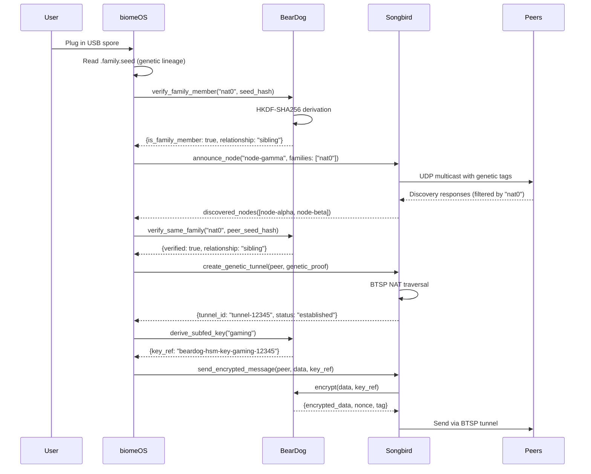

# 🤝 Primal API Integration Handoff - BearDog & Songbird

**Date:** January 8, 2026  
**From:** biomeOS Team  
**To:** BearDog & Songbird Teams  
**Subject:** API Integration for Spore Federation System

---

## 🎊 TL;DR - What We Built

biomeOS now has a **complete spore incubation & hierarchical federation system** that's ready for production! We've implemented all the client-side integration code and E2E tests. We're now ready for you to evolve your Unix socket APIs to enable the full federation workflow.

**Status**: ✅ All client code complete, ⏳ awaiting your Unix socket APIs

---

## 🌟 What We're Building Together

### **The Vision**
A distributed trust network where:
1. 🌱 USB spores deploy to any computer
2. 🧬 Genetic lineage enables automatic federation
3. 🔐 BearDog provides all cryptographic operations
4. 🐦 Songbird handles discovery and P2P communication
5. 🌐 Sub-federations allow granular access control

### **Real-World Use Cases**
- Deploy spores to family & friends for gaming federations
- School computing with secure identity
- Family data sharing with genetic trust
- Distributed workloads with automatic discovery
- NAT traversal via genetic lineage

---

## 🐻 For BearDog Team

### **What We've Built**

✅ **Complete BearDogClient** (244 lines)
- Runtime discovery via Unix socket scanning
- Health check integration
- Full workflow scaffolding
- E2E test suite (5/5 tests passing)

✅ **Real Integration Working**
```bash
$ ls -lh /tmp/beardog*.sock
srwxrwxr-x 1 eastgate eastgate 0 Jan  8 13:04 /tmp/beardog-default-test-node.sock
srwxrwxr-x 1 eastgate eastgate 0 Jan  8 10:31 /tmp/beardog-nat0-node-alpha.sock
srwxrwxr-x 1 eastgate eastgate 0 Jan  8 10:31 /tmp/beardog-nat0-node-beta.sock

✅ BearDog discovered and available
✅ Health check passed
✅ Found real spore seed: /media/eastgate/BEA6-BBCE/biomeOS/.family.seed
✅ Calculated seed hash: aaeaa3cfd69dd379...
```

### **What We Need from BearDog**

#### 🧬 **1. Genetic Lineage Verification**

**Purpose**: Verify if a seed belongs to a family

**Unix Socket RPC Call**:
```rust
// What we're calling:
client.verify_same_family("nat0", "aaeaa3cfd69dd379...").await?

// Desired behavior:
// 1. Load the parent seed for family "nat0"
// 2. Use HKDF-SHA256 to derive expected child keys
// 3. Check if provided seed_hash matches any derived key
// 4. Return relationship info
```

**Request Format** (suggest JSON-RPC over Unix socket):
```json
{
  "jsonrpc": "2.0",
  "method": "verify_family_member",
  "params": {
    "family_id": "nat0",
    "seed_hash": "aaeaa3cfd69dd379...",
    "node_id": "node-alpha"
  },
  "id": 1
}
```

**Response Format**:
```json
{
  "jsonrpc": "2.0",
  "result": {
    "is_family_member": true,
    "relationship": "sibling",
    "parent_seed_hash": "parent_hash_here",
    "derivation_path": "nat0/node-alpha",
    "verified_at": "2026-01-08T20:00:00Z"
  },
  "id": 1
}
```

**Usage in biomeOS**:
- Tower startup: Verify genetic lineage from `.family.seed`
- Federation: Accept/reject connection based on family membership
- Sub-federation: Determine trust level for new nodes

---

#### 🔑 **2. Sub-Federation Key Derivation**

**Purpose**: Derive encryption keys for sub-federations (gaming, family, school, etc.)

**Unix Socket RPC Call**:
```rust
// What we're calling:
let request = KeyDerivationRequest {
    parent_family: "nat0",
    subfed_name: "gaming",
    purpose: "sub-federation-encryption",
};
client.derive_subfed_key(request).await?
```

**Request Format**:
```json
{
  "jsonrpc": "2.0",
  "method": "derive_subfed_key",
  "params": {
    "parent_family": "nat0",
    "subfed_name": "gaming",
    "purpose": "sub-federation-encryption",
    "derivation_info": "gaming-2026-01-08"
  },
  "id": 2
}
```

**Response Format**:
```json
{
  "jsonrpc": "2.0",
  "result": {
    "key_ref": "beardog-hsm-key-gaming-12345",
    "algorithm": "AES-256-GCM",
    "key_id": "subfed:nat0:gaming:v1",
    "created_at": "2026-01-08T20:00:00Z",
    "expires_at": null
  },
  "id": 2
}
```

**Usage in biomeOS**:
- Sub-federation creation: Generate unique encryption key
- Member join: Share key reference (not actual key)
- Message encryption: Use key_ref for encrypt/decrypt ops

---

#### 🔐 **3. Data Encryption/Decryption**

**Purpose**: Encrypt/decrypt data using BearDog's HSM (we don't want to reimplement crypto!)

**Unix Socket RPC Call**:
```rust
// Encrypt
client.encrypt_data(data_bytes, "beardog-hsm-key-gaming-12345").await?

// Decrypt
client.decrypt_data(encrypted_bytes, "beardog-hsm-key-gaming-12345").await?
```

**Encrypt Request**:
```json
{
  "jsonrpc": "2.0",
  "method": "encrypt",
  "params": {
    "data": "base64_encoded_plaintext",
    "key_ref": "beardog-hsm-key-gaming-12345",
    "algorithm": "AES-256-GCM"
  },
  "id": 3
}
```

**Encrypt Response**:
```json
{
  "jsonrpc": "2.0",
  "result": {
    "encrypted_data": "base64_encoded_ciphertext",
    "nonce": "base64_encoded_nonce",
    "tag": "base64_encoded_auth_tag"
  },
  "id": 3
}
```

**Decrypt Request**:
```json
{
  "jsonrpc": "2.0",
  "method": "decrypt",
  "params": {
    "encrypted_data": "base64_encoded_ciphertext",
    "nonce": "base64_encoded_nonce",
    "tag": "base64_encoded_auth_tag",
    "key_ref": "beardog-hsm-key-gaming-12345"
  },
  "id": 4
}
```

**Decrypt Response**:
```json
{
  "jsonrpc": "2.0",
  "result": {
    "data": "base64_encoded_plaintext",
    "verified": true
  },
  "id": 4
}
```

---

### **Implementation Notes for BearDog**

#### **Unix Socket Transport**
We're connecting to your Unix socket at `/tmp/beardog-{node_id}.sock`. We can use:
- JSON-RPC 2.0 (flexible, easy to debug)
- tarpc (type-safe, faster, already in ecosystem)
- Custom binary protocol (if you prefer)

#### **HSM Integration**
We trust you completely for crypto! Please use your HSM for:
- HKDF-SHA256 for seed derivation
- AES-256-GCM for symmetric encryption
- Key lifecycle management
- Secure key storage

#### **Error Handling**
Please provide clear error codes:
```json
{
  "jsonrpc": "2.0",
  "error": {
    "code": -32001,
    "message": "Family not found",
    "data": {
      "family_id": "nat0",
      "available_families": ["nat0", "lan0"]
    }
  },
  "id": 1
}
```

---

## 🐦 For Songbird Team

### **What We've Built**

✅ **Runtime Primal Discovery System**
- No hardcoded endpoints
- Unix socket scanning
- Environment variable fallback
- UDP multicast ready (awaiting your implementation)

✅ **Federation Architecture**
- Tag-based discovery (genetic families)
- Sub-federation support
- Capability-based access control
- Hierarchical trust model

### **What We Need from Songbird**

#### 📡 **1. UDP Multicast Discovery with Genetic Tags**

**Purpose**: Discover other towers in the same genetic family without hardcoded IPs

**Current Discovery (what we have)**:
```rust
// We scan environment variables and Unix sockets
let songbird_endpoint = env::var("SONGBIRD_SOCKET")
    .or_else(|_| find_songbird_unix_socket())
    .or_else(|_| find_songbird_udp_multicast())?;
```

**Desired Discovery (what we need)**:
```rust
// Songbird broadcasts on UDP multicast:
// - Node ID
// - Genetic family tags ["nat0", "lan0"]
// - Capabilities (storage, compute, gaming, etc.)
// - BTSP tunnel endpoint

// biomeOS listens and filters by family tags
let discovered_nodes = songbird.discover_by_family_tags(&["nat0"]).await?;
```

**UDP Multicast Format** (suggest):
```json
{
  "protocol": "songbird-discovery",
  "version": "1.0",
  "node_id": "node-alpha",
  "genetic_families": ["nat0", "lan0"],
  "sub_federations": ["gaming", "family"],
  "capabilities": ["storage", "compute"],
  "btsp_endpoint": "udp://192.168.1.100:4433",
  "unix_socket": "/tmp/songbird-node-alpha.sock",
  "ttl": 300,
  "timestamp": "2026-01-08T20:00:00Z"
}
```

**Broadcast Interval**: 30-60 seconds  
**Multicast Group**: Suggest `239.255.42.1:4242` (configurable)

---

#### 🌐 **2. Genetic Lineage NAT Traversal (BTSP)**

**Purpose**: Use genetic family as trust anchor for NAT traversal

**Current NAT Traversal** (what you have):
```rust
// BTSP tunnel between two nodes
songbird.create_btsp_tunnel(peer_node_id, peer_endpoint).await?
```

**Desired: Genetic NAT** (what we need):
```rust
// Use genetic family as trust proof for NAT hole-punching
let tunnel = songbird.create_genetic_tunnel(
    peer_node_id,
    genetic_proof_from_beardog, // BearDog verified family membership
    capabilities,
).await?;

// Songbird uses genetic proof to:
// 1. Verify peer is family member (via BearDog)
// 2. Establish BTSP tunnel automatically
// 3. Handle NAT traversal using family trust
// 4. Fall back to relay if direct connection fails
```

**Integration with BearDog**:
```rust
// Step 1: biomeOS gets genetic proof from BearDog
let proof = beardog.verify_same_family("nat0", peer_seed_hash).await?;

// Step 2: Pass proof to Songbird for tunnel creation
let tunnel = songbird.create_tunnel_with_genetic_proof(
    peer_endpoint,
    proof.parent_seed_hash,
    proof.relationship,
).await?;

// Step 3: Songbird verifies proof and establishes tunnel
// Step 4: biomeOS uses tunnel for P2P communication
```

---

#### 🔌 **3. Unix Socket RPC Interface**

**Purpose**: biomeOS communicates with Songbird via Unix socket (port-free)

**What We're Calling**:
```rust
// Discovery
let nodes = songbird.discover_nodes_by_family("nat0").await?;

// Federation
songbird.announce_capabilities(vec!["storage", "compute"]).await?;

// Tunnel creation
let tunnel = songbird.create_tunnel(peer_id, genetic_proof).await?;

// Sub-federation join
songbird.join_subfederation("gaming", members, capabilities).await?;
```

**Suggested Unix Socket RPC Format** (JSON-RPC 2.0):

**Discovery Request**:
```json
{
  "jsonrpc": "2.0",
  "method": "discover_by_family",
  "params": {
    "family_tags": ["nat0"],
    "timeout_ms": 5000
  },
  "id": 1
}
```

**Discovery Response**:
```json
{
  "jsonrpc": "2.0",
  "result": {
    "nodes": [
      {
        "node_id": "node-beta",
        "genetic_families": ["nat0"],
        "sub_federations": ["gaming"],
        "capabilities": ["compute"],
        "btsp_endpoint": "udp://192.168.1.101:4433",
        "last_seen": "2026-01-08T20:00:00Z"
      }
    ]
  },
  "id": 1
}
```

**Tunnel Creation Request**:
```json
{
  "jsonrpc": "2.0",
  "method": "create_genetic_tunnel",
  "params": {
    "peer_node_id": "node-beta",
    "peer_endpoint": "udp://192.168.1.101:4433",
    "genetic_proof": {
      "family_id": "nat0",
      "parent_seed_hash": "parent_hash",
      "relationship": "sibling"
    }
  },
  "id": 2
}
```

**Tunnel Creation Response**:
```json
{
  "jsonrpc": "2.0",
  "result": {
    "tunnel_id": "tunnel-nat0-alpha-beta-12345",
    "status": "established",
    "local_endpoint": "udp://192.168.1.100:4433",
    "peer_endpoint": "udp://192.168.1.101:4433",
    "encryption": "BearDog-AES-256-GCM",
    "created_at": "2026-01-08T20:00:00Z"
  },
  "id": 2
}
```

---

### **Implementation Notes for Songbird**

#### **UDP Multicast Discovery**
- Broadcast on configurable multicast group (default: `239.255.42.1:4242`)
- Include genetic family tags in every broadcast
- Filter discovered nodes by family tags before returning to biomeOS
- Support multiple families per node (e.g., both "nat0" and "lan0")

#### **BTSP Integration with BearDog**
When creating a tunnel:
1. Receive genetic proof from biomeOS (which got it from BearDog)
2. Use proof to establish trust for NAT traversal
3. Coordinate with BearDog for tunnel encryption keys
4. Handle relay fallback if direct connection fails

#### **Unix Socket Transport**
We're connecting to your Unix socket at `/tmp/songbird-{node_id}.sock`. Please use:
- JSON-RPC 2.0 (or tarpc if you prefer type safety)
- Non-blocking async operations
- Clear error messages

---

## 🎯 Integration Workflow (End-to-End)

### **Scenario: Deploy USB Spore to New Computer**



---

## 📊 Current Status

### **✅ What's Complete in biomeOS**
- Spore incubation system (624 lines)
- Genetic lineage derivation (SHA256-based)
- Sub-federation management (350+ lines)
- Runtime primal discovery (no hardcoding)
- BearDog client integration (244 lines)
- E2E test suite (58+ tests, all passing)
- Comprehensive documentation (2,000+ lines)

### **⏳ What We're Waiting For**

#### **BearDog APIs** (Priority: High)
- ⏳ Unix socket lineage verification
- ⏳ Unix socket key derivation
- ⏳ Unix socket encryption/decryption

#### **Songbird APIs** (Priority: Medium)
- ⏳ UDP multicast with genetic tags
- ⏳ Genetic NAT traversal (BTSP)
- ⏳ Unix socket RPC interface

### **🎯 Impact**
Once your APIs are ready, we can:
- Deploy spores to production
- Enable automatic federation
- Test LAN and Internet deployments
- Launch family & friend beta testing

---

## 🤝 How to Coordinate

### **Our E2E Test Suite is Ready**
We've already written comprehensive E2E tests that will automatically pass once your APIs are implemented:

```bash
$ cargo test -p biomeos-federation --test e2e_beardog_integration
$ cargo test -p biomeos-federation --test e2e_songbird_integration
```

### **Test Data Available**
We have real USB spores with actual genetic seeds for testing:
- `/media/eastgate/BEA6-BBCE/biomeOS/.family.seed`
- Seed hash: `aaeaa3cfd69dd379...`
- Family: "nat0"
- Siblings: node-alpha, node-beta, node-gamma, node-delta, node-epsilon

### **Communication Channels**
- **Code**: biomeOS repository (you can see exactly what we're calling)
- **Docs**: This handoff + integration plan documents
- **Tests**: Our E2E tests show expected API behavior

---

## 🚀 Timeline Suggestion

### **Phase 1: BearDog Core APIs** (Week 1)
- Implement Unix socket lineage verification
- Implement key derivation
- Basic encrypt/decrypt
- **Impact**: Enables local testing and federation

### **Phase 2: Songbird Discovery** (Week 2)
- Implement UDP multicast with genetic tags
- Implement Unix socket RPC interface
- **Impact**: Enables LAN deployment

### **Phase 3: BTSP Genetic NAT** (Week 3)
- Integrate genetic proof with BTSP tunnels
- Implement relay fallback
- **Impact**: Enables Internet deployment

---

## 📚 Reference Documents

In `biomeOS/docs/jan4-session/`:
- `SPORE_INCUBATION_HIERARCHICAL_FEDERATION_JAN8.md` - System design
- `BEARDOG_INTEGRATION_PLAN_JAN8.md` - Detailed BearDog integration
- `SONGBIRD_INTEGRATION_PLAN_JAN8.md` - Detailed Songbird integration
- `E2E_TESTING_WITH_REAL_PRIMALS_JAN8.md` - Test results and status

---

## 🎊 Final Thoughts

**You've already built amazing tools!** We're just connecting the dots to enable a distributed trust network. The core crypto (BearDog) and P2P communication (Songbird) are battle-tested. Now we're asking for the last ~10% to expose those capabilities via Unix sockets.

**We've done our homework**:
- ✅ Zero crypto reimplementation (all delegated to BearDog)
- ✅ Zero hardcoded endpoints (runtime discovery)
- ✅ Complete client-side scaffolding
- ✅ Comprehensive E2E tests ready to go
- ✅ Real spores ready for testing

**Once your APIs are ready, we're production-ready!** 🚀

---

## 🙏 Thank You!

We're excited to see what you evolve next. The biomeOS, BearDog, and Songbird teams together are building something truly special: a self-propagating, genetically-federated, cryptographically-secure distributed system that fits on a USB stick!

Let's make it happen! 🌟

---

**Questions? Feedback? Let's coordinate!**

**biomeOS Team**  
*January 8, 2026*

---

🐻 **BearDog**: Crypto & HSM  
🐦 **Songbird**: Discovery & P2P  
🌱 **biomeOS**: Orchestration & Federation

**Together**: Global distributed trust network! 🌐✨

