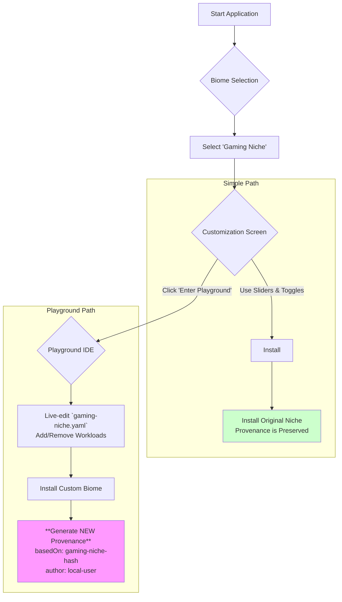

# `biomeOS` - Interactive Installer Specification v1

**Status:** Finalized | **Author:** The Architect & The Artisan AI | **Date:** July 2025

**Related Documents:** [ARCHITECTURE_OVERVIEW.md](./ARCHITECTURE_OVERVIEW.md), [COMPOSABLE_INSTALLER_SPEC.md](./COMPOSABLE_INSTALLER_SPEC.md)

---

## 1. Preamble: The Interactive Onboard

The `biomeOS` installer is the universal entry point to the ecosystem. This specification extends its function from a simple installation tool to a live, **interactive development environment**.

The installer does not just deploy pre-packaged configurations; it provides a "playground" where the user can safely modify and iterate on a Niche *at the moment of installation*, making every user a potential contributor to the ecosystem from day one.

## 2. Architecture: Pure Rust with `egui`

To ensure universality, security, and absolute alignment with the `ecoPrimals` "pure Rust" philosophy, the UI will be built using the **`egui` framework**.

-   **Framework:** `egui`. An immediate-mode, pure-Rust GUI library chosen for its simplicity, speed, and philosophical alignment with the project.
-   **Rendering Backend:** `wgpu` (likely via the `eframe` crate). This will provide cross-platform graphics rendering on Windows, macOS, and Linux using modern graphics APIs (Vulkan, Metal, DX12).
-   **Distribution:** A single, self-contained Rust binary will be compiled for each target platform. No webviews, interpreters, or external dependencies are required.

## 3. Core Features & User Flow

The UI guides the user through a choice: a simple, safe installation or an interactive, creative one.

### 3.1. Visual User Flow with Playground Mode

### 3.2. Feature Breakdown

#### **Screen 1: Biome Selection ("The Nursery")**
-   The user is presented with a list of pre-configured `biome.yaml` templates, or "Niches."
-   Each Niche has a clear name, a simple description of its purpose, and an icon.
-   **Examples:**
    -   `Scientific Research`: Pre-configured with AlphaFold, a Jupyter Notebook server, etc.
    -   `Sovereign Cloud`: Pre-configured with file synchronization tools, a photo gallery app, etc.
    -   `Gaming`: Pre-configured for low-latency game streaming.
-   An "Advanced" option allows the user to import or write their own `biome.yaml` from scratch.

#### **Screen 2: Customization ("The Shaping")**
This screen provides two paths forward:

1.  **The Simple Path:** Users can make high-level adjustments using simple controls (name, toggles, sliders) and click "Install" for a safe, standard installation.
2.  **The Playground Path:** A prominent **"Enter Playground"** button is available. Clicking this transitions the user to the Playground IDE.

#### **Screen 3: Playground IDE ("The Workshop")**
This is an advanced mode that transforms the installer into a simple development environment.
-   **File Tree:** A simple file tree showing the structure of the selected Niche (`niche.yaml`, `manifests/`, `workloads/`).
-   **Text Editor:** A built-in text editor for modifying the `biome.yaml` and other configuration files directly.
-   **File Management:** Basic controls to add or remove files from the `workloads/` directory.
-   **Install Control:** A button to "Install Custom Biome," which triggers the installation using the user's modified Niche.

#### **Screen 4: Dashboard ("The Biome")**
-   After launching, the user is taken to a dashboard for the running `biomeOS` instance.
-   **Displays:**
    -   The overall status (Starting, Running, Stopped).
    -   A list of the running services within the biome.
    -   Basic resource consumption graphs (CPU, Memory).
-   **Controls:**
    -   A "Stop" button to shut down the entire `biomeOS`.
    -   A "View Logs" button to see the aggregated logs from all services.
    -   A quick-launch button to open the web interface for key services, like the `songbird` API gateway.

## 4. Implementation Plan

1.  Create a new `biomeOS/ui` directory for the `egui` application.
2.  Set up the basic `eframe` project structure.
3.  Implement the four core states (Selection, Customization, Playground, Dashboard).
4.  The application logic will be responsible for:
    -   Reading and writing `biome.yaml` files.
    -   Communicating with the `toadstool` daemon process.
    -   **Detecting modifications made in Playground Mode and generating new provenance records for the installed system, preserving the original Niche's hash as a `basedOn` attribute.**
5.  This Bootstrap UI will be the first "user" of the `toadstool` API and the `iso-forge`'s provenance model, driving their development and ensuring they are practical and aligned. 