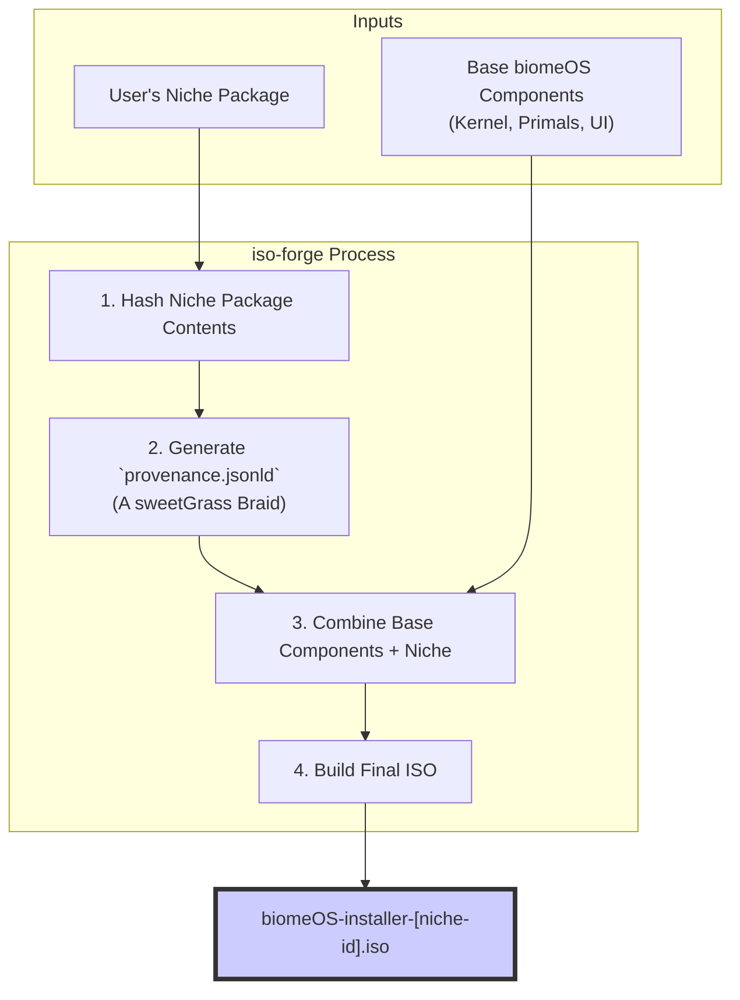

# `biomeOS` - Composable Installer Specification v1

**Status:** Draft | **Author:** The Architect & The Artisan AI | **Date:** July 2025

**Related Documents:** [UNIVERSAL_INSTALLER_SPEC.md](./UNIVERSAL_INSTALLER_SPEC.md)

---

## 1. Preamble: The Installer as a Culture Medium

The universal installer provides a baseline for `biomeOS` adoption. This specification extends that concept, transforming the installer from a static artifact into a dynamic, composable "culture medium."

The goal is to allow any user to create and share a custom, bootable `biomeOS` ISO pre-loaded with a specific "Niche"—a complete, reproducible, and verifiable software environment for a specific purpose (e.g., a gaming tournament, a research project, or a homelab).

## 2. The Architecture: `Niche Packages` and the `iso-forge`

The system consists of two core components: a standardized format for user-created content (the `Niche Package`) and a tool to build an ISO from it (the `iso-forge`).

### 2.1. The `Niche Package` Format

A "Niche" is a directory containing all the assets required for a custom `biomeOS` experience.

**Example Structure:**
```
my-niche/
├── niche.yaml
├── icon.png
├── manifests/
│   └── main-biome.yaml
└── workloads/
    └── custom-app.wasm
```

-   **`niche.yaml` (Required):** A metadata file defining the Niche.
    ```yaml
    # The unique identifier for this niche.
    id: "com.example.research-niche"
    # The human-readable name displayed in the UI.
    name: "Sovereign Research Environment"
    # The entity responsible for this niche.
    author: "BioInformatics Lab"
    # A brief description of the niche's purpose.
    description: "A secure biome with pre-installed bioinformatics tools and datasets."
    # The manifest to be used by default in the UI.
    default_manifest: "main-biome.yaml"
    ```
-   **`icon.png` (Optional):** A custom icon for the installer UI.
-   **`manifests/` (Required):** A directory containing one or more `biome.yaml` files. These are the pre-configured biomes the user can launch.
-   **`workloads/` (Optional):** A directory containing any additional binaries, data files, or container images required by the manifests.

### 2.2. The `iso-forge` Tool and Provenance

The `iso-forge` is a command-line utility that builds a custom, bootable `.iso` file. Its most critical function is embedding provenance into the final artifact, in alignment with the `sweetGrass` philosophy.

**Build Process:**


1.  **Execution:** `iso-forge --niche /path/to/my-niche/ --output /path/to/isos/`
2.  **Provenance Generation:** The forge recursively hashes the contents of the Niche Package and combines it with metadata from the `niche.yaml` to create a `provenance.jsonld` file. This is a verifiable "semantic build" record.
3.  **ISO Assembly:** The tool assembles the base `biomeOS` components, the Niche Package, and the `provenance.jsonld` into a new bootable ISO.
4.  **Result:** A self-contained, sharable, and verifiable `biomeOS` distribution. The `biomeos-ui`, when launched from this ISO, will read the provenance file and display the Niche's information to the user, ensuring trust and transparency. 