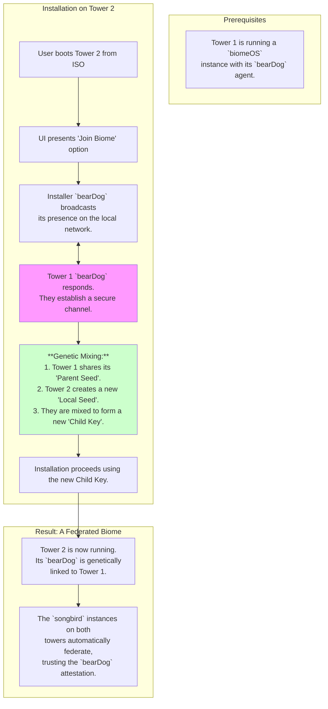

# `biomeOS` - Federated Installation Specification v1

**Status:** Draft | **Author:** The Architect & The Artisan AI | **Date:** July 2025

**Related Documents:** [INTERACTIVE_INSTALLER_SPEC.md](./INTERACTIVE_INSTALLER_SPEC.md), [ENCRYPTION_STRATEGY_SPEC.md](./ENCRYPTION_STRATEGY_SPEC.md)

---

## 1. Preamble: The Growing Organism

A single `biomeOS` instance is a sovereign cell. A federated network of biomes is a resilient, distributed organism. This specification defines the **"Mesh Installation"** workflow, a process that allows a new `biomeOS` installation to securely and automatically join an existing biome, creating a federated trust fabric from the moment of its birth.

This transforms the act of installation from creating an isolated system to extending a living colony.

## 2. The "Mesh Installation" Workflow

The installer UI will provide a new primary workflow: **"Join an Existing Biome."** This process leverages proximity-based trust and cryptographic "genetic mixing" to seamlessly onboard a new machine into a federated network.

## 3. The Process in Detail

1.  **Initiation:** The user selects "Join an Existing Biome" from the main installer screen. The installer's `bearDog` begins broadcasting a discovery beacon on the local network.
2.  **Proximity Handshake:** A `bearDog` agent from an existing biome (e.g., "Tower 1") detects this beacon. The user is prompted on both machines to confirm the connection, establishing trust based on physical proximity. The two agents perform a secure key exchange to create an encrypted communication channel.
3.  **Genetic Mixing:**
    -   The established biome's `bearDog` ("Parent") securely transmits its own seed to the installer's `bearDog` ("Child"). This inherited seed carries its "genetic type" (e.g., "home-grown" or "store-bought").
    -   The "Child" `bearDog` generates a new **local seed** using standard, "store-bought" CSPRNG entropy. The Ephemeral Key Sacrifice is a human-only ritual and is not performed in machine-to-machine federation.
    -   The "Child" `bearDog` uses a Key Derivation Function (KDF) to mix the **Parent Seed** and its own **Local Seed**, producing a new, unique **Master Key** for the new machine.
4.  **Genetic Inheritance:** The "genetic type" of the new Master Key is determined by its lineage. **If the Parent Seed was "home-grown" (originating from a human's Ephemeral Key Sacrifice), the new Child Key is also considered "home-grown."** The sanctity and story of the human-forged seed are inherited by all its descendants.
5.  **Installation:** The installation proceeds using this new, mixed Master Key to encrypt the disk.
6.  **Automatic Federation:** Upon first boot, the new biome's `bearDog` is fully aware of its lineage. It can provide a cryptographic attestation to its local `songbird` instance, proving its relationship to the parent biome. The two `songbird` instances can then use this trusted proof to automatically establish a federated connection, sharing service discovery information and network policies without any manual configuration.

## 4. Security Implications

This model creates a one-way trust hierarchy. The child biome can prove its origin from the parent, but the parent does not possess the child's unique key. This allows for secure, decentralized expansion of a trusted network without compromising the sovereignty of any individual node. 