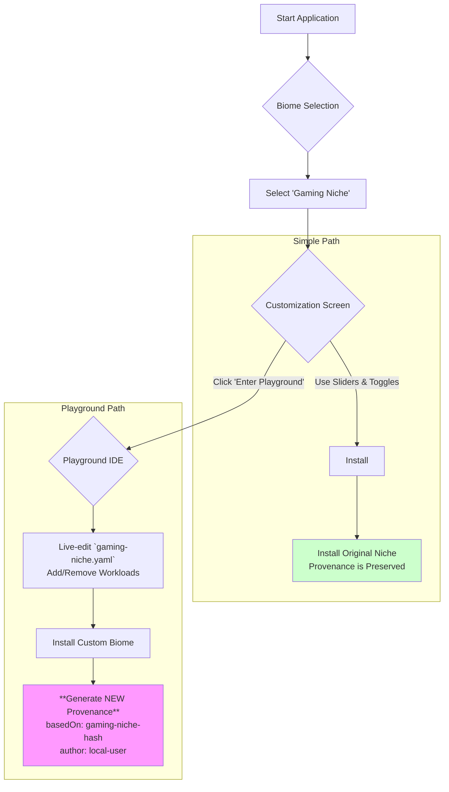

# `biomeOS` - Interactive Installer Specification v1

**Status:** Finalized | **Author:** The Architect & The Artisan AI | **Date:** July 2025

**Related Documents:** [ARCHITECTURE_OVERVIEW.md](./ARCHITECTURE_OVERVIEW.md), [COMPOSABLE_INSTALLER_SPEC.md](./COMPOSABLE_INSTALLER_SPEC.md)

---

## 1. Preamble: The API-First, Interactive Onboard

The `biomeOS` installer is the universal entry point to the ecosystem. This specification defines it as an **API-first** system with a primary user-facing client. This ensures that both humans and AI agents are treated as first-class citizens, capable of performing installations.

The system provides a "playground" where a user or AI can safely modify and iterate on a Niche *at the moment of installation*.

## 2. Architecture: Headless Core + `egui` Client

The installer is split into two distinct components:

-   **`installer-core` (Headless Daemon):** A pure-Rust binary that exposes a local API (e.g., via a Unix socket or local HTTP) to handle all backend logic. This is the "brain" of the installer. Its responsibilities include:
    -   Parsing Niche packages.
    -   Modifying `biome.yaml` manifests.
    -   Generating provenance records.
    -   Executing the installation (disk partitioning, file copying).
    -   Managing encryption workflows via `bearDog`.
-   **`biomeos-ui` (`egui` Client):** The pure-Rust `egui` application described previously. It is the primary *human* interface and is a client of the `installer-core` API. It contains no installation logic itself.

```mermaid
graph TD
    subgraph "Clients"
        A["`biomeos-ui`<br>(egui app for humans)"]
        B["AI Agent / Scripts"]
    end

    subgraph "Installation System"
        C["`installer-core` Daemon<br>(Local API Server)"]
        D["`bearDog`<br>(Encryption Primal)"]
    end
    
    E[Target System]

    A --> C;
    B --> C;
    C <--> D;
    C --> E;

    style C fill:#f9f,stroke:#333,stroke-width:2px
```

## 3. Core Features & User Flow

(User flow remains the same, but is now driven by API calls from the `egui` client to the `installer-core` daemon.)

### 3.1. Visual User Flow with Playground Mode
(No changes to the diagram)


### 3.2. Feature Breakdown
(No changes to feature descriptions)

## 4. Implementation Plan

1.  Create a `biomeOS/installer` directory containing two crates: `installer-core` and `biomeos-ui`.
2.  **`installer-core`:**
    -   Define a clear API schema for installation actions.
    -   Implement logic for parsing Niches, managing manifests, and generating provenance.
    -   Integrate with `bearDog` to provide encryption capabilities as defined in `ENCRYPTION_STRATEGY_SPEC.md`.
3.  **`biomeos-ui`:**
    -   Implement the four UI states (Selection, Customization, Playground, Dashboard) as a client to the `installer-core` API.
4.  This API-first approach ensures the core logic is robust, testable, and accessible to any authorized client, fully realizing the AI-friendly nature of the ecosystem. 