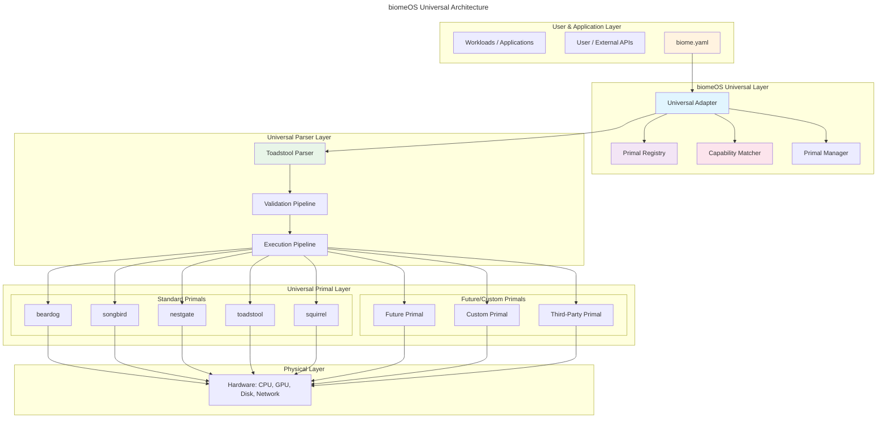
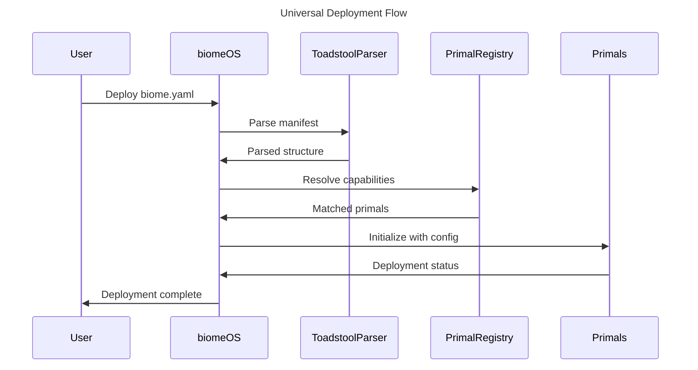
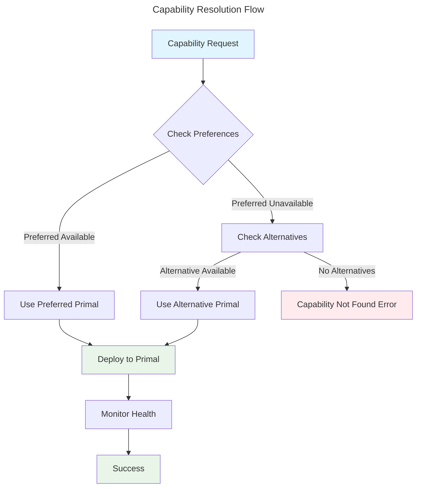

# `biomeOS` - Universal Architecture Overview v1

**Status:** Implementation Ready | **Author:** ecoPrimals Architecture Team | **Date:** January 2025

---

## 1. Preamble: Universal Parser Architecture

This document outlines the universal architecture for `biomeOS` with a fundamental principle: **toadstool serves as the universal parser** for all biomeOS operations. biomeOS employs toadstool's mature parsing capabilities using universal and agnostic patterns inspired by songbird's universal adapter architecture.

### Core Design Philosophy

- **Universal Parser**: toadstool provides the proven parsing foundation
- **Agnostic Integration**: Works with any current or future Primal
- **Capability-Based**: Route functionality based on capabilities, not specific implementations
- **Adapter Pattern**: Universal adapters handle Primal-specific integrations

## 2. The Universal `biomeOS` Architecture

The ecosystem is designed as a universal orchestration platform where toadstool serves as the parsing foundation and biomeOS provides universal adapter patterns for seamless Primal integration.



### **Layer 0: Physical Hardware**
- The foundation. Consists of the raw compute, storage, and networking hardware.

### **Layer 1: Universal Primal Layer**
- **Standard Primals**: Current ecosystem (beardog, songbird, nestgate, toadstool, squirrel)
- **Future Primals**: Any new Primals that implement the universal interface
- **Custom Primals**: Third-party and custom implementations
- **Universal Interface**: Common API for all Primals regardless of implementation

### **Layer 2: Universal Parser Layer**
- **Toadstool Parser**: The proven parsing engine that handles all manifest processing
- **Validation Pipeline**: Comprehensive validation using toadstool's mature validation system
- **Execution Pipeline**: Orchestrates Primal deployment based on parsed manifests

### **Layer 3: biomeOS Universal Layer**
- **Universal Adapter**: Core component that abstracts Primal-specific details
- **Primal Registry**: Dynamic registry of all available Primals
- **Capability Matcher**: Routes functionality based on capabilities, not specific Primals
- **Primal Manager**: Manages lifecycle and health of all Primals

### **Layer 4: Applications & Workloads**
- User-facing applications and services that benefit from universal orchestration
- Transparent to the underlying Primal implementations
- Capability-based deployment for optimal performance

## 3. Universal Adapter Pattern (Inspired by Songbird)

Following songbird's universal adapter architecture, biomeOS implements a universal adapter pattern that enables seamless integration with any Primal:

### 3.1 Universal Adapter Structure

```rust
// Universal Adapter Pattern (inspired by songbird)
pub struct BiomeOSUniversalAdapter {
    // Toadstool integration
    toadstool_parser: ToadstoolManifestParser,
    
    // Universal registries
    primal_registry: UniversalPrimalRegistry,
    capability_registry: CapabilityRegistry,
    
    // Matching and routing
    capability_matcher: CapabilityMatcher,
    primal_router: PrimalRouter,
    
    // Monitoring and health
    health_monitor: UniversalHealthMonitor,
    metrics_collector: UniversalMetricsCollector,
}

impl BiomeOSUniversalAdapter {
    pub async fn process_biome_manifest(
        &self,
        manifest_path: &str
    ) -> Result<BiomeDeployment> {
        // 1. Parse with toadstool (proven parser)
        let parsed = self.toadstool_parser.parse(manifest_path).await?;
        
        // 2. Apply universal transformations
        let universal = self.universalize_manifest(parsed).await?;
        
        // 3. Match capabilities to available Primals
        let matched = self.capability_matcher.resolve_primals(&universal).await?;
        
        // 4. Route to appropriate Primals
        let deployment = self.primal_router.deploy(matched).await?;
        
        // 5. Monitor and maintain
        self.health_monitor.start_monitoring(&deployment).await?;
        
        Ok(deployment)
    }
}
```

### 3.2 Universal Primal Interface

```rust
// Universal Primal Interface (any Primal can implement)
#[async_trait]
pub trait UniversalPrimal: Send + Sync {
    // Identity and capabilities
    fn primal_id(&self) -> &str;
    fn primal_type(&self) -> PrimalType;
    fn capabilities(&self) -> Vec<String>;
    fn version(&self) -> &str;
    
    // Lifecycle management
    async fn initialize(&mut self, config: serde_json::Value) -> Result<()>;
    async fn health_check(&self) -> HealthStatus;
    async fn shutdown(&mut self) -> Result<()>;
    
    // Request handling
    async fn handle_request(&self, request: UniversalRequest) -> Result<UniversalResponse>;
    
    // Capability-specific methods
    async fn can_handle_capability(&self, capability: &str) -> bool;
    async fn get_capability_metadata(&self, capability: &str) -> Option<CapabilityMetadata>;
}
```

## 4. Capability-Based Architecture

### 4.1 Capability Registry System

```rust
pub struct CapabilityRegistry {
    capabilities: HashMap<String, Vec<PrimalProvider>>,
    priority_matrix: HashMap<String, Vec<String>>, // capability -> ordered primal preferences
}

impl CapabilityRegistry {
    pub async fn register_primal(&mut self, primal: Box<dyn UniversalPrimal>) -> Result<()> {
        let primal_id = primal.primal_id().to_string();
        let capabilities = primal.capabilities();
        
        for capability in capabilities {
            self.capabilities
                .entry(capability.clone())
                .or_insert_with(Vec::new)
                .push(PrimalProvider::new(primal_id.clone(), primal));
        }
        
        Ok(())
    }
    
    pub async fn resolve_capability(
        &self, 
        capability: &str, 
        preferences: &[String]
    ) -> Result<PrimalProvider> {
        // Match based on preference order
        for preference in preferences {
            if let Some(providers) = self.capabilities.get(capability) {
                if let Some(provider) = providers.iter().find(|p| p.id == *preference) {
                    return Ok(provider.clone());
                }
            }
        }
        
        // Fallback to any available provider
        self.capabilities
            .get(capability)
            .and_then(|providers| providers.first())
            .cloned()
            .ok_or_else(|| CapabilityNotFoundError::new(capability))
    }
}
```

### 4.2 Capability Matching Examples

```yaml
# Capability-based Primal selection
primals:
  # Security capability - prefers beardog, falls back to custom
  security:
    capability_required: "encryption"
    provider_preference: ["beardog", "custom_security", "fallback_security"]
    
  # Storage capability - prefers nestgate, falls back to alternatives
  storage:
    capability_required: "persistent_storage"
    provider_preference: ["nestgate", "custom_storage", "basic_storage"]
    
  # Service mesh capability - prefers songbird, works with alternatives
  networking:
    capability_required: "service_discovery"
    provider_preference: ["songbird", "custom_mesh", "basic_networking"]
```

## 5. Universal Primal Integration Process

### 5.1 Standard Primal Integration

```rust
// Example: Integrating songbird as a universal primal
pub struct SongbirdUniversalAdapter {
    songbird_client: SongbirdClient,
    capabilities: Vec<String>,
}

impl UniversalPrimal for SongbirdUniversalAdapter {
    fn primal_id(&self) -> &str { "songbird" }
    fn primal_type(&self) -> PrimalType { PrimalType::ServiceMesh }
    
    fn capabilities(&self) -> Vec<String> {
        vec![
            "service_discovery".to_string(),
            "load_balancing".to_string(),
            "api_gateway".to_string(),
            "protocol_translation".to_string(),
        ]
    }
    
    async fn handle_request(&self, request: UniversalRequest) -> Result<UniversalResponse> {
        match request.capability.as_str() {
            "service_discovery" => self.handle_service_discovery(request).await,
            "load_balancing" => self.handle_load_balancing(request).await,
            "api_gateway" => self.handle_api_gateway(request).await,
            _ => Err(UnsupportedCapabilityError::new(&request.capability))
        }
    }
}
```

### 5.2 Future Primal Integration

```rust
// Example: Hypothetical AI inference primal
pub struct AIInferencePrimal {
    model_cache: HashMap<String, Box<dyn AIModel>>,
    capabilities: Vec<String>,
}

impl UniversalPrimal for AIInferencePrimal {
    fn primal_id(&self) -> &str { "ai_inference_primal" }
    fn primal_type(&self) -> PrimalType { PrimalType::Custom("ai_inference".to_string()) }
    
    fn capabilities(&self) -> Vec<String> {
        vec![
            "llm_inference".to_string(),
            "embedding_generation".to_string(),
            "vision_processing".to_string(),
        ]
    }
    
    async fn handle_request(&self, request: UniversalRequest) -> Result<UniversalResponse> {
        match request.capability.as_str() {
            "llm_inference" => self.handle_llm_inference(request).await,
            "embedding_generation" => self.handle_embeddings(request).await,
            "vision_processing" => self.handle_vision(request).await,
            _ => Err(UnsupportedCapabilityError::new(&request.capability))
        }
    }
}
```

## 6. Deployment Flow

### 6.1 Universal Deployment Process



### 6.2 Capability Resolution Flow



## 7. Benefits of Universal Architecture

### 7.1 Immediate Benefits
- **Proven Parser**: Leverages toadstool's mature, battle-tested parsing engine
- **Seamless Integration**: Works with all current Primals without modification
- **Capability Flexibility**: Choose best Primal for each capability
- **Future-Proof**: Automatic support for new Primals through universal interface

### 7.2 Long-term Benefits
- **Vendor Independence**: No lock-in to specific Primal implementations
- **Ecosystem Growth**: Easy integration of third-party and custom Primals
- **Performance Optimization**: Dynamic routing based on performance metrics
- **Fault Tolerance**: Automatic failover between Primal providers

### 7.3 Developer Benefits
- **Unified API**: Single interface for all Primal interactions
- **Simplified Testing**: Mock any Primal through universal interface
- **Easy Extension**: Add new capabilities without changing core architecture
- **Clear Patterns**: Consistent patterns for all Primal integrations

## 8. Migration Strategy

### 8.1 Phase 1: Foundation (Current)
- Implement universal adapter framework
- Integrate toadstool parser as foundation
- Create capability registry system
- Build universal Primal interfaces

### 8.2 Phase 2: Standard Primal Integration
- Wrap existing Primals with universal adapters
- Implement capability-based routing
- Add health monitoring and metrics
- Create migration tools

### 8.3 Phase 3: Ecosystem Expansion
- Define standards for third-party Primals
- Implement advanced features (multi-provider, load balancing)
- Add performance optimization
- Create marketplace for Primal providers

This universal architecture ensures that biomeOS remains agnostic, extensible, and future-proof while leveraging the proven capabilities of toadstool as the parsing foundation and songbird's universal adapter patterns as the integration model. 