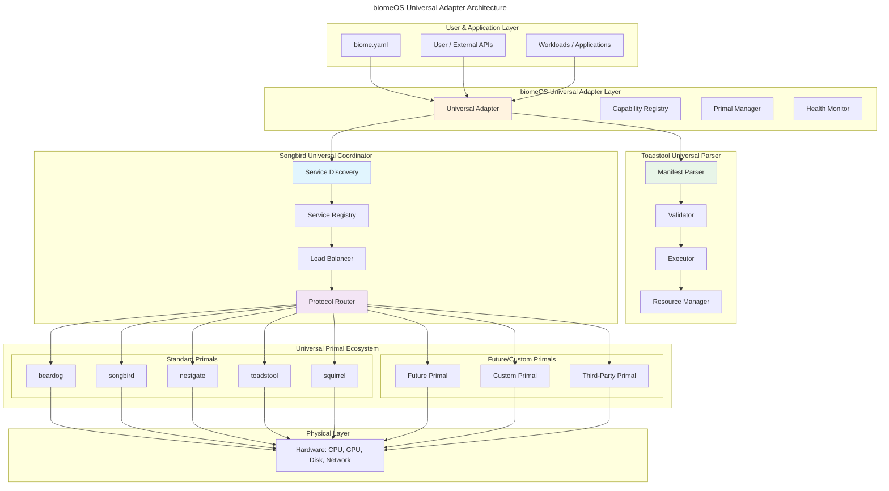

# `biomeOS` - Universal Architecture Overview v2

**Status:** Implementation Ready | **Author:** ecoPrimals Architecture Team | **Date:** January 2025

---

## 1. Preamble: Universal Adapter Architecture

This document outlines the universal architecture for `biomeOS` with fundamental principles:
- **Toadstool serves as the universal parser** for all manifest operations
- **Songbird serves as the universal coordinator** for all discovery and orchestration
- **BiomeOS provides universal adapter patterns** for seamless integration
- **Capability-based routing** eliminates hardcoded primal dependencies

### Core Design Philosophy

- **Universal Parser**: Delegate to Toadstool's proven parsing infrastructure
- **Universal Coordinator**: Route through Songbird's discovery and orchestration hub
- **Agnostic Integration**: Works with any current or future Primal
- **Capability-Based**: Route functionality based on capabilities, not specific implementations
- **Adapter Pattern**: Universal adapters handle Primal-agnostic integrations

## 2. The Universal `biomeOS` Architecture

BiomeOS acts as a universal orchestration platform that delegates core functionality to existing, mature primal services while providing universal adapter patterns for seamless integration.



### **Layer 0: Physical Hardware**
- The foundation: raw compute, storage, and networking hardware

### **Layer 1: Universal Primal Ecosystem**
- **Standard Primals**: Current ecosystem (beardog, songbird, nestgate, toadstool, squirrel)
- **Future Primals**: Any new Primals that implement universal interfaces
- **Custom Primals**: Third-party and custom implementations
- **Universal Interface**: Common API for all Primals regardless of implementation

### **Layer 2: Toadstool Universal Parser + Songbird Universal Coordinator**
- **Toadstool Parser**: Proven manifest parsing, validation, execution, and resource management
- **Songbird Coordinator**: Service discovery, registry, load balancing, and protocol routing
- **No Duplication**: BiomeOS delegates to these mature systems instead of reimplementing

### **Layer 3: biomeOS Universal Adapter Layer**
- **Universal Adapter**: Coordinates between Toadstool parser and Songbird coordinator
- **Capability Registry**: Maps capabilities to available Primals via Songbird
- **Primal Manager**: Manages lifecycle through Toadstool execution
- **Health Monitor**: Monitors system health through both services

### **Layer 4: Applications & Workloads**
- User-facing applications that benefit from universal orchestration
- Transparent to underlying Primal implementations
- Capability-based deployment for optimal performance

## 3. Universal Adapter Pattern

BiomeOS implements a universal adapter that coordinates between Toadstool's parsing capabilities and Songbird's discovery/coordination capabilities:

### 3.1 Universal Adapter Structure

```rust
// Universal Adapter Pattern - delegates to mature primal services
pub struct BiomeOSUniversalAdapter {
    // Delegate parsing to Toadstool's proven parser
    toadstool_client: ToadstoolClient,
    
    // Delegate coordination to Songbird's discovery system
    songbird_client: SongbirdClient,
    
    // Universal registries (thin layer over Songbird)
    capability_registry: CapabilityRegistry,
    
    // Monitoring and health (aggregates from both services)
    health_monitor: UniversalHealthMonitor,
}

impl BiomeOSUniversalAdapter {
    pub async fn process_biome_manifest(
        &self,
        manifest_path: &str
    ) -> Result<BiomeDeployment> {
        // 1. Delegate parsing to Toadstool
        let parsed = self.toadstool_client.parse_manifest(manifest_path).await?;
        
        // 2. Delegate discovery to Songbird
        let available_primals = self.songbird_client.discover_primals().await?;
        
        // 3. Match capabilities (thin coordination layer)
        let resolved = self.capability_registry
            .resolve_capabilities(&parsed, &available_primals).await?;
        
        // 4. Delegate execution to Toadstool
        let deployment = self.toadstool_client
            .execute_manifest(parsed, resolved).await?;
        
        // 5. Register with Songbird for coordination
        self.songbird_client.register_deployment(&deployment).await?;
        
        Ok(deployment)
    }
}
```

### 3.2 Delegation Strategy

BiomeOS avoids reimplementing functionality that already exists in mature primals:

**Toadstool Delegation:**
- ✅ Manifest parsing and validation
- ✅ Multi-runtime execution (Container, WASM, Native, GPU)
- ✅ Resource management and scheduling
- ✅ Security context enforcement

**Songbird Delegation:**
- ✅ Service discovery across multiple backends
- ✅ Protocol routing and load balancing  
- ✅ Primal registration and health monitoring
- ✅ Cross-primal communication coordination

**BiomeOS Coordination:**
- ✅ Universal adapter between Toadstool and Songbird
- ✅ Capability-based primal resolution
- ✅ Unified API for universal orchestration
- ✅ Cross-cutting concerns (logging, metrics, etc.)

### 3.3 Benefits of Universal Adapter Architecture

1. **Mature Foundation**: Leverages battle-tested parsing (Toadstool) and discovery (Songbird)
2. **Reduced Complexity**: No duplication of complex parsing or discovery logic
3. **Better Reliability**: Uses proven, production-ready implementations
4. **Future Compatibility**: Automatically benefits from Toadstool and Songbird improvements
5. **Maintainability**: Smaller codebase focused on coordination rather than reimplementation

## 4. Implementation Strategy

### 4.1 Phase 1: Universal Client Implementation
1. **Toadstool Client**: HTTP/gRPC client for Toadstool's parsing and execution APIs
2. **Songbird Client**: HTTP/WebSocket client for Songbird's discovery and coordination APIs
3. **Capability Registry**: Thin mapping layer between capabilities and discovered primals
4. **Universal Health Monitor**: Aggregated health monitoring from both services

### 4.2 Phase 2: Remove Hardcoded Implementations
1. **Replace Mock Parsers**: Remove BiomeOS manifest parsing, delegate to Toadstool
2. **Replace Mock Discovery**: Remove hardcoded primal references, use Songbird discovery
3. **Replace Mock Execution**: Use Toadstool's execution engine instead of local mocks
4. **Replace Mock Coordination**: Use Songbird's coordination instead of local registries

### 4.3 Phase 3: Universal Interface Layer
1. **Unified API**: Single API that coordinates Toadstool and Songbird
2. **Capability Abstraction**: Abstract away specific primal implementations
3. **Universal UI**: Interface that works with any discovered primals
4. **Migration Tools**: Help migrate from hardcoded to capability-based configurations

## 5. Architecture Benefits

### 5.1 Delegation Benefits
- **Proven Stability**: Uses mature, battle-tested parsing and coordination
- **Performance**: Optimized implementations instead of prototype code
- **Feature Completeness**: Full feature sets from specialized services
- **Reduced Maintenance**: Less code to maintain and debug

### 5.2 Universal Benefits
- **Current Ecosystem**: Works seamlessly with all existing Primals
- **Future Compatibility**: Automatically supports new Primals through Songbird discovery
- **Third-Party Integration**: Easy integration of custom/third-party Primals
- **Vendor Independence**: No lock-in to specific Primal implementations

### 5.3 Capability-Based Benefits
- **Flexible Deployment**: Choose optimal Primal for each capability requirement
- **Automatic Failover**: Switch between Primals based on availability and health
- **Performance Optimization**: Route to best-performing Primal for each workload
- **Gradual Migration**: Migrate between Primals without configuration changes

## 6. Conclusion

The universal adapter architecture enables BiomeOS to provide comprehensive orchestration while:
- **Delegating parsing to Toadstool**: Leveraging proven manifest processing
- **Delegating coordination to Songbird**: Using mature discovery and routing
- **Providing universal abstraction**: Capability-based primal interaction
- **Maintaining simplicity**: Focused coordination layer instead of reimplementation

This approach delivers production-ready functionality faster and with higher reliability than reimplementing core primal capabilities. 