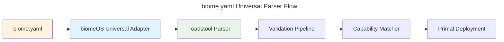

# biome.yaml Universal Specification

**Version:** 1.0.0 | **Status:** Implementation Ready | **Date:** January 2025

---

## Overview

The `biome.yaml` file is the **universal genome** of a biomeOS instance, defining the complete configuration and orchestration of all Primals using **toadstool as the universal parser**. This specification employs universal and agnostic patterns to ensure compatibility with current and future Primals while leveraging toadstool's proven parsing capabilities.

### Universal Parser Architecture



## Universal File Structure

```yaml
# biome.yaml - Universal Digital Organism Genome
apiVersion: biomeOS/v1      # Universal compatibility
kind: Biome                 # Toadstool parser compatibility
metadata:
  name: my-universal-biome
  version: "1.0.0"
  description: "Universal biome supporting any Primal"
  specialization: research  # development, enterprise, edge, scientific, research
  created: "2025-01-15T10:30:00Z"
  owner: "research-team"
  tags:
    - universal
    - ai-research
    - gpu-compute

# MYCORRHIZA: biomeOS-specific energy flow management
mycorrhiza:
  system_state: "closed"  # closed | private_open | commercial_open
  
  # Personal sovereignty - always available
  personal_ai:
    enabled: true
    local_models:
      - llama.cpp
      - whisper.cpp
    api_keys:
      - provider: anthropic
        key_ref: claude_personal_key
      - provider: openai
        key_ref: gpt4_personal_key
        
  # Security enforcement
  enforcement:
    deep_packet_inspection: true
    api_signature_detection: true
    behavioral_analysis: true
    threat_response: "block_and_preserve"

# Universal Primal Orchestration (toadstool-parsed)
primals:
  # Security Primal (capability-based selection)
  security:
    capability_required: "encryption"
    provider_preference: ["beardog", "custom_security"]
    version: ">=0.2.0"
    priority: 1
    startup_timeout: 30s
    config:
      security_level: high
      compliance: [gdpr, hipaa]
      hsm_integration: true
      
  # Service Mesh Primal (capability-based selection)
  service_mesh:
    capability_required: "service_discovery"
    provider_preference: ["songbird", "custom_mesh"]
    version: ">=0.3.0"
    priority: 2
    startup_timeout: 45s
    depends_on: ["security"]
    config:
      discovery_backend: consul
      load_balancing: health_based
      federation_enabled: true
      
  # Storage Primal (capability-based selection)
  storage:
    capability_required: "persistent_storage"
    provider_preference: ["nestgate", "custom_storage"]
    version: ">=0.1.5"
    priority: 3
    startup_timeout: 60s
    depends_on: ["security", "service_mesh"]
    config:
      storage_type: "zfs"
      tiered_storage: true
      protocols: [nfs, smb, s3]
      
  # Runtime Primal (toadstool as parser AND runtime)
  runtime:
    capability_required: "container_orchestration"
    provider_preference: ["toadstool"]
    version: ">=0.4.0"
    priority: 4
    startup_timeout: 30s
    depends_on: ["security", "service_mesh", "storage"]
    config:
      runtime_types: ["wasm", "container"]
      security_enforcement: true
      
  # AI Processing Primal (future/custom example)
  ai_processing:
    capability_required: "llm_inference"
    provider_preference: ["squirrel", "custom_ai", "cloud_ai"]
    version: ">=1.0.0"
    priority: 5
    startup_timeout: 120s
    depends_on: ["security", "storage"]
    config:
      models: ["llama-3", "mistral-7b"]
      gpu_support: true
      quantization: true

# Universal Source Management (delegated to toadstool)
sources:
  primal_registry:
    type: "oci"
    url: "registry.ecoprimals.io"
    auth: "bearer_token"
    
  custom_registry:
    type: "oci"
    url: "custom.registry.example.com"
    auth: "basic_auth"
    
  future_registry:
    type: "oci"
    url: "future.primal.registry.io"
    auth: "oauth2"

# Universal Volume Management (delegated to toadstool)
volumes:
  research_data:
    driver: "universal-storage"
    provider_preference: ["nestgate", "custom_storage"]
    options:
      encryption: true
      compression: "zstd"
      quota: "1TB"
      backup: true
      
  model_cache:
    driver: "universal-storage"
    provider_preference: ["nestgate", "fast_storage"]
    options:
      performance: "high"
      quota: "500GB"
      ssd_preferred: true

# Universal Network Management (delegated to toadstool)
networks:
  research_net:
    driver: "universal-network"
    provider_preference: ["songbird", "custom_network"]
    subnet: "10.42.0.0/16"
    security_level: "high"
    
  ai_mesh:
    driver: "universal-network"
    provider_preference: ["songbird", "high_performance_network"]
    subnet: "10.43.0.0/16"
    performance: "low_latency"

# Universal Service Definitions (delegated to toadstool)
services:
  research_api:
    primal: "service_mesh"
    source: "primal_registry:research-api:v1.0.0"
    runtime: "wasm"
    capabilities_required: ["http_server", "database_access"]
    networks:
      - research_net
    ports:
      - "8080:8080"
    volumes:
      - "research_data:/app/data"
    depends_on: ["research_db"]
    
  research_db:
    primal: "storage"
    source: "primal_registry:postgres:14"
    runtime: "container"
    capabilities_required: ["sql_database", "persistence"]
    networks:
      - research_net
    volumes:
      - "research_data:/var/lib/postgresql/data"
    config:
      database_name: "research"
      encryption: true
      
  ai_inference:
    primal: "ai_processing"
    source: "primal_registry:llama-inference:v2.0.0"
    runtime: "gpu"
    capabilities_required: ["llm_inference", "gpu_compute"]
    networks:
      - ai_mesh
    volumes:
      - "model_cache:/models"
    config:
      model: "llama-3-8b"
      quantization: "4bit"
      max_tokens: 4096
```

## Universal Primal Specification Format

### Standard Primal Pattern
```yaml
primal_name:
  capability_required: "capability_name"           # What capability is needed
  provider_preference: ["primary", "fallback"]    # Ordered preference list
  version: ">=x.y.z"                             # Version constraint
  priority: 1                                    # Startup order
  startup_timeout: 30s                          # Startup timeout
  depends_on: ["other_primal"]                   # Dependencies
  config:                                        # Primal-specific config
    key: value
```

### Future Primal Integration
```yaml
# Example: Hypothetical quantum computing primal
quantum_compute:
  capability_required: "quantum_simulation"
  provider_preference: ["quantum_primal", "simulation_fallback"]
  version: ">=3.0.0"
  priority: 10
  startup_timeout: 300s
  depends_on: ["security", "storage"]
  config:
    qubits: 50
    error_correction: true
    algorithms: ["shor", "grover"]
```

## Universal Capabilities System

### Core Capabilities
- **Security**: `encryption`, `authentication`, `compliance`, `hsm`
- **Storage**: `persistent_storage`, `tiered_storage`, `backup`, `encryption`
- **Networking**: `service_discovery`, `load_balancing`, `api_gateway`, `federation`
- **Runtime**: `container_orchestration`, `wasm_runtime`, `process_isolation`
- **AI**: `llm_inference`, `embedding_generation`, `vision_processing`

### Capability Matching Logic
```rust
// Universal capability resolution
pub async fn resolve_capability(
    capability: &str,
    preferences: &[String],
    available_primals: &[PrimalProvider]
) -> Result<PrimalProvider> {
    // 1. Try preferred providers in order
    for preference in preferences {
        if let Some(primal) = available_primals.iter()
            .find(|p| p.id == *preference && p.has_capability(capability)) {
            return Ok(primal.clone());
        }
    }
    
    // 2. Fallback to any available provider
    available_primals.iter()
        .find(|p| p.has_capability(capability))
        .cloned()
        .ok_or_else(|| CapabilityNotFoundError::new(capability))
}
```

## MYCORRHIZA Universal Energy Flow

### Energy Flow States
```yaml
mycorrhiza:
  system_state: "closed"  # Universal default
  
  # Personal AI - always available in any state
  personal_ai:
    enabled: true
    local_models: ["llama.cpp", "whisper.cpp"]
    api_keys:
      - provider: anthropic
        key_ref: claude_key
      - provider: openai  
        key_ref: gpt4_key
        
  # Trust-based external access (private_open)
  trusted_externals:
    enabled: false
    grants: []  # Crypto keys for trusted access
    
  # Commercial integrations (commercial_open)
  commercial_access:
    enabled: false
    licensed_providers: []  # Paid cloud services
    
  # Universal enforcement
  enforcement:
    deep_packet_inspection: true
    api_signature_detection: true
    behavioral_analysis: true
    threat_response: "block_and_preserve"
```

## Universal Validation Rules

### Toadstool Parser Validation
1. **Schema Validation**: Uses toadstool's proven validation system
2. **Dependency Checking**: Validates Primal dependencies
3. **Capability Verification**: Ensures required capabilities are available
4. **Resource Validation**: Checks resource requirements and constraints

### biomeOS Universal Validation
1. **MYCORRHIZA Compliance**: Validates energy flow configurations
2. **Capability Matching**: Ensures capabilities can be resolved
3. **Security Validation**: Validates security configurations
4. **Performance Validation**: Checks resource allocation

## Universal Deployment Process

### Phase 1: Parsing (Toadstool)
```rust
// Toadstool handles proven parsing
let parsed_manifest = toadstool_parser.parse(biome_yaml).await?;
```

### Phase 2: Universal Transformation (biomeOS)
```rust
// biomeOS applies universal patterns
let universal_manifest = biomeos_adapter.universalize(parsed_manifest).await?;
```

### Phase 3: Capability Resolution (biomeOS)
```rust
// Match capabilities to available Primals
let resolved_primals = capability_matcher.resolve_all(&universal_manifest).await?;
```

### Phase 4: Deployment (Universal)
```rust
// Deploy to matched Primals
let deployment = primal_deployer.deploy_all(resolved_primals).await?;
```

## Universal Extension Points

### Custom Primal Integration
```yaml
# Example: Custom blockchain primal
blockchain:
  capability_required: "distributed_ledger"
  provider_preference: ["custom_blockchain", "ethereum_adapter"]
  version: ">=1.0.0"
  priority: 8
  config:
    network: "mainnet"
    consensus: "proof_of_stake"
    smart_contracts: true
```

### Third-Party Primal Support
```yaml
# Example: Third-party monitoring primal
monitoring:
  capability_required: "metrics_collection"
  provider_preference: ["prometheus_primal", "custom_metrics"]
  version: ">=2.0.0"
  priority: 7
  depends_on: ["service_mesh"]
  config:
    retention: "30d"
    alerting: true
    dashboards: ["grafana"]
```

## Benefits of Universal Architecture

### Toadstool Parser Benefits
- **Proven Stability**: Leverages mature, battle-tested parsing
- **Comprehensive Validation**: Uses toadstool's robust validation system
- **Performance Optimized**: Optimized parsing performance
- **Feature Rich**: Full feature set from mature implementation

### Universal Primal Benefits
- **Future-Proof**: Automatic support for new Primals
- **Vendor Independent**: No lock-in to specific implementations
- **Capability Focused**: Choose best Primal for each capability
- **Extensible**: Easy integration of custom and third-party Primals

### Developer Benefits
- **Consistent API**: Single interface for all Primal interactions
- **Easy Testing**: Mock any Primal through universal interface
- **Clear Patterns**: Consistent patterns across all integrations
- **Gradual Migration**: Migrate between Primals without breaking changes

## Migration from Current Specification

### Backwards Compatibility
- Existing `biome.yaml` files remain compatible
- Gradual migration path available
- No breaking changes to core structure

### Enhancement Path
1. **Add capability requirements** to existing Primal definitions
2. **Specify provider preferences** for flexibility
3. **Update to universal patterns** for future-proofing
4. **Test with multiple providers** for resilience

This universal specification ensures that biomeOS can work with any current or future Primal while leveraging toadstool's proven parsing capabilities as the foundation. 