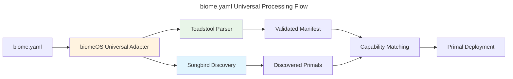

# biome.yaml Universal Specification

**Version:** 2.0.0 | **Status:** Implementation Ready | **Date:** January 2025

---

## Overview

The `biome.yaml` file is the **universal genome** of a biomeOS instance, defining the complete configuration and orchestration using the universal adapter architecture. This specification leverages **Toadstool's proven parsing capabilities** and **Songbird's discovery and coordination** while providing capability-based primal integration.

### Universal Adapter Architecture



## Universal File Structure

```yaml
# biome.yaml - Universal Digital Organism Genome v2
apiVersion: biomeOS/v2      # Universal compatibility with Toadstool parser
kind: Biome                 # Toadstool parser requirement
metadata:
  name: my-universal-biome
  version: "2.0.0"
  description: "Universal biome using capability-based primal selection"
  specialization: research  # development, enterprise, edge, scientific, research
  created: "2025-01-15T10:30:00Z"
  owner: "research-team"
  tags:
    - universal-adapter
    - capability-based
    - toadstool-parsed
    - songbird-discovered

# MYCORRHIZA: biomeOS-specific energy flow management
# (Compatible with both Toadstool execution and Songbird coordination)
mycorrhiza:
  system_state: "closed"  # closed | private_open | commercial_open
  
  # Personal sovereignty - always available
  personal_ai:
    enabled: true
    local_models:
      - llama.cpp
      - whisper.cpp
    api_keys:
      - provider: anthropic
        key_ref: claude_personal_key
      - provider: openai
        key_ref: gpt4_personal_key
        
  # Security enforcement
  enforcement:
    deep_packet_inspection: true
    api_signature_detection: true
    behavioral_analysis: true
    threat_response: "block_and_preserve"

# Universal Capability-Based Primal Configuration
# (Processed by Toadstool parser, resolved by Songbird discovery)
primals:
  # Security capability - discovered dynamically via Songbird
  security:
    capability_required: "encryption_and_authentication"
    provider_preference: ["beardog", "custom_security", "fallback_security"]
    version: ">=0.2.0"
    priority: 1
    startup_timeout: 30s
    config:
      security_level: high
      compliance: [gdpr, hipaa]
      hsm_integration: true
      
  # Service mesh capability - discovered dynamically via Songbird
  coordination:
    capability_required: "service_discovery_and_routing"
    provider_preference: ["songbird", "custom_mesh", "basic_coordination"]
    version: ">=0.3.0"
    priority: 2
    startup_timeout: 45s
    depends_on: ["security"]
    config:
      discovery_backend: consul
      load_balancing: health_based
      federation_enabled: true
      
  # Storage capability - discovered dynamically via Songbird
  storage:
    capability_required: "persistent_storage_with_tiering"
    provider_preference: ["nestgate", "custom_storage", "basic_storage"]
    version: ">=0.1.5"
    priority: 3
    startup_timeout: 60s
    depends_on: ["security", "coordination"]
    config:
      storage_type: "zfs"
      tiered_storage: true
      protocols: [nfs, smb, s3]
      
  # Runtime capability - Toadstool as both parser AND execution engine
  execution:
    capability_required: "container_and_wasm_orchestration"
    provider_preference: ["toadstool"]  # Toadstool provides both parsing and execution
    version: ">=0.4.0"
    priority: 4
    startup_timeout: 30s
    depends_on: ["security", "coordination", "storage"]
    config:
      runtime_types: ["wasm", "container", "native", "gpu"]
      security_enforcement: true
      
  # AI processing capability - discovered dynamically via Songbird
  ai_processing:
    capability_required: "llm_inference_and_mcp"
    provider_preference: ["squirrel", "custom_ai", "cloud_ai"]
    version: ">=1.0.0"
    priority: 5
    startup_timeout: 120s
    depends_on: ["security", "storage"]
    config:
      models: ["llama-3", "mistral-7b"]
      gpu_support: true
      quantization: true
      mcp_integration: true

# Universal Source Management (delegated to Toadstool's proven source handling)
sources:
  biome_registry:
    type: "http"
    url: "https://registry.biomeos.org"
    auth:
      type: "bearer"
      token_ref: "registry_token"
      
  custom_images:
    type: "oci"
    registry: "registry.example.com"
    namespace: "my-org"
    auth:
      type: "docker_config"
      config_ref: "docker_config"
      
  local_development:
    type: "local"
    path: "./development"

# Universal Service Definitions (processed by Toadstool, coordinated by Songbird)
services:
  # Web service - capability-based deployment
  web-frontend:
    capability_requirements:
      runtime: "container_orchestration"
      networking: "load_balancing"
      storage: "temporary_storage"
    
    source: "custom_images"
    image: "my-frontend:latest"
    runtime: container
    
    resources:
      cpu: 2.0
      memory: "4Gi"
      storage: "10Gi"
      
    networking:
      ports:
        - container: 3000
          host: 3000
          protocol: "http"
      load_balancing: true
      
    scaling:
      min_replicas: 2
      max_replicas: 10
      auto_scaling: true

  # AI service - capability-based deployment
  ai-assistant:
    capability_requirements:
      runtime: "wasm_execution" 
      ai: "llm_inference"
      storage: "model_storage"
      
    source: "biome_registry"
    image: "ai-assistant:v1.2"
    runtime: wasm
    
    resources:
      cpu: 4.0
      memory: "16Gi"
      gpu: 1
      storage: "100Gi"
      
    ai_config:
      models:
        - name: "llama-3-8b"
          quantization: "4bit"
        - name: "mistral-7b"
          quantization: "8bit"
      mcp_enabled: true
      
    scaling:
      min_replicas: 1
      max_replicas: 5

  # Data processing service - capability-based deployment  
  data-processor:
    capability_requirements:
      runtime: "native_execution"
      storage: "high_performance_storage"
      networking: "service_mesh"
      
    source: "biome_registry"
    binary: "data-processor:latest"
    runtime: native
    
    resources:
      cpu: 8.0
      memory: "32Gi"
      storage: "1Ti"
      
    volumes:
      - name: "data-volume"
        mount_path: "/data"
        size: "500Gi"
        tier: "hot"
        
    environment:
      RUST_LOG: "info"
      PROCESSING_THREADS: "8"

# Universal Volume Definitions (delegated to storage capability providers)
volumes:
  shared_data:
    capability_requirements:
      storage: "shared_persistent_volume"
    size: "1Ti"
    access_modes: ["ReadWriteMany"]
    storage_class: "high_performance"
    tier: "hot"
    
  model_cache:
    capability_requirements:
      storage: "high_iops_storage"  
    size: "500Gi"
    access_modes: ["ReadOnlyMany"]
    storage_class: "ssd"
    tier: "warm"

# Universal Network Definitions (delegated to networking capability providers)
networks:
  frontend_network:
    capability_requirements:
      networking: "load_balancing_network"
    type: "bridge"
    subnet: "10.1.0.0/16"
    load_balancing: true
    
  backend_network:
    capability_requirements:
      networking: "service_mesh_network"
    type: "overlay"
    subnet: "10.2.0.0/16"
    service_mesh: true
    encryption: true

# Global Networking (coordinated by networking capability providers)
networking:
  service_discovery: true
  load_balancing: true
  ssl_termination: true
  ingress:
    enabled: true
    class: "universal"
  federation:
    enabled: true
    discovery_method: "songbird"

# Global Security (enforced by security capability providers)  
security:
  network_policies: true
  pod_security: true
  secrets_encryption: true
  compliance:
    - gdpr
    - hipaa
    - sox
  audit_logging: true

# Global Resources (managed by execution capability providers)
resources:
  cpu_limit: "64"
  memory_limit: "256Gi" 
  storage_limit: "10Ti"
  gpu_limit: "8"
  
  quotas:
    max_pods: 100
    max_services: 50
    max_volumes: 200

# Universal Deployment Preferences (used by capability matching)
deployment:
  placement_strategy: "optimal"  # optimal | performance | cost | availability
  scaling_policy: "adaptive"     # manual | scheduled | adaptive
  update_strategy: "rolling"     # rolling | blue_green | canary
  
  preferences:
    # Prefer local/edge deployment when possible
    locality: "edge_first"
    
    # Prefer high-performance primals for compute workloads
    compute_optimization: "performance"
    
    # Prefer cost-effective storage for non-critical data
    storage_optimization: "cost"
    
    # Require high-security primals for sensitive workloads
    security_requirement: "high"

# Universal Health Monitoring (aggregated across all capability providers)
monitoring:
  health_checks: true
  metrics_collection: true
  log_aggregation: true
  alerting: true
  
  dashboards:
    - name: "system_overview"
      capability_requirements:
        monitoring: "system_metrics"
        
    - name: "ai_performance" 
      capability_requirements:
        monitoring: "ai_metrics"
        ai: "model_monitoring"
```

## Key Architectural Changes in v2.0

### 1. **Capability-Based Primal Selection**
```yaml
# v2.0: Capability-based (dynamic discovery via Songbird)
primals:
  security:
    capability_required: "encryption_and_authentication"
    provider_preference: ["beardog", "custom_security"]

# v1.0: Hardcoded primal names
# primals:
#   beardog:
#     enabled: true
#     config: {...}
```

### 2. **Universal Parser Delegation**
- **Parsing**: Completely delegated to Toadstool's proven parser
- **Validation**: Uses Toadstool's comprehensive validation system
- **Execution**: Leverages Toadstool's multi-runtime execution engine

### 3. **Universal Discovery Integration**  
- **Primal Discovery**: Delegated to Songbird's service discovery
- **Capability Matching**: Thin coordination layer in BiomeOS
- **Health Monitoring**: Aggregated from Songbird and Toadstool

### 4. **Service Capability Requirements**
```yaml
# v2.0: Services specify capability requirements
services:
  web-app:
    capability_requirements:
      runtime: "container_orchestration"
      networking: "load_balancing"
      storage: "persistent_storage"

# v1.0: Services specify hardcoded primal names
# services:
#   web-app:
#     primal: toadstool
#     networking: songbird
```

## Benefits of v2.0 Universal Architecture

### **Delegation Benefits**
- ✅ **Proven Parsing**: Uses Toadstool's battle-tested manifest parser
- ✅ **Mature Discovery**: Leverages Songbird's comprehensive service discovery
- ✅ **Reduced Complexity**: No duplication of parsing or discovery logic
- ✅ **Better Reliability**: Production-ready implementations

### **Capability-Based Benefits**
- ✅ **Dynamic Selection**: Choose best available primal for each capability
- ✅ **Automatic Failover**: Switch between primals based on availability
- ✅ **Future Compatibility**: Automatically supports new primals
- ✅ **Vendor Independence**: No lock-in to specific implementations

### **Universal Benefits**
- ✅ **Ecosystem Integration**: Works with all existing and future primals
- ✅ **Performance Optimization**: Route to optimal primal for each workload
- ✅ **Simplified Deployment**: Single manifest for any primal combination
- ✅ **Graceful Degradation**: Falls back to alternatives when preferred primals unavailable

## Processing Flow

### Universal Adapter Processing Pipeline

1. **BiomeOS Universal Adapter** receives biome.yaml
2. **Delegates to Toadstool Parser** for manifest parsing and validation
3. **Delegates to Songbird Discovery** for primal discovery and capability matching
4. **Thin Coordination Layer** matches capabilities to discovered primals
5. **Delegates to Toadstool Executor** for manifest execution with resolved primals
6. **Registers with Songbird** for ongoing coordination and health monitoring

This architecture ensures that BiomeOS provides comprehensive orchestration while leveraging the mature, specialized capabilities of Toadstool and Songbird, rather than reimplementing core functionality. 