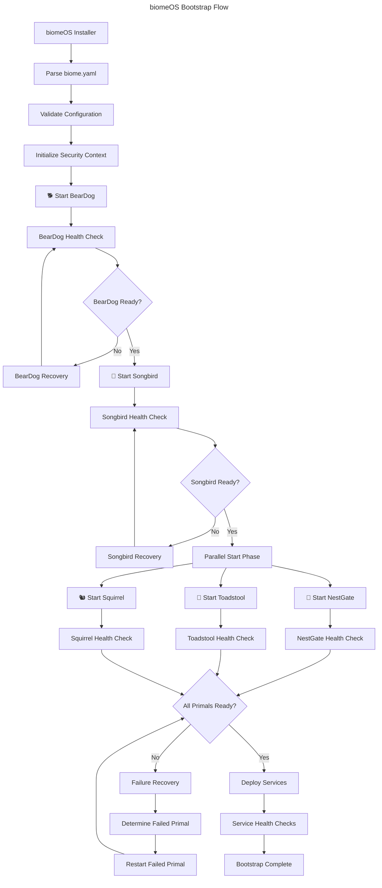
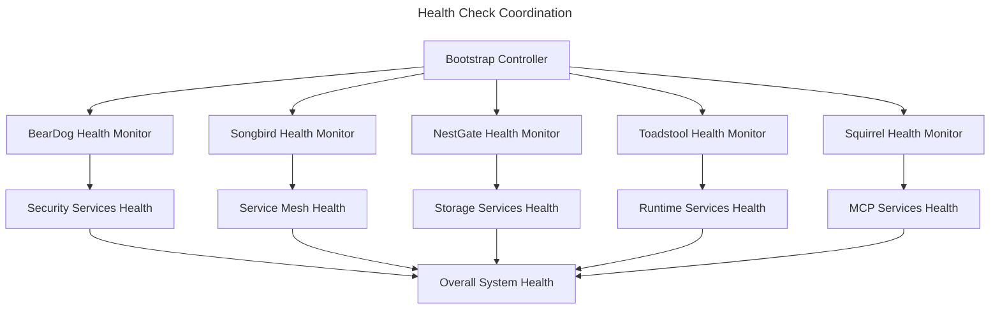
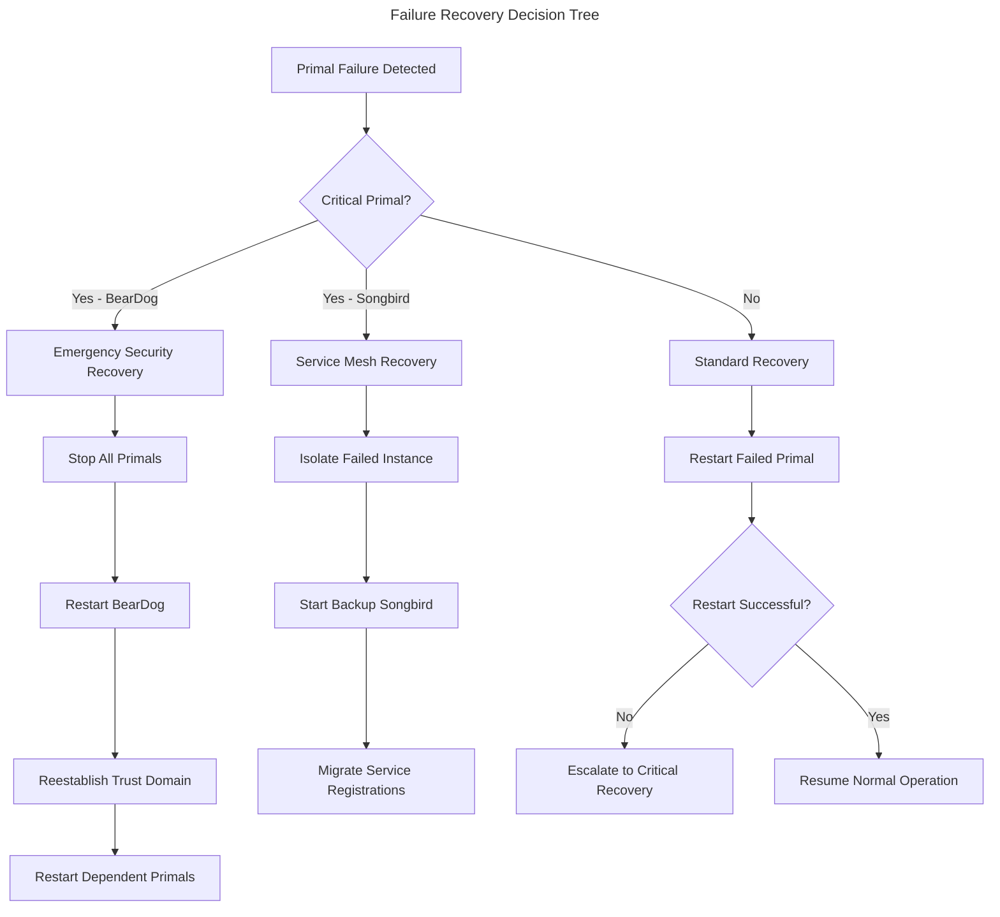

# Bootstrap Orchestration Sequence

**Version:** 1.0.0 | **Status:** Draft | **Date:** January 2025

---

## Overview

This specification defines the complete bootstrap orchestration sequence for biomeOS, including Primal startup dependencies, health check coordination, failure recovery procedures, and the overall system initialization process.

## Bootstrap Architecture



## Startup Dependency Graph

### Phase 1: Security Foundation (Critical Path)
```yaml
phase_1:
  name: "Security Foundation"
  critical: true
  timeout: 120s
  
  steps:
    - name: beardog_startup
      primal: beardog
      priority: 1
      timeout: 60s
      dependencies: []
      health_check:
        endpoint: "/health"
        interval: 5s
        retries: 12
      
    - name: security_context_validation
      type: validation
      timeout: 30s
      dependencies: [beardog_startup]
      checks:
        - hsm_connectivity
        - certificate_authority_ready
        - root_secrets_accessible
      
    - name: trust_anchor_establishment
      type: security
      timeout: 30s
      dependencies: [security_context_validation]
      actions:
        - generate_ca_certificates
        - initialize_trust_domain
        - create_service_accounts
```

### Phase 2: Service Mesh (Critical Path)
```yaml
phase_2:
  name: "Service Mesh Foundation"
  critical: true
  timeout: 90s
  dependencies: [phase_1]
  
  steps:
    - name: songbird_startup
      primal: songbird
      priority: 2
      timeout: 60s
      dependencies: [beardog_startup]
      health_check:
        endpoint: "/health"
        interval: 5s
        retries: 12
      
    - name: service_discovery_ready
      type: validation
      timeout: 30s
      dependencies: [songbird_startup]
      checks:
        - discovery_backend_connected
        - load_balancer_operational
        - health_monitoring_active
```

### Phase 3: Core Services (Parallel)
```yaml
phase_3:
  name: "Core Services"
  critical: false
  timeout: 180s
  dependencies: [phase_2]
  parallel: true
  
  steps:
    - name: nestgate_startup
      primal: nestgate
      priority: 3
      timeout: 120s
      dependencies: [beardog_startup, songbird_startup]
      health_check:
        endpoint: "/health"
        interval: 10s
        retries: 12
      pre_checks:
        - zfs_pools_available
        - storage_devices_accessible
        - encryption_keys_ready
      
    - name: toadstool_startup
      primal: toadstool
      priority: 4
      timeout: 90s
      dependencies: [beardog_startup, songbird_startup]
      health_check:
        endpoint: "/health"
        interval: 10s
        retries: 9
      pre_checks:
        - container_runtime_ready
        - resource_pools_available
        - gpu_drivers_loaded
      
    - name: squirrel_startup
      primal: squirrel
      priority: 5
      timeout: 120s
      dependencies: [beardog_startup, songbird_startup]
      health_check:
        endpoint: "/health"
        interval: 10s
        retries: 12
      pre_checks:
        - ai_providers_accessible
        - plugin_system_ready
        - mcp_protocol_available
```

### Phase 4: Service Deployment
```yaml
phase_4:
  name: "Service Deployment"
  critical: false
  timeout: 300s
  dependencies: [phase_3]
  
  steps:
    - name: volume_provisioning
      type: orchestration
      timeout: 180s
      dependencies: [nestgate_startup]
      actions:
        - provision_required_volumes
        - mount_volumes_to_services
        - verify_volume_accessibility
      
    - name: service_deployment
      type: orchestration
      timeout: 120s
      dependencies: [toadstool_startup, volume_provisioning]
      actions:
        - deploy_defined_services
        - register_services_with_songbird
        - start_health_monitoring
```

## Health Check Coordination

### Health Check Hierarchy



### Health Check Implementation

```python
class BootstrapHealthCoordinator:
    def __init__(self, biome_config):
        self.biome_config = biome_config
        self.health_checks = {}
        self.startup_sequence = StartupSequence(biome_config)
        
    async def coordinate_startup(self):
        """Coordinate the complete biomeOS startup sequence"""
        try:
            # Phase 1: Security Foundation
            await self.start_security_phase()
            
            # Phase 2: Service Mesh
            await self.start_service_mesh_phase()
            
            # Phase 3: Core Services (Parallel)
            await self.start_core_services_phase()
            
            # Phase 4: Service Deployment
            await self.start_service_deployment_phase()
            
            # Final validation
            await self.validate_complete_system()
            
            logger.info("biomeOS bootstrap completed successfully")
            return BootstrapResult.SUCCESS
            
        except BootstrapException as e:
            logger.error(f"Bootstrap failed: {e}")
            await self.handle_bootstrap_failure(e)
            return BootstrapResult.FAILURE
    
    async def start_security_phase(self):
        """Phase 1: Start BearDog and establish security context"""
        phase = self.startup_sequence.get_phase("security_foundation")
        
        # Start BearDog
        beardog_result = await self.start_primal(
            primal="beardog",
            timeout=phase.timeout,
            health_check_interval=5
        )
        
        if not beardog_result.success:
            raise BootstrapException("BearDog startup failed", beardog_result.error)
        
        # Validate security context
        security_validation = await self.validate_security_context()
        if not security_validation.success:
            raise BootstrapException("Security context validation failed")
        
        # Establish trust domain
        await self.establish_trust_domain()
        
    async def start_primal(self, primal: str, timeout: int, health_check_interval: int):
        """Start a specific Primal with health monitoring"""
        primal_config = self.biome_config.primals[primal]
        
        # Start the Primal process
        process = await self.launch_primal_process(primal, primal_config)
        
        # Monitor health until ready
        health_monitor = PrimalHealthMonitor(
            primal=primal,
            endpoint=primal_config.endpoints.health,
            interval=health_check_interval,
            timeout=timeout
        )
        
        result = await health_monitor.wait_for_healthy()
        
        if result.success:
            # Register with service mesh (if Songbird is available)
            if primal != "beardog" and self.is_songbird_ready():
                await self.register_primal_with_songbird(primal, primal_config)
        
        return result
```

### Health Check Specifications

#### BearDog Health Check
```json
{
  "endpoint": "/health",
  "method": "GET",
  "timeout": "10s",
  "interval": "5s",
  "expected_response": {
    "status": "healthy",
    "components": {
      "hsm": "operational",
      "certificate_authority": "ready",
      "secret_store": "accessible",
      "audit_service": "running"
    }
  },
  "failure_threshold": 3,
  "recovery_actions": [
    "restart_hsm_connection",
    "reinitialize_ca",
    "restart_beardog_service"
  ]
}
```

#### Songbird Health Check
```json
{
  "endpoint": "/health",
  "method": "GET", 
  "timeout": "10s",
  "interval": "5s",
  "expected_response": {
    "status": "healthy",
    "components": {
      "discovery_backend": "connected",
      "load_balancer": "operational",
      "health_monitor": "active",
      "federation": "ready"
    }
  },
  "dependencies": ["beardog"],
  "failure_threshold": 3
}
```

#### NestGate Health Check
```json
{
  "endpoint": "/health",
  "method": "GET",
  "timeout": "15s",
  "interval": "10s",
  "expected_response": {
    "status": "healthy",
    "components": {
      "zfs_pools": "online",
      "volume_service": "ready",
      "backup_service": "operational",
      "encryption_service": "ready"
    }
  },
  "dependencies": ["beardog", "songbird"],
  "pre_startup_checks": [
    "zfs_pools_importable",
    "storage_devices_accessible",
    "encryption_keys_available"
  ]
}
```

## Failure Recovery Procedures

### Recovery Decision Matrix



### Recovery Procedures

#### BearDog Recovery (Critical)
```python
async def recover_beardog_failure(self, failure_context):
    """Critical recovery procedure for BearDog failure"""
    logger.critical("BearDog failure detected - initiating emergency recovery")
    
    # 1. Stop all dependent Primals immediately
    await self.emergency_stop_all_primals()
    
    # 2. Preserve security state
    security_backup = await self.backup_security_state()
    
    # 3. Restart BearDog with preserved state
    beardog_result = await self.restart_beardog_with_backup(security_backup)
    
    if not beardog_result.success:
        # Escalate to manual intervention
        await self.escalate_to_manual_recovery("beardog_restart_failed")
        return RecoveryResult.MANUAL_INTERVENTION_REQUIRED
    
    # 4. Reestablish trust domain
    await self.reestablish_trust_domain()
    
    # 5. Restart dependent Primals in sequence
    await self.restart_dependent_primals_sequence()
    
    return RecoveryResult.SUCCESS
```

#### Standard Primal Recovery
```python
async def recover_primal_failure(self, primal: str, failure_context):
    """Standard recovery procedure for non-critical Primal failure"""
    logger.warning(f"{primal} failure detected - initiating recovery")
    
    # 1. Isolate failed Primal
    await self.isolate_failed_primal(primal)
    
    # 2. Preserve Primal state if possible
    primal_state = await self.backup_primal_state(primal)
    
    # 3. Attempt restart with exponential backoff
    for attempt in range(3):
        restart_result = await self.restart_primal_with_backoff(
            primal, primal_state, attempt
        )
        
        if restart_result.success:
            # Re-register with service mesh
            await self.reregister_primal_services(primal)
            return RecoveryResult.SUCCESS
    
    # 4. If restart fails, escalate
    logger.error(f"{primal} recovery failed after 3 attempts")
    await self.escalate_recovery_failure(primal, failure_context)
    
    return RecoveryResult.ESCALATED
```

### Timeout and Retry Configuration

```yaml
timeout_configuration:
  global_bootstrap_timeout: 600s  # 10 minutes
  
  phase_timeouts:
    security_foundation: 120s
    service_mesh: 90s
    core_services: 180s
    service_deployment: 300s
  
  primal_timeouts:
    beardog: 60s
    songbird: 45s
    nestgate: 120s
    toadstool: 90s
    squirrel: 120s
  
  health_check_configuration:
    initial_delay: 10s
    interval: 5s
    timeout: 10s
    retries: 12
    grace_period: 30s
  
  retry_policies:
    exponential_backoff:
      base_delay: 1s
      max_delay: 60s
      multiplier: 2
      max_attempts: 5
    
    linear_backoff:
      delay: 5s
      max_attempts: 3
```

## Bootstrap Monitoring & Observability

### Bootstrap Metrics

```prometheus
# Bootstrap progress
biome_bootstrap_phase_duration_seconds{phase="security_foundation"} 45.2
biome_bootstrap_phase_status{phase="security_foundation"} 1

# Primal startup metrics
biome_primal_startup_duration_seconds{primal="beardog"} 32.1
biome_primal_health_check_duration_seconds{primal="beardog"} 0.5

# Failure metrics
biome_bootstrap_failures_total{phase="core_services",reason="timeout"} 2
biome_primal_restart_attempts_total{primal="nestgate"} 1

# Overall bootstrap status
biome_bootstrap_status{biome_id="research-biome-001"} 1  # 1=success, 0=failure
```

### Bootstrap Logging

```json
{
  "timestamp": "2025-01-15T10:30:00Z",
  "level": "INFO",
  "component": "bootstrap_controller",
  "message": "Starting biomeOS bootstrap sequence",
  "biome_id": "research-biome-001",
  "biome_version": "1.0.0",
  "context": {
    "total_primals": 5,
    "expected_services": 12,
    "bootstrap_timeout": "600s"
  }
}
```

### Bootstrap Events

```json
{
  "event_type": "primal_startup_completed",
  "timestamp": "2025-01-15T10:30:45Z",
  "source": "bootstrap_controller",
  "data": {
    "primal": "beardog",
    "startup_duration": "32.1s",
    "health_check_attempts": 7,
    "status": "healthy"
  }
}
```

## Configuration Management

### Bootstrap Configuration
```yaml
# bootstrap-config.yaml
bootstrap:
  global_timeout: 600s
  parallel_startup: true
  failure_tolerance: medium
  
  phases:
    - name: security_foundation
      critical: true
      timeout: 120s
      primals: [beardog]
      
    - name: service_mesh
      critical: true
      timeout: 90s
      primals: [songbird]
      dependencies: [security_foundation]
      
    - name: core_services
      critical: false
      timeout: 180s
      primals: [nestgate, toadstool, squirrel]
      dependencies: [service_mesh]
      parallel: true
      
  health_monitoring:
    enabled: true
    interval: 5s
    timeout: 10s
    retries: 12
    
  failure_recovery:
    enabled: true
    max_recovery_attempts: 3
    escalation_timeout: 300s
    
  observability:
    metrics_enabled: true
    logging_level: info
    tracing_enabled: true
```

## Testing & Validation

### Bootstrap Testing Framework

```python
class BootstrapTestSuite:
    def test_normal_startup_sequence(self):
        """Test normal bootstrap sequence completion"""
        bootstrap = BiomeBootstrap(test_config)
        result = await bootstrap.start()
        
        assert result.status == BootstrapStatus.SUCCESS
        assert result.duration < 600  # 10 minutes
        assert all(primal.status == "healthy" for primal in result.primals)
    
    def test_beardog_failure_recovery(self):
        """Test recovery from BearDog failure"""
        bootstrap = BiomeBootstrap(test_config)
        
        # Simulate BearDog failure during startup
        with mock_primal_failure("beardog", after_seconds=30):
            result = await bootstrap.start()
        
        assert result.status == BootstrapStatus.SUCCESS
        assert result.recovery_attempts > 0
        assert result.beardog_restarts == 1
    
    def test_parallel_startup_efficiency(self):
        """Test that parallel startup improves performance"""
        config_sequential = test_config.copy()
        config_sequential.bootstrap.parallel_startup = False
        
        config_parallel = test_config.copy()
        config_parallel.bootstrap.parallel_startup = True
        
        sequential_time = await time_bootstrap(config_sequential)
        parallel_time = await time_bootstrap(config_parallel)
        
        assert parallel_time < sequential_time * 0.8  # 20% improvement
```

### Bootstrap Validation Checklist

```yaml
validation_checklist:
  pre_bootstrap:
    - biome_yaml_valid: true
    - hardware_requirements_met: true
    - network_connectivity: true
    - storage_devices_available: true
    
  during_bootstrap:
    - primal_startup_order_correct: true
    - health_checks_responding: true
    - service_registration_successful: true
    - security_context_established: true
    
  post_bootstrap:
    - all_primals_healthy: true
    - services_deployed: true
    - cross_primal_communication: true
    - monitoring_active: true
    
  failure_scenarios:
    - beardog_failure_recovery: tested
    - network_partition_recovery: tested
    - storage_failure_handling: tested
    - timeout_handling: tested
```

This specification provides a comprehensive framework for orchestrating the biomeOS bootstrap sequence, ensuring reliable startup, proper dependency management, and robust failure recovery across all Primals. 