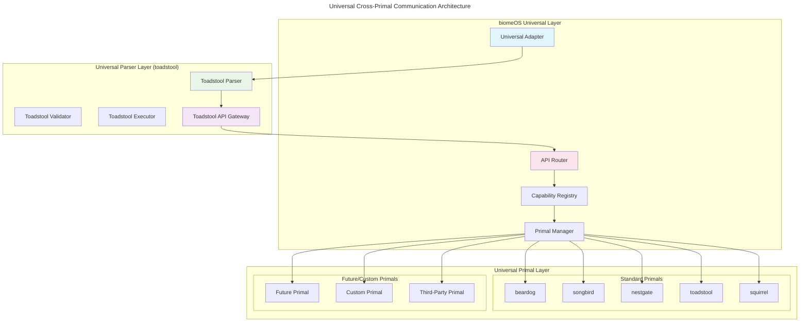

# Cross-Primal Universal API Contracts

**Version:** 1.0.0 | **Status:** Implementation Ready | **Date:** January 2025

**Related Documents:**
- [UNIVERSAL_PARSER_ADAPTER_SPEC.md](./UNIVERSAL_PARSER_ADAPTER_SPEC.md)
- [ARCHITECTURE_OVERVIEW.md](./ARCHITECTURE_OVERVIEW.md)
- [TOADSTOOL_BIOMEOS_UNIFICATION_SPEC.md](./TOADSTOOL_BIOMEOS_UNIFICATION_SPEC.md)

---

## Overview

This specification defines the **Universal API Contracts** for cross-primal communication where **toadstool serves as the universal parser** and biomeOS provides universal adapter patterns for seamless integration with current and future Primals. The contracts ensure consistent, agnostic, and capability-based communication across all Primals in the ecosystem.

## Universal Parser Architecture

### Core Communication Flow



## Universal API Interface

### Core Universal Request/Response Format

```rust
// Universal request format for all Primals
#[derive(Debug, Clone, Serialize, Deserialize)]
pub struct UniversalRequest {
    /// Request identifier
    pub id: String,
    
    /// Source primal making the request
    pub source_primal: String,
    
    /// Target capability required
    pub capability: String,
    
    /// Optional target primal preference
    pub target_primal: Option<String>,
    
    /// Request payload
    pub payload: serde_json::Value,
    
    /// Request metadata
    pub metadata: RequestMetadata,
    
    /// Timestamp
    pub timestamp: chrono::DateTime<chrono::Utc>,
    
    /// Security context
    pub security_context: SecurityContext,
}

// Universal response format for all Primals
#[derive(Debug, Clone, Serialize, Deserialize)]
pub struct UniversalResponse {
    /// Response identifier (matches request id)
    pub id: String,
    
    /// Source primal providing the response
    pub source_primal: String,
    
    /// Request capability that was handled
    pub capability: String,
    
    /// Response status
    pub status: ResponseStatus,
    
    /// Response payload
    pub payload: serde_json::Value,
    
    /// Response metadata
    pub metadata: ResponseMetadata,
    
    /// Timestamp
    pub timestamp: chrono::DateTime<chrono::Utc>,
    
    /// Error information (if any)
    pub error: Option<UniversalError>,
}

// Universal error format
#[derive(Debug, Clone, Serialize, Deserialize)]
pub struct UniversalError {
    pub code: String,
    pub message: String,
    pub details: Option<serde_json::Value>,
    pub retryable: bool,
}

// Security context for requests
#[derive(Debug, Clone, Serialize, Deserialize)]
pub struct SecurityContext {
    pub auth_token: Option<String>,
    pub user_id: Option<String>,
    pub permissions: Vec<String>,
    pub security_level: SecurityLevel,
}

// Request metadata
#[derive(Debug, Clone, Serialize, Deserialize)]
pub struct RequestMetadata {
    pub trace_id: String,
    pub span_id: String,
    pub priority: Priority,
    pub timeout: Option<Duration>,
    pub retry_count: u32,
}

// Response metadata
#[derive(Debug, Clone, Serialize, Deserialize)]
pub struct ResponseMetadata {
    pub trace_id: String,
    pub span_id: String,
    pub processing_time: Duration,
    pub resource_usage: ResourceUsage,
}

// Response status
#[derive(Debug, Clone, Serialize, Deserialize)]
pub enum ResponseStatus {
    Success,
    Partial,
    Failed,
    Timeout,
    Retry,
}

// Priority levels
#[derive(Debug, Clone, Serialize, Deserialize)]
pub enum Priority {
    Low,
    Normal,
    High,
    Critical,
}

// Security levels
#[derive(Debug, Clone, Serialize, Deserialize)]
pub enum SecurityLevel {
    Public,
    Internal,
    Restricted,
    Confidential,
}
```

## Universal Primal Interface

### Universal Primal Trait

```rust
// Universal trait that all Primals must implement
#[async_trait]
pub trait UniversalPrimal: Send + Sync {
    /// Unique identifier for this Primal
    fn primal_id(&self) -> &str;
    
    /// Type of this Primal
    fn primal_type(&self) -> PrimalType;
    
    /// Capabilities this Primal provides
    fn capabilities(&self) -> Vec<String>;
    
    /// Version of this Primal
    fn version(&self) -> &str;
    
    /// Initialize the Primal with configuration
    async fn initialize(&mut self, config: serde_json::Value) -> Result<()>;
    
    /// Health check for this Primal
    async fn health_check(&self) -> HealthStatus;
    
    /// Shutdown the Primal gracefully
    async fn shutdown(&mut self) -> Result<()>;
    
    /// Handle a universal request
    async fn handle_request(&self, request: UniversalRequest) -> Result<UniversalResponse>;
    
    /// Check if this Primal can handle a specific capability
    async fn can_handle_capability(&self, capability: &str) -> bool;
    
    /// Get metadata for a specific capability
    async fn get_capability_metadata(&self, capability: &str) -> Option<CapabilityMetadata>;
    
    /// Get dynamic configuration for this Primal
    fn get_dynamic_config(&self) -> Option<serde_json::Value>;
    
    /// Register with toadstool parser
    async fn register_with_parser(&self, parser_endpoint: &str) -> Result<()>;
    
    /// Notify parser of status changes
    async fn notify_parser_status(&self, status: PrimalStatus) -> Result<()>;
}

// Primal types
#[derive(Debug, Clone, Serialize, Deserialize, PartialEq)]
pub enum PrimalType {
    Security,
    Storage,
    ServiceMesh,
    Runtime,
    AI,
    Custom(String),
}

// Health status
#[derive(Debug, Clone, Serialize, Deserialize)]
pub enum HealthStatus {
    Healthy,
    Degraded,
    Unhealthy,
    Unknown,
}

// Primal status
#[derive(Debug, Clone, Serialize, Deserialize)]
pub enum PrimalStatus {
    Starting,
    Running,
    Stopping,
    Stopped,
    Error(String),
}

// Capability metadata
#[derive(Debug, Clone, Serialize, Deserialize)]
pub struct CapabilityMetadata {
    pub name: String,
    pub version: String,
    pub description: String,
    pub parameters: Vec<CapabilityParameter>,
    pub security_requirements: Vec<String>,
    pub resource_requirements: ResourceRequirements,
}

// Capability parameter
#[derive(Debug, Clone, Serialize, Deserialize)]
pub struct CapabilityParameter {
    pub name: String,
    pub param_type: String,
    pub required: bool,
    pub default_value: Option<String>,
    pub description: String,
}

// Resource requirements
#[derive(Debug, Clone, Serialize, Deserialize)]
pub struct ResourceRequirements {
    pub cpu: Option<String>,
    pub memory: Option<String>,
    pub storage: Option<String>,
    pub network: Option<String>,
}
```

## Toadstool Parser Integration

### Universal Parser Interface

```rust
// Universal parser interface for toadstool
#[async_trait]
pub trait UniversalParser: Send + Sync {
    /// Parse a biome manifest
    async fn parse_manifest(&self, manifest_path: &str) -> Result<ParsedManifest>;
    
    /// Validate a parsed manifest
    async fn validate_manifest(&self, manifest: &ParsedManifest) -> Result<ValidationResult>;
    
    /// Execute a manifest with resolved Primals
    async fn execute_manifest(
        &self, 
        manifest: ParsedManifest, 
        primals: Vec<ResolvedPrimal>
    ) -> Result<ExecutionResult>;
    
    /// Get parser status
    async fn get_status(&self) -> ParserStatus;
    
    /// Register a Primal with the parser
    async fn register_primal(&self, primal: Arc<dyn UniversalPrimal>) -> Result<()>;
    
    /// Unregister a Primal from the parser
    async fn unregister_primal(&self, primal_id: &str) -> Result<()>;
    
    /// Route a request to the appropriate Primal
    async fn route_request(&self, request: UniversalRequest) -> Result<UniversalResponse>;
    
    /// Get registered Primals
    async fn get_registered_primals(&self) -> Vec<PrimalInfo>;
    
    /// Get capability registry
    async fn get_capability_registry(&self) -> CapabilityRegistry;
}

// Parsed manifest structure
#[derive(Debug, Clone, Serialize, Deserialize)]
pub struct ParsedManifest {
    pub api_version: String,
    pub kind: String,
    pub metadata: ManifestMetadata,
    pub primals: HashMap<String, PrimalSpec>,
    pub services: Vec<ServiceSpec>,
    pub volumes: HashMap<String, VolumeSpec>,
    pub networks: HashMap<String, NetworkSpec>,
    pub sources: SourceSpec,
    pub mycorrhiza: Option<MycorrhizaSpec>,
}

// Validation result
#[derive(Debug, Clone, Serialize, Deserialize)]
pub struct ValidationResult {
    pub valid: bool,
    pub errors: Vec<ValidationError>,
    pub warnings: Vec<ValidationWarning>,
}

// Execution result
#[derive(Debug, Clone, Serialize, Deserialize)]
pub struct ExecutionResult {
    pub success: bool,
    pub deployed_primals: Vec<DeployedPrimal>,
    pub failed_primals: Vec<FailedPrimal>,
    pub execution_time: Duration,
    pub resource_usage: ResourceUsage,
}

// Parser status
#[derive(Debug, Clone, Serialize, Deserialize)]
pub struct ParserStatus {
    pub status: String,
    pub version: String,
    pub registered_primals: usize,
    pub active_deployments: usize,
    pub uptime: Duration,
}

// Primal info
#[derive(Debug, Clone, Serialize, Deserialize)]
pub struct PrimalInfo {
    pub id: String,
    pub primal_type: PrimalType,
    pub capabilities: Vec<String>,
    pub version: String,
    pub status: PrimalStatus,
    pub health: HealthStatus,
}
```

## Standard Primal API Contracts

### Beardog Security API

```rust
// Beardog universal security API
impl UniversalPrimal for BeardogAdapter {
    async fn handle_request(&self, request: UniversalRequest) -> Result<UniversalResponse> {
        match request.capability.as_str() {
            "encryption" => self.handle_encryption(request).await,
            "authentication" => self.handle_authentication(request).await,
            "authorization" => self.handle_authorization(request).await,
            "compliance" => self.handle_compliance(request).await,
            "hsm" => self.handle_hsm(request).await,
            _ => Err(UniversalError::unsupported_capability(&request.capability))
        }
    }
    
    async fn handle_encryption(&self, request: UniversalRequest) -> Result<UniversalResponse> {
        #[derive(Deserialize)]
        struct EncryptionRequest {
            data: String,
            algorithm: Option<String>,
            key_id: Option<String>,
        }
        
        #[derive(Serialize)]
        struct EncryptionResponse {
            encrypted_data: String,
            key_id: String,
            algorithm: String,
        }
        
        let req: EncryptionRequest = serde_json::from_value(request.payload)?;
        let result = self.beardog_client.encrypt(&req.data, req.algorithm, req.key_id).await?;
        
        Ok(UniversalResponse {
            id: request.id,
            source_primal: self.primal_id().to_string(),
            capability: "encryption".to_string(),
            status: ResponseStatus::Success,
            payload: serde_json::to_value(EncryptionResponse {
                encrypted_data: result.encrypted_data,
                key_id: result.key_id,
                algorithm: result.algorithm,
            })?,
            metadata: ResponseMetadata {
                trace_id: request.metadata.trace_id,
                span_id: request.metadata.span_id,
                processing_time: Duration::from_millis(10),
                resource_usage: ResourceUsage::minimal(),
            },
            timestamp: chrono::Utc::now(),
            error: None,
        })
    }
    
    async fn handle_authentication(&self, request: UniversalRequest) -> Result<UniversalResponse> {
        #[derive(Deserialize)]
        struct AuthRequest {
            credentials: String,
            auth_type: String,
        }
        
        #[derive(Serialize)]
        struct AuthResponse {
            token: String,
            expires_at: chrono::DateTime<chrono::Utc>,
            user_id: String,
            permissions: Vec<String>,
        }
        
        let req: AuthRequest = serde_json::from_value(request.payload)?;
        let result = self.beardog_client.authenticate(&req.credentials, &req.auth_type).await?;
        
        Ok(UniversalResponse {
            id: request.id,
            source_primal: self.primal_id().to_string(),
            capability: "authentication".to_string(),
            status: ResponseStatus::Success,
            payload: serde_json::to_value(AuthResponse {
                token: result.token,
                expires_at: result.expires_at,
                user_id: result.user_id,
                permissions: result.permissions,
            })?,
            metadata: ResponseMetadata {
                trace_id: request.metadata.trace_id,
                span_id: request.metadata.span_id,
                processing_time: Duration::from_millis(50),
                resource_usage: ResourceUsage::low(),
            },
            timestamp: chrono::Utc::now(),
            error: None,
        })
    }
}
```

### Songbird Service Mesh API

```rust
// Songbird universal service mesh API
impl UniversalPrimal for SongbirdAdapter {
    async fn handle_request(&self, request: UniversalRequest) -> Result<UniversalResponse> {
        match request.capability.as_str() {
            "service_discovery" => self.handle_service_discovery(request).await,
            "load_balancing" => self.handle_load_balancing(request).await,
            "api_gateway" => self.handle_api_gateway(request).await,
            "protocol_translation" => self.handle_protocol_translation(request).await,
            "federation" => self.handle_federation(request).await,
            _ => Err(UniversalError::unsupported_capability(&request.capability))
        }
    }
    
    async fn handle_service_discovery(&self, request: UniversalRequest) -> Result<UniversalResponse> {
        #[derive(Deserialize)]
        struct DiscoveryRequest {
            service_name: Option<String>,
            service_type: Option<String>,
            tags: Option<Vec<String>>,
        }
        
        #[derive(Serialize)]
        struct DiscoveryResponse {
            services: Vec<ServiceInfo>,
        }
        
        #[derive(Serialize)]
        struct ServiceInfo {
            id: String,
            name: String,
            address: String,
            port: u16,
            tags: Vec<String>,
            health: String,
        }
        
        let req: DiscoveryRequest = serde_json::from_value(request.payload)?;
        let services = self.songbird_client.discover_services(
            req.service_name,
            req.service_type,
            req.tags,
        ).await?;
        
        Ok(UniversalResponse {
            id: request.id,
            source_primal: self.primal_id().to_string(),
            capability: "service_discovery".to_string(),
            status: ResponseStatus::Success,
            payload: serde_json::to_value(DiscoveryResponse {
                services: services.into_iter().map(|s| ServiceInfo {
                    id: s.id,
                    name: s.name,
                    address: s.address,
                    port: s.port,
                    tags: s.tags,
                    health: s.health.to_string(),
                }).collect(),
            })?,
            metadata: ResponseMetadata {
                trace_id: request.metadata.trace_id,
                span_id: request.metadata.span_id,
                processing_time: Duration::from_millis(20),
                resource_usage: ResourceUsage::low(),
            },
            timestamp: chrono::Utc::now(),
            error: None,
        })
    }
    
    async fn handle_load_balancing(&self, request: UniversalRequest) -> Result<UniversalResponse> {
        #[derive(Deserialize)]
        struct LoadBalanceRequest {
            service_name: String,
            request_data: serde_json::Value,
            algorithm: Option<String>,
        }
        
        #[derive(Serialize)]
        struct LoadBalanceResponse {
            target_endpoint: String,
            response_data: serde_json::Value,
            load_info: LoadInfo,
        }
        
        #[derive(Serialize)]
        struct LoadInfo {
            algorithm_used: String,
            endpoint_selected: String,
            load_score: f64,
        }
        
        let req: LoadBalanceRequest = serde_json::from_value(request.payload)?;
        let result = self.songbird_client.balance_request(
            &req.service_name,
            req.request_data,
            req.algorithm,
        ).await?;
        
        Ok(UniversalResponse {
            id: request.id,
            source_primal: self.primal_id().to_string(),
            capability: "load_balancing".to_string(),
            status: ResponseStatus::Success,
            payload: serde_json::to_value(LoadBalanceResponse {
                target_endpoint: result.target_endpoint,
                response_data: result.response_data,
                load_info: LoadInfo {
                    algorithm_used: result.algorithm_used,
                    endpoint_selected: result.endpoint_selected,
                    load_score: result.load_score,
                },
            })?,
            metadata: ResponseMetadata {
                trace_id: request.metadata.trace_id,
                span_id: request.metadata.span_id,
                processing_time: Duration::from_millis(30),
                resource_usage: ResourceUsage::medium(),
            },
            timestamp: chrono::Utc::now(),
            error: None,
        })
    }
}
```

### Nestgate Storage API

```rust
// Nestgate universal storage API
impl UniversalPrimal for NestgateAdapter {
    async fn handle_request(&self, request: UniversalRequest) -> Result<UniversalResponse> {
        match request.capability.as_str() {
            "persistent_storage" => self.handle_persistent_storage(request).await,
            "tiered_storage" => self.handle_tiered_storage(request).await,
            "backup" => self.handle_backup(request).await,
            "encryption" => self.handle_storage_encryption(request).await,
            _ => Err(UniversalError::unsupported_capability(&request.capability))
        }
    }
    
    async fn handle_persistent_storage(&self, request: UniversalRequest) -> Result<UniversalResponse> {
        #[derive(Deserialize)]
        struct StorageRequest {
            operation: String, // "create", "read", "update", "delete"
            path: String,
            data: Option<serde_json::Value>,
            metadata: Option<HashMap<String, String>>,
        }
        
        #[derive(Serialize)]
        struct StorageResponse {
            success: bool,
            path: String,
            data: Option<serde_json::Value>,
            metadata: Option<HashMap<String, String>>,
            storage_info: StorageInfo,
        }
        
        #[derive(Serialize)]
        struct StorageInfo {
            size: u64,
            created_at: chrono::DateTime<chrono::Utc>,
            modified_at: chrono::DateTime<chrono::Utc>,
            storage_tier: String,
            checksum: String,
        }
        
        let req: StorageRequest = serde_json::from_value(request.payload)?;
        
        let result = match req.operation.as_str() {
            "create" => self.nestgate_client.create_object(&req.path, req.data, req.metadata).await?,
            "read" => self.nestgate_client.read_object(&req.path).await?,
            "update" => self.nestgate_client.update_object(&req.path, req.data, req.metadata).await?,
            "delete" => self.nestgate_client.delete_object(&req.path).await?,
            _ => return Err(UniversalError::invalid_operation(&req.operation)),
        };
        
        Ok(UniversalResponse {
            id: request.id,
            source_primal: self.primal_id().to_string(),
            capability: "persistent_storage".to_string(),
            status: ResponseStatus::Success,
            payload: serde_json::to_value(StorageResponse {
                success: result.success,
                path: result.path,
                data: result.data,
                metadata: result.metadata,
                storage_info: StorageInfo {
                    size: result.size,
                    created_at: result.created_at,
                    modified_at: result.modified_at,
                    storage_tier: result.storage_tier,
                    checksum: result.checksum,
                },
            })?,
            metadata: ResponseMetadata {
                trace_id: request.metadata.trace_id,
                span_id: request.metadata.span_id,
                processing_time: Duration::from_millis(100),
                resource_usage: ResourceUsage::high(),
            },
            timestamp: chrono::Utc::now(),
            error: None,
        })
    }
}
```

### Toadstool Runtime API

```rust
// Toadstool universal runtime API (dual role: parser + runtime)
impl UniversalPrimal for ToadstoolAdapter {
    async fn handle_request(&self, request: UniversalRequest) -> Result<UniversalResponse> {
        match request.capability.as_str() {
            "container_orchestration" => self.handle_container_orchestration(request).await,
            "wasm_runtime" => self.handle_wasm_runtime(request).await,
            "process_isolation" => self.handle_process_isolation(request).await,
            "resource_management" => self.handle_resource_management(request).await,
            "manifest_parsing" => self.handle_manifest_parsing(request).await,
            _ => Err(UniversalError::unsupported_capability(&request.capability))
        }
    }
    
    async fn handle_container_orchestration(&self, request: UniversalRequest) -> Result<UniversalResponse> {
        #[derive(Deserialize)]
        struct ContainerRequest {
            operation: String, // "create", "start", "stop", "delete", "list"
            container_spec: Option<ContainerSpec>,
            container_id: Option<String>,
        }
        
        #[derive(Deserialize)]
        struct ContainerSpec {
            image: String,
            command: Option<Vec<String>>,
            environment: Option<HashMap<String, String>>,
            volumes: Option<Vec<VolumeMount>>,
            networks: Option<Vec<String>>,
            resources: Option<ResourceLimits>,
        }
        
        #[derive(Serialize)]
        struct ContainerResponse {
            success: bool,
            container_id: Option<String>,
            containers: Option<Vec<ContainerInfo>>,
            operation: String,
        }
        
        #[derive(Serialize)]
        struct ContainerInfo {
            id: String,
            name: String,
            image: String,
            status: String,
            created_at: chrono::DateTime<chrono::Utc>,
            resource_usage: ResourceUsage,
        }
        
        let req: ContainerRequest = serde_json::from_value(request.payload)?;
        
        let result = match req.operation.as_str() {
            "create" => {
                let spec = req.container_spec.ok_or_else(|| UniversalError::missing_field("container_spec"))?;
                self.toadstool_client.create_container(spec).await?
            }
            "start" => {
                let id = req.container_id.ok_or_else(|| UniversalError::missing_field("container_id"))?;
                self.toadstool_client.start_container(&id).await?
            }
            "stop" => {
                let id = req.container_id.ok_or_else(|| UniversalError::missing_field("container_id"))?;
                self.toadstool_client.stop_container(&id).await?
            }
            "delete" => {
                let id = req.container_id.ok_or_else(|| UniversalError::missing_field("container_id"))?;
                self.toadstool_client.delete_container(&id).await?
            }
            "list" => self.toadstool_client.list_containers().await?,
            _ => return Err(UniversalError::invalid_operation(&req.operation)),
        };
        
        Ok(UniversalResponse {
            id: request.id,
            source_primal: self.primal_id().to_string(),
            capability: "container_orchestration".to_string(),
            status: ResponseStatus::Success,
            payload: serde_json::to_value(result)?,
            metadata: ResponseMetadata {
                trace_id: request.metadata.trace_id,
                span_id: request.metadata.span_id,
                processing_time: Duration::from_millis(200),
                resource_usage: ResourceUsage::high(),
            },
            timestamp: chrono::Utc::now(),
            error: None,
        })
    }
    
    async fn handle_manifest_parsing(&self, request: UniversalRequest) -> Result<UniversalResponse> {
        #[derive(Deserialize)]
        struct ParseRequest {
            manifest_content: String,
            manifest_path: Option<String>,
            validation_level: Option<String>,
        }
        
        #[derive(Serialize)]
        struct ParseResponse {
            success: bool,
            parsed_manifest: Option<ParsedManifest>,
            validation_result: ValidationResult,
            parse_time: Duration,
        }
        
        let req: ParseRequest = serde_json::from_value(request.payload)?;
        let start_time = std::time::Instant::now();
        
        let result = if let Some(path) = req.manifest_path {
            self.toadstool_client.parse_manifest_file(&path).await?
        } else {
            self.toadstool_client.parse_manifest_content(&req.manifest_content).await?
        };
        
        let parse_time = start_time.elapsed();
        
        Ok(UniversalResponse {
            id: request.id,
            source_primal: self.primal_id().to_string(),
            capability: "manifest_parsing".to_string(),
            status: ResponseStatus::Success,
            payload: serde_json::to_value(ParseResponse {
                success: result.success,
                parsed_manifest: result.parsed_manifest,
                validation_result: result.validation_result,
                parse_time: parse_time.into(),
            })?,
            metadata: ResponseMetadata {
                trace_id: request.metadata.trace_id,
                span_id: request.metadata.span_id,
                processing_time: parse_time.into(),
                resource_usage: ResourceUsage::medium(),
            },
            timestamp: chrono::Utc::now(),
            error: None,
        })
    }
}
```

## Future Primal Integration

### Custom Primal Example

```rust
// Example: Custom AI inference primal
impl UniversalPrimal for CustomAIPrimal {
    async fn handle_request(&self, request: UniversalRequest) -> Result<UniversalResponse> {
        match request.capability.as_str() {
            "llm_inference" => self.handle_llm_inference(request).await,
            "embedding_generation" => self.handle_embedding_generation(request).await,
            "vision_processing" => self.handle_vision_processing(request).await,
            _ => Err(UniversalError::unsupported_capability(&request.capability))
        }
    }
    
    async fn handle_llm_inference(&self, request: UniversalRequest) -> Result<UniversalResponse> {
        #[derive(Deserialize)]
        struct LLMRequest {
            prompt: String,
            model: Option<String>,
            parameters: Option<HashMap<String, serde_json::Value>>,
        }
        
        #[derive(Serialize)]
        struct LLMResponse {
            response: String,
            model_used: String,
            tokens_used: u32,
            processing_time: Duration,
        }
        
        let req: LLMRequest = serde_json::from_value(request.payload)?;
        let result = self.ai_client.generate_text(
            &req.prompt,
            req.model,
            req.parameters,
        ).await?;
        
        Ok(UniversalResponse {
            id: request.id,
            source_primal: self.primal_id().to_string(),
            capability: "llm_inference".to_string(),
            status: ResponseStatus::Success,
            payload: serde_json::to_value(LLMResponse {
                response: result.response,
                model_used: result.model_used,
                tokens_used: result.tokens_used,
                processing_time: result.processing_time,
            })?,
            metadata: ResponseMetadata {
                trace_id: request.metadata.trace_id,
                span_id: request.metadata.span_id,
                processing_time: result.processing_time,
                resource_usage: ResourceUsage::high(),
            },
            timestamp: chrono::Utc::now(),
            error: None,
        })
    }
}
```

## Universal API Router

### Request Routing Logic

```rust
// Universal API router for cross-primal communication
pub struct UniversalAPIRouter {
    primal_registry: Arc<PrimalRegistry>,
    capability_registry: Arc<CapabilityRegistry>,
    toadstool_parser: Arc<dyn UniversalParser>,
    metrics_collector: Arc<MetricsCollector>,
    security_manager: Arc<SecurityManager>,
}

impl UniversalAPIRouter {
    pub async fn route_request(&self, request: UniversalRequest) -> Result<UniversalResponse> {
        let span = tracing::info_span!("route_request", 
            request_id = %request.id,
            capability = %request.capability
        );
        let _enter = span.enter();
        
        // 1. Validate request
        self.validate_request(&request).await?;
        
        // 2. Check security
        self.security_manager.authorize_request(&request).await?;
        
        // 3. Resolve target primal
        let target_primal = self.resolve_target_primal(&request).await?;
        
        // 4. Route to primal
        let response = target_primal.handle_request(request.clone()).await?;
        
        // 5. Collect metrics
        self.metrics_collector.record_request(&request, &response).await?;
        
        // 6. Notify parser if needed
        if request.capability == "manifest_parsing" {
            self.toadstool_parser.notify_parser_activity(&request, &response).await?;
        }
        
        Ok(response)
    }
    
    async fn resolve_target_primal(&self, request: &UniversalRequest) -> Result<Arc<dyn UniversalPrimal>> {
        // 1. Check for specific primal preference
        if let Some(target_primal) = &request.target_primal {
            if let Some(primal) = self.primal_registry.get_primal(target_primal).await? {
                if primal.can_handle_capability(&request.capability).await {
                    return Ok(primal);
                }
            }
        }
        
        // 2. Use capability registry to find best match
        let providers = self.capability_registry
            .find_providers_for_capability(&request.capability)
            .await?;
        
        if providers.is_empty() {
            return Err(UniversalError::capability_not_found(&request.capability));
        }
        
        // 3. Select best provider based on load, health, etc.
        let best_provider = self.select_best_provider(providers, request).await?;
        
        Ok(best_provider)
    }
    
    async fn select_best_provider(
        &self,
        providers: Vec<Arc<dyn UniversalPrimal>>,
        request: &UniversalRequest,
    ) -> Result<Arc<dyn UniversalPrimal>> {
        let mut best_provider = None;
        let mut best_score = f64::MIN;
        
        for provider in providers {
            // Check health
            let health = provider.health_check().await;
            if !matches!(health, HealthStatus::Healthy) {
                continue;
            }
            
            // Calculate score based on various factors
            let score = self.calculate_provider_score(&provider, request).await?;
            
            if score > best_score {
                best_score = score;
                best_provider = Some(provider);
            }
        }
        
        best_provider.ok_or_else(|| UniversalError::no_healthy_providers(&request.capability))
    }
    
    async fn calculate_provider_score(
        &self,
        provider: &Arc<dyn UniversalPrimal>,
        request: &UniversalRequest,
    ) -> Result<f64> {
        let mut score = 0.0;
        
        // Factor 1: Health status
        match provider.health_check().await {
            HealthStatus::Healthy => score += 100.0,
            HealthStatus::Degraded => score += 50.0,
            _ => score += 0.0,
        }
        
        // Factor 2: Current load (from metrics)
        let load = self.metrics_collector.get_provider_load(provider.primal_id()).await?;
        score += (1.0 - load) * 50.0;
        
        // Factor 3: Capability match quality
        if let Some(metadata) = provider.get_capability_metadata(&request.capability).await {
            score += 25.0; // Bonus for detailed capability metadata
        }
        
        // Factor 4: Security level match
        if request.security_context.security_level == SecurityLevel::Confidential {
            // Prefer security-focused primals for confidential requests
            if provider.primal_type() == PrimalType::Security {
                score += 20.0;
            }
        }
        
        // Factor 5: Request priority
        match request.metadata.priority {
            Priority::Critical => score += 10.0,
            Priority::High => score += 5.0,
            _ => {}
        }
        
        Ok(score)
    }
    
    async fn validate_request(&self, request: &UniversalRequest) -> Result<()> {
        // Validate request structure
        if request.id.is_empty() {
            return Err(UniversalError::invalid_request("missing request id"));
        }
        
        if request.capability.is_empty() {
            return Err(UniversalError::invalid_request("missing capability"));
        }
        
        if request.source_primal.is_empty() {
            return Err(UniversalError::invalid_request("missing source primal"));
        }
        
        // Validate capability exists
        if !self.capability_registry.capability_exists(&request.capability).await? {
            return Err(UniversalError::capability_not_found(&request.capability));
        }
        
        // Validate timeout
        if let Some(timeout) = request.metadata.timeout {
            if timeout > Duration::from_secs(300) {
                return Err(UniversalError::invalid_request("timeout too long"));
            }
        }
        
        Ok(())
    }
}
```

## Error Handling and Recovery

### Universal Error Types

```rust
// Universal error types for cross-primal communication
#[derive(thiserror::Error, Debug)]
pub enum UniversalError {
    #[error("Capability '{capability}' not found")]
    CapabilityNotFound { capability: String },
    
    #[error("No healthy providers available for capability '{capability}'")]
    NoHealthyProviders { capability: String },
    
    #[error("Unsupported capability '{capability}' for primal '{primal}'")]
    UnsupportedCapability { capability: String, primal: String },
    
    #[error("Invalid request: {reason}")]
    InvalidRequest { reason: String },
    
    #[error("Invalid operation: {operation}")]
    InvalidOperation { operation: String },
    
    #[error("Missing required field: {field}")]
    MissingField { field: String },
    
    #[error("Security error: {message}")]
    SecurityError { message: String },
    
    #[error("Timeout waiting for response")]
    Timeout,
    
    #[error("Primal '{primal}' is unavailable")]
    PrimalUnavailable { primal: String },
    
    #[error("Parser error: {message}")]
    ParserError { message: String },
    
    #[error("Internal error: {message}")]
    InternalError { message: String },
}

impl UniversalError {
    pub fn unsupported_capability(capability: &str) -> Self {
        Self::UnsupportedCapability {
            capability: capability.to_string(),
            primal: "unknown".to_string(),
        }
    }
    
    pub fn capability_not_found(capability: &str) -> Self {
        Self::CapabilityNotFound {
            capability: capability.to_string(),
        }
    }
    
    pub fn no_healthy_providers(capability: &str) -> Self {
        Self::NoHealthyProviders {
            capability: capability.to_string(),
        }
    }
    
    pub fn invalid_request(reason: &str) -> Self {
        Self::InvalidRequest {
            reason: reason.to_string(),
        }
    }
    
    pub fn invalid_operation(operation: &str) -> Self {
        Self::InvalidOperation {
            operation: operation.to_string(),
        }
    }
    
    pub fn missing_field(field: &str) -> Self {
        Self::MissingField {
            field: field.to_string(),
        }
    }
    
    pub fn is_retryable(&self) -> bool {
        matches!(self, 
            Self::Timeout | 
            Self::PrimalUnavailable { .. } | 
            Self::NoHealthyProviders { .. }
        )
    }
}
```

## Benefits of Universal API Contracts

### Parser Integration Benefits
- **Proven Foundation**: Leverages toadstool's mature parsing capabilities
- **Unified Processing**: Single point of manifest processing and validation
- **Consistent Behavior**: Standardized parsing across all deployments
- **Performance Optimized**: Optimized parsing performance from mature implementation

### Universal Primal Benefits
- **Consistent Interface**: All Primals implement the same universal interface
- **Capability-Based Routing**: Route requests by capability, not specific implementation
- **Future-Proof**: Automatic support for new Primals through universal contracts
- **Vendor Independence**: No lock-in to specific Primal implementations

### Cross-Primal Communication Benefits
- **Standardized Protocols**: Consistent request/response formats across all Primals
- **Security Context**: Standardized security handling across all communications
- **Tracing Support**: Built-in distributed tracing for all requests
- **Error Handling**: Consistent error handling and recovery mechanisms

### Operational Benefits
- **Monitoring Integration**: Universal monitoring across all Primal communications
- **Performance Metrics**: Consistent metrics collection and reporting
- **Health Management**: Standardized health checking and status reporting
- **Load Balancing**: Intelligent routing based on Primal health and load

This universal API contract specification ensures that all Primals can communicate seamlessly while leveraging toadstool's proven parsing capabilities as the foundation for all biomeOS operations. 