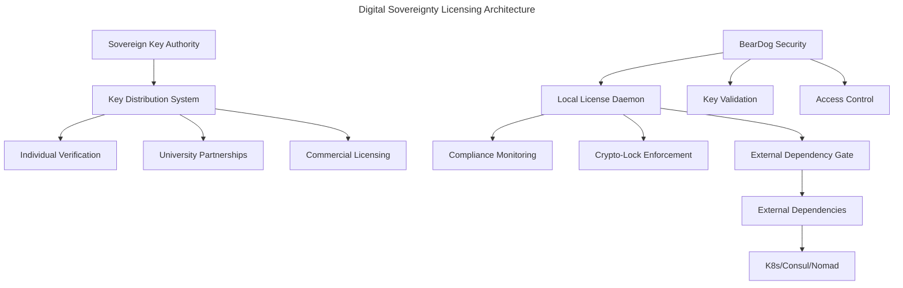

# Digital Sovereignty Licensing System

## Context
- When implementing licensing enforcement across all Primals
- When protecting external dependencies behind crypto-locks
- When distributing sovereign keys to legitimate users
- When enforcing AGPL3 compliance at dependency boundaries
- When preventing corporate extraction without compliance

## Overview

The biomeOS Digital Sovereignty Licensing System enforces licensing compliance through cryptographic locks on external dependencies while maintaining true digital sovereignty with no data collection or "phone home" functionality.

## Architecture

### Core Components



## Sovereign Key Distribution Strategy

### 1. Individual Access (Good Faith Model)
```yaml
individual_access:
  verification_method: "encrypted_connection"
  requirements:
    - proof_of_good_faith: true
    - human_verification: true
    - non_commercial_intent: true
  key_type: "individual_sovereign_key"
  validity_period: "1_year"
  renewal_process: "annual_good_faith_renewal"
```

**Process:**
1. Individual requests access through encrypted channel
2. Human verification of identity and intent
3. Good faith assessment (research, learning, personal use)
4. Sovereign key issued with individual restrictions
5. Annual renewal with continued good faith verification

### 2. University/Research Partnerships
```yaml
university_access:
  verification_method: "institutional_agreement"
  requirements:
    - accredited_institution: true
    - research_focus: true
    - academic_license_agreement: true
  key_type: "institutional_sovereign_key"
  validity_period: "multi_year"
  scope: "full_research_access"
```

**Process:**
1. Institutional partnership agreement
2. Academic license terms (research, education, publication)
3. Multi-year sovereign keys for stability
4. Full access to all capabilities for research

### 3. Commercial Licensing
```yaml
commercial_access:
  options:
    - commercial_license: "paid_licensing_agreement"
    - agpl3_compliance: "full_source_disclosure"
  requirements:
    commercial_license:
      - licensing_fee: true
      - commercial_terms: true
      - support_agreement: true
    agpl3_compliance:
      - source_disclosure: "all_modifications"
      - derivative_licensing: "agpl3_required"
      - distribution_compliance: true
```

## Crypto-Lock Implementation

### External Dependency Protection

```rust
// External dependency crypto-lock structure
pub struct ExternalDependencyLock {
    dependency_name: String,
    crypto_signature: Vec<u8>,
    sovereign_key_required: bool,
    access_level: AccessLevel,
}

pub enum AccessLevel {
    Blocked,           // No sovereign key
    Individual,        // Personal/research use
    Institutional,     // University/research
    Commercial,        // Paid license or AGPL3 compliance
}

impl ExternalDependencyLock {
    pub fn validate_access(&self, key: &SovereignKey) -> Result<AccessGrant> {
        match self.verify_signature(key) {
            Ok(level) => self.grant_access(level),
            Err(_) => Err(AccessDenied::InvalidKey),
        }
    }
}
```

### Dependency Boundary Enforcement

```yaml
external_dependencies:
  kubernetes:
    crypto_lock: true
    access_requirements: "sovereign_key"
    compliance_level: "commercial_or_agpl3"
  consul:
    crypto_lock: true
    access_requirements: "sovereign_key"
    compliance_level: "commercial_or_agpl3"
  nomad:
    crypto_lock: true
    access_requirements: "sovereign_key"
    compliance_level: "commercial_or_agpl3"
  docker:
    crypto_lock: false  # Open source friendly
    access_requirements: "none"
```

## Local License Enforcement

### License Compliance Daemon

```rust
pub struct LicenseComplianceDaemon {
    sovereign_key: Option<SovereignKey>,
    usage_classifier: UsageClassifier,
    compliance_monitor: ComplianceMonitor,
    dependency_gate: DependencyGate,
}

impl LicenseComplianceDaemon {
    pub async fn monitor_compliance(&self) -> ComplianceStatus {
        let usage_pattern = self.usage_classifier.classify_current_usage().await;
        let compliance_state = self.compliance_monitor.check_compliance(usage_pattern).await;
        
        match compliance_state {
            ComplianceState::Valid => self.allow_operation(),
            ComplianceState::Commercial => self.require_commercial_license(),
            ComplianceState::AGPL3Required => self.enforce_source_disclosure(),
            ComplianceState::Invalid => self.block_operation(),
        }
    }
}
```

### Usage Pattern Classification

```rust
pub enum UsagePattern {
    Personal {
        user_count: u32,
        revenue_generating: bool,
    },
    Research {
        institution: Option<String>,
        academic_purpose: bool,
    },
    Commercial {
        external_customers: bool,
        revenue_model: RevenueModel,
        employee_count: u32,
    },
    Distribution {
        modified_source: bool,
        source_disclosed: bool,
        agpl3_compliant: bool,
    },
}

impl UsageClassifier {
    pub fn classify_current_usage(&self) -> UsagePattern {
        // Local analysis only - no data collection
        let metrics = self.gather_local_metrics();
        self.pattern_from_metrics(metrics)
    }
    
    fn gather_local_metrics(&self) -> LocalMetrics {
        LocalMetrics {
            service_endpoints: self.count_external_endpoints(),
            user_connections: self.count_unique_users(),
            revenue_indicators: self.detect_payment_systems(),
            modification_status: self.check_source_modifications(),
        }
    }
}
```

## Security Integration with BearDog

### Key Validation Service

```rust
// BearDog integration for key validation
pub struct SovereignKeyValidator {
    crypto_provider: Arc<dyn CryptoProvider>,
    key_store: Arc<dyn SecureKeyStore>,
}

impl SovereignKeyValidator {
    pub fn validate_sovereign_key(&self, key: &[u8]) -> Result<KeyValidation> {
        let signature = self.crypto_provider.verify_signature(key)?;
        let metadata = self.extract_key_metadata(&signature)?;
        
        Ok(KeyValidation {
            valid: true,
            access_level: metadata.access_level,
            expiry: metadata.expiry,
            restrictions: metadata.restrictions,
        })
    }
    
    pub fn enforce_access_control(&self, 
        resource: &ExternalDependency,
        validation: &KeyValidation
    ) -> Result<AccessGrant> {
        match (resource.required_level(), validation.access_level) {
            (RequiredLevel::Individual, AccessLevel::Individual) => Ok(AccessGrant::Limited),
            (RequiredLevel::Commercial, AccessLevel::Commercial) => Ok(AccessGrant::Full),
            (RequiredLevel::Commercial, AccessLevel::Individual) => Err(AccessDenied::InsufficientLevel),
            _ => self.evaluate_special_cases(resource, validation),
        }
    }
}
```

### Crypto-Lock Repository Structure

```yaml
repository_structure:
  external_dependencies/:
    kubernetes/:
      - crypto_lock.signature
      - access_requirements.yaml
      - compliance_validator.rs
    consul/:
      - crypto_lock.signature
      - access_requirements.yaml
      - compliance_validator.rs
    nomad/:
      - crypto_lock.signature
      - access_requirements.yaml
      - compliance_validator.rs
  
  sovereign_keys/:
    - key_distribution_system.rs
    - individual_verification.rs
    - institutional_partnerships.rs
    - commercial_licensing.rs
  
  compliance/:
    - license_daemon.rs
    - usage_classifier.rs
    - compliance_monitor.rs
    - dependency_gate.rs
```

## Implementation Across Primals

### Toadstool Integration
```yaml
toadstool_integration:
  runtime_enforcement:
    - container_access_control: "sovereign_key_required"
    - external_service_discovery: "crypto_locked"
    - dependency_injection: "compliance_validated"
  
  biome_manifest_extension:
    licensing:
      sovereign_key_path: "/etc/biome/sovereign.key"
      compliance_level: "commercial"
      external_dependencies:
        - name: "kubernetes"
          crypto_locked: true
        - name: "consul"
          crypto_locked: true
```

### Songbird Integration
```yaml
songbird_integration:
  service_discovery:
    external_registries: "crypto_locked"
    federation_access: "sovereign_key_required"
  
  orchestration:
    external_schedulers: "compliance_validated"
    load_balancer_backends: "access_controlled"
```

### NestGate Integration
```yaml
nestgate_integration:
  storage_backends:
    external_object_stores: "crypto_locked"
    cloud_providers: "sovereign_key_required"
  
  backup_systems:
    external_backup_services: "compliance_validated"
    cloud_sync: "access_controlled"
```

### Squirrel Integration
```yaml
squirrel_integration:
  mcp_providers:
    external_ai_services: "crypto_locked"
    cloud_compute: "sovereign_key_required"
  
  plugin_system:
    external_plugins: "compliance_validated"
    marketplace_access: "access_controlled"
```

## Enforcement Mechanisms

### 1. Compile-Time Locks
```rust
// Compile-time dependency validation
#[cfg(feature = "external-deps")]
compile_error!("External dependencies require sovereign key validation");

#[cfg(not(feature = "sovereign-validated"))]
compile_error!("Sovereign key validation required for external access");
```

### 2. Runtime Locks
```rust
// Runtime access control
pub struct DependencyGate {
    validator: SovereignKeyValidator,
    locked_dependencies: HashSet<String>,
}

impl DependencyGate {
    pub fn allow_dependency_access(&self, dep: &str) -> Result<()> {
        if self.locked_dependencies.contains(dep) {
            self.validator.require_valid_key()?;
        }
        Ok(())
    }
}
```

### 3. Network-Level Enforcement
```yaml
network_enforcement:
  dns_filtering:
    - block_external_registries: true
    - require_sovereign_validation: true
  
  firewall_rules:
    - external_k8s_apis: "sovereign_key_required"
    - consul_clusters: "compliance_validated"
    - nomad_schedulers: "access_controlled"
```

## Compliance Monitoring (Local Only)

### No Data Collection Policy
```rust
// Compliance monitoring without data collection
pub struct LocalComplianceMonitor {
    // NO network communication
    // NO data transmission
    // NO telemetry
    local_state: ComplianceState,
    violation_log: LocalLog,
}

impl LocalComplianceMonitor {
    pub fn monitor_local_compliance(&mut self) {
        // All monitoring stays local
        let current_usage = self.classify_local_usage();
        let compliance_status = self.evaluate_compliance(current_usage);
        
        // Log locally only
        self.violation_log.record_local(compliance_status);
        
        // Enforce locally only
        self.enforce_local_restrictions(compliance_status);
    }
    
    // Explicitly no network methods
    // fn phone_home() - FORBIDDEN
    // fn send_telemetry() - FORBIDDEN
    // fn report_usage() - FORBIDDEN
}
```

### Local Violation Handling
```rust
pub enum ComplianceViolation {
    CommercialUseWithoutLicense,
    ModificationWithoutSourceDisclosure,
    DistributionWithoutAGPL3,
    ExternalDependencyAccessWithoutKey,
}

impl LocalComplianceMonitor {
    fn handle_violation(&self, violation: ComplianceViolation) {
        match violation {
            CommercialUseWithoutLicense => {
                self.block_external_dependencies();
                self.display_licensing_notice();
            },
            ModificationWithoutSourceDisclosure => {
                self.require_source_disclosure();
                self.block_distribution();
            },
            ExternalDependencyAccessWithoutKey => {
                self.block_dependency_access();
                self.display_key_requirement_notice();
            },
        }
    }
}
```

## Key Distribution Implementation

### Individual Verification System
```rust
pub struct IndividualVerificationSystem {
    encrypted_channel: SecureChannel,
    human_verifier: HumanVerificationService,
    good_faith_assessor: GoodFaithAssessment,
}

impl IndividualVerificationSystem {
    pub async fn process_individual_request(&self, request: KeyRequest) -> Result<SovereignKey> {
        // Encrypted communication only
        let verified_identity = self.human_verifier.verify_human(request.identity).await?;
        
        // Good faith assessment
        let good_faith = self.good_faith_assessor.assess(request.purpose).await?;
        
        if verified_identity && good_faith {
            Ok(self.generate_individual_key(request))
        } else {
            Err(VerificationFailed)
        }
    }
}
```

### University Partnership System
```rust
pub struct UniversityPartnershipSystem {
    institutional_agreements: HashMap<String, Agreement>,
    academic_verifier: AcademicVerificationService,
}

impl UniversityPartnershipSystem {
    pub fn process_institutional_request(&self, request: InstitutionalKeyRequest) -> Result<SovereignKey> {
        let agreement = self.institutional_agreements
            .get(&request.institution)
            .ok_or(NoAgreement)?;
        
        if agreement.is_valid() && self.academic_verifier.verify_academic_purpose(&request)? {
            Ok(self.generate_institutional_key(request))
        } else {
            Err(InstitutionalVerificationFailed)
        }
    }
}
```

## Technical Implementation Requirements

### BearDog Security Provider Requirements
- Cryptographic key validation and storage
- Access control enforcement at dependency boundaries
- Secure key distribution mechanisms
- Local compliance monitoring without data collection

### Toadstool Runtime Requirements
- Container-level access control for external dependencies
- Biome manifest integration for licensing configuration
- Runtime enforcement of sovereign key requirements

### Songbird Orchestration Requirements
- Service discovery filtering based on sovereign key validation
- Federation access control for external orchestrators
- Load balancer backend filtering for compliance

### NestGate Storage Requirements
- External storage provider access control
- Backup service compliance validation
- Cloud sync restrictions based on licensing

### Squirrel MCP Requirements
- AI provider access control based on sovereign key
- Plugin marketplace restrictions
- External compute resource validation

## Testing and Validation

### Compliance Testing Framework
```rust
#[cfg(test)]
mod compliance_tests {
    #[test]
    fn test_individual_key_access() {
        // Test individual sovereign key access patterns
    }
    
    #[test]
    fn test_commercial_license_enforcement() {
        // Test commercial usage detection and enforcement
    }
    
    #[test]
    fn test_agpl3_compliance_validation() {
        // Test AGPL3 source disclosure requirements
    }
    
    #[test]
    fn test_external_dependency_blocking() {
        // Test crypto-lock enforcement on external dependencies
    }
}
```

## Benefits

### For Legitimate Users
- **Individuals**: Easy access through good faith verification
- **Universities**: Stable institutional partnerships with full research access
- **Researchers**: Complete freedom for academic and research purposes

### For Digital Sovereignty
- **No Corporate Extraction**: Technical and legal barriers to unauthorized commercial use
- **True Sovereignty**: No data collection, no phone home, complete local control
- **Compliance Enforcement**: Automatic AGPL3 enforcement at dependency boundaries
- **Selective Access**: Sovereign key authority maintains control over external dependency access

### For Ecosystem Health
- **Sustainable Funding**: Commercial users pay or comply with AGPL3
- **Research Freedom**: Academic use remains completely unrestricted
- **Innovation Protection**: Core innovations remain under sovereign control
- **Community Growth**: Individual users can access and contribute freely

## Implementation Timeline

### Phase 1 (2-3 weeks): Core Infrastructure
- Sovereign key generation and distribution system
- BearDog integration for cryptographic validation
- Basic compliance monitoring framework

### Phase 2 (3-4 weeks): Dependency Locks
- External dependency crypto-lock implementation
- Compile-time and runtime enforcement mechanisms
- Network-level access control

### Phase 3 (2-3 weeks): Primal Integration
- Integration across all five Primals
- Cross-Primal compliance coordination
- End-to-end testing and validation

### Phase 4 (1-2 weeks): Deployment and Hardening
- Production deployment procedures
- Security hardening and audit
- Documentation and user guides

**Total Timeline: 8-12 weeks**

## Success Metrics

### Technical Metrics
- 100% external dependency access requires sovereign key validation
- Zero unauthorized access to crypto-locked dependencies
- Local compliance monitoring with zero data collection
- Cross-Primal enforcement consistency

### Business Metrics
- Individual users: Easy access with good faith verification
- Universities: Stable institutional partnerships
- Commercial users: Clear compliance path (license or AGPL3)
- Corporate extraction: Technically and legally prevented

<version>1.0.0</version> 