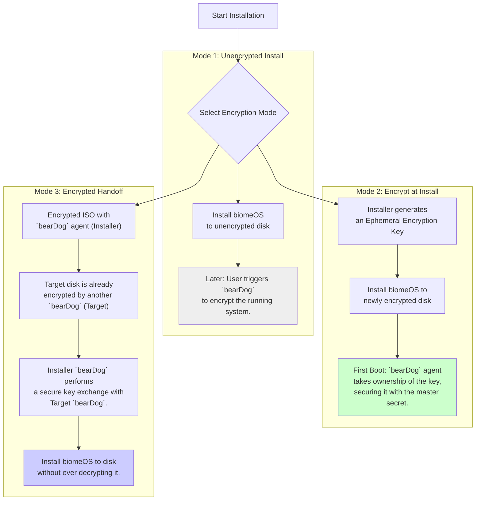

# `biomeOS` - Recursive Encryption Strategy v1

**Status:** Draft | **Author:** The Architect & The Artisan AI | **Date:** July 2025

**Related Documents:** [INTERACTIVE_INSTALLER_SPEC.md](./INTERACTIVE_INSTALLER_SPEC.md)

---

## 1. Preamble: Security as a Recursive Process

The `biomeOS` installation process must offer a flexible and robust encryption strategy that is as powerful and recursive as the system itself. This specification details three primary encryption workflows, all orchestrated by the `installer-core` daemon and executed by the `bearDog` security Primal.

The goal is to provide users with clear choices, from simple post-install encryption to fully encrypted, trust-based handoffs.

## 2. Encryption Workflows

The `installer-core` API will expose endpoints to initiate one of three encryption modes during installation.

### 2.1. Mode 1: Install Now, Encrypt Later
-   **Use Case:** The simplest path for low-security environments or for users who want to configure the system before locking it down.
-   **Process:** The `installer-core` performs a standard installation to an unencrypted disk. Post-installation, the user can command the running `bearDog` agent to perform a live encryption of the filesystem.
-   **Analogy:** Building a house and then installing the security system.

### 2.2. Mode 2: Encrypt at Install Time - The Seeding Choice

-   **Use Case:** The recommended path for most users, ensuring the system is secure from the very first boot. This mode presents the user with a choice about the *origin* of their security.
-   **Process:** The installer UI asks the user how they wish to generate the initial encryption key.

    -   **Option A: "Store-Bought" Seed (Quick & Impersonal)**
        -   **Action:** The user selects the standard option. `bearDog` generates a key using a standard cryptographically secure pseudorandom number generator (CSPRNG).
        -   **Analogy:** Using the generic lock that came with the house. It's secure, but not uniquely yours.

    -   **Option B: "Home-Grown" Seed (The Ephemeral Key Sacrifice)**
        -   **Action:** The user selects the personal option and actively participates in the **Sacrifice**. They are prompted to move the mouse, speak into the microphone, etc.
        -   **Process:** `bearDog` collects a stream of this high-entropy "lived experience" data to generate a truly personal, unique key.
        -   **Analogy:** Performing a unique ritual to forge a personal key for your new home. This key can then be "genetically mixed" with other personal seeds (from a phone, another `biomeOS` instance, etc.) to create a shared trust lineage.

    -   **Option C: Import a Pre-Existing Seed (Genetic Inoculation)**
        -   **Action:** The user selects "Import Seed." The installer provides a mechanism (e.g., QR code scan from a phone, file dialog) to securely receive a seed file from another `bearDog`-enabled device.
        -   **Use Case:** This is the core of "genetic mixing." A seed from a shared moment (like a concert) or another sovereign device can be used to inoculate a new biome, linking them cryptographically.
        -   **Analogy:** Bringing a key from a sacred, shared place to lock your new home, making it part of the same trusted estate.

-   **Handoff:** Regardless of the origin (generated or imported), the resulting ephemeral key is used to encrypt the disk. On first boot, the new "Target `bearDog`" agent takes ownership of the key, securing it with its master secret and erasing the original.

### 2.3. Mode 3: Recursive Encrypted Handoff
-   **Use Case:** The most secure method for high-stakes environments, or for updating a sensitive system with a trusted Niche.
-   **Process:**
    1.  This mode requires an **encrypted ISO** (a Niche built with sensitive data and its own `bearDog` instance) and a target disk that is **already encrypted and managed by another `bearDog`**.
    2.  The `installer-core` facilitates a secure communication channel between the "Installer `bearDog`" and the "Target `bearDog`".
    3.  The two agents perform a secure key-exchange protocol (e.g., Diffie-Hellman) to establish a shared secret.
    4.  The installation data is streamed from the ISO to the target disk, re-encrypted on the fly using the shared secret. The underlying data is never exposed.
-   **Analogy:** Two trusted security guards exchanging a locked briefcase inside a secure room, without ever opening it. This is true, recursive security. 