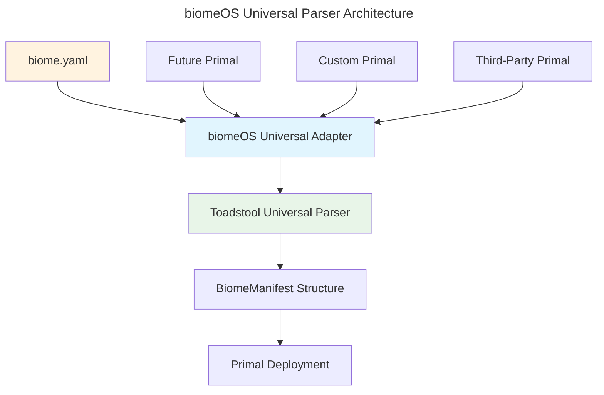

# `biomeOS` - Universal Manifest Specification v1

**Status:** Implementation Ready | **Author:** ecoPrimals Architecture Team | **Date:** January 2025

**Related Documents:** [ARCHITECTURE_OVERVIEW.md](./ARCHITECTURE_OVERVIEW.md) | [TOADSTOOL_BIOMEOS_UNIFICATION_SPEC.md](./TOADSTOOL_BIOMEOS_UNIFICATION_SPEC.md)

---

## 1. Preamble: Universal Parser Architecture

This document defines the structure of the `biome.yaml` manifest file with a fundamental architectural principle: **toadstool serves as the universal parser** for all biomeOS operations. biomeOS employs toadstool's mature parsing capabilities using universal and agnostic patterns to ensure compatibility with current and future Primals.

### Core Architecture Philosophy



The goal is a manifest that is:
- **Universal**: Works with any current or future Primal
- **Agnostic**: No hardcoded assumptions about specific implementations
- **Extensible**: Supports third-party and custom Primal integrations
- **Parser-Delegated**: Leverages toadstool's proven parsing infrastructure

## 2. Universal Manifest Schema v1

The manifest employs **toadstool's BiomeManifest structure** as the foundation, with biomeOS providing universal adapter patterns for seamless integration:

### 2.1 Universal Adapter Integration

```rust
// biomeOS Universal Adapter Pattern (inspired by songbird)
pub struct BiomeOSUniversalAdapter {
    toadstool_parser: ToadstoolManifestParser,
    primal_registry: UniversalPrimalRegistry,
    capability_matcher: CapabilityMatcher,
}

impl BiomeOSUniversalAdapter {
    pub async fn parse_biome_manifest(
        &self, 
        manifest_path: &str
    ) -> Result<UniversalBiomeManifest> {
        // Delegate to toadstool's proven parser
        let parsed = self.toadstool_parser.parse(manifest_path).await?;
        
        // Apply universal transformations
        let universal = self.universalize_manifest(parsed).await?;
        
        // Match capabilities to available Primals
        self.capability_matcher.resolve_primals(&universal).await
    }
}
```

### 2.2 Root Schema Structure

The manifest is composed of several root keys that align with toadstool's existing structure:

-   `apiVersion`: (Required) Always "biomeOS/v1" for universal compatibility
-   `kind`: (Required) Always "Biome" for toadstool parsing
-   `metadata`: (Required) Universal metadata structure
-   `sources`: (Optional) Universal source management (delegated to toadstool)
-   `volumes`: (Optional) Universal volume definitions (delegated to toadstool)
-   `networks`: (Optional) Universal network definitions (delegated to toadstool)
-   `primals`: (Required) Universal Primal specifications
-   `services`: (Optional) Universal service definitions (delegated to toadstool)
-   `mycorrhiza`: (Optional) biomeOS-specific energy flow management

## 3. Universal Primal Integration Pattern

### 3.1 Primal Agnostic Specification

```yaml
# Universal Primal Integration - Works with ANY Primal
primals:
  # Standard Primals (current ecosystem)
  beardog:
    primal_type: "security"
    provider: "beardog"
    version: ">=0.2.0"
    capabilities: ["encryption", "authentication", "compliance"]
    
  songbird:
    primal_type: "service_mesh"
    provider: "songbird"
    version: ">=0.3.0"
    capabilities: ["load_balancing", "service_discovery", "api_gateway"]
    
  nestgate:
    primal_type: "storage"
    provider: "nestgate"
    version: ">=0.1.5"
    capabilities: ["zfs", "tiered_storage", "encryption"]
    
  toadstool:
    primal_type: "runtime"
    provider: "toadstool"
    version: ">=0.4.0"
    capabilities: ["container", "wasm", "orchestration"]
    
  # Future Primal (hypothetical)
  future_primal:
    primal_type: "ai_inference"
    provider: "future-ai-primal"
    version: ">=1.0.0"
    capabilities: ["llm", "embedding", "vision"]
    
  # Third-party Primal (custom)
  custom_primal:
    primal_type: "custom"
    provider: "third-party-solution"
    version: ">=2.1.0"
    capabilities: ["custom_capability_1", "custom_capability_2"]
```

### 3.2 Universal Capability Matching

```rust
// Universal capability matching system
pub struct UniversalCapabilityMatcher {
    available_primals: Vec<PrimalProvider>,
    capability_registry: HashMap<String, Vec<String>>,
}

impl UniversalCapabilityMatcher {
    pub async fn resolve_primal_for_capability(
        &self, 
        capability: &str
    ) -> Result<PrimalProvider> {
        // Find any Primal that provides this capability
        for primal in &self.available_primals {
            if primal.capabilities().contains(capability) {
                return Ok(primal.clone());
            }
        }
        Err(CapabilityNotFoundError::new(capability))
    }
}
```

## 4. Conceptual Universal `biome.yaml` Example

This example demonstrates universal integration using toadstool as the parser:

```yaml
# Universal biome.yaml - Parsed by toadstool, orchestrated by biomeOS
apiVersion: biomeOS/v1
kind: Biome
metadata:
  name: "universal-research-biome"
  version: "1.0.0"
  description: "Universal research environment supporting any Primal"
  specialization: research
  created: "2025-01-15T10:30:00Z"
  tags:
    - universal
    - research
    - ai-ready

# MYCORRHIZA: biomeOS-specific energy flow management
mycorrhiza:
  system_state: "closed"
  personal_ai:
    enabled: true
    local_models: ["llama.cpp", "whisper.cpp"]
    api_keys:
      - provider: anthropic
        key_ref: claude_key
  enforcement:
    threat_response: "block_and_preserve"

# Universal source management (delegated to toadstool)
sources:
  primal_registry:
    type: "oci"
    url: "registry.ecoprimals.io"
    auth: "bearer_token"
  
  custom_registry:
    type: "oci"
    url: "custom.registry.io"
    auth: "basic_auth"

# Universal volume definitions (delegated to toadstool)
volumes:
  research_data:
    driver: "universal-storage"
    provider_preference: ["nestgate", "custom_storage"]
    options:
      encryption: true
      compression: "zstd"
      quota: "1TB"

# Universal network definitions (delegated to toadstool)
networks:
  research_net:
    driver: "universal-network"
    provider_preference: ["songbird", "custom_network"]
    subnet: "10.42.0.0/16"
    security_level: "high"

# Universal Primal specifications
primals:
  # Security Primal (capability-based selection)
  security:
    capability_required: "encryption"
    provider_preference: ["beardog", "custom_security"]
    version: ">=0.2.0"
    priority: 1
    config:
      security_level: "high"
      compliance: ["gdpr", "hipaa"]
    
  # Service Mesh Primal (capability-based selection)
  service_mesh:
    capability_required: "load_balancing"
    provider_preference: ["songbird", "custom_mesh"]
    version: ">=0.3.0"
    priority: 2
    depends_on: ["security"]
    config:
      discovery_backend: "consul"
      federation_enabled: true
    
  # Storage Primal (capability-based selection)
  storage:
    capability_required: "tiered_storage"
    provider_preference: ["nestgate", "custom_storage"]
    version: ">=0.1.5"
    priority: 3
    depends_on: ["security", "service_mesh"]
    volumes:
      - "research_data:/data"
    
  # Runtime Primal (toadstool as universal parser AND runtime)
  runtime:
    capability_required: "container"
    provider_preference: ["toadstool"]
    version: ">=0.4.0"
    priority: 4
    depends_on: ["security", "service_mesh", "storage"]
    config:
      runtime_types: ["wasm", "container"]
      security_enforcement: true

# Universal service definitions (delegated to toadstool)
services:
  research_api:
    primal: "service_mesh"
    source: "primal_registry:research-api:v1.0.0"
    runtime: "wasm"
    capabilities_required: ["http_server", "database_access"]
    ports:
      - "8080:8080"
    volumes:
      - "research_data:/app/data"
    depends_on: ["research_db"]
    
  research_db:
    primal: "storage"
    source: "primal_registry:postgres:14"
    runtime: "container"
    capabilities_required: ["sql_database", "persistence"]
    volumes:
      - "research_data:/var/lib/postgresql/data"
    config:
      database_name: "research"
      encryption: true
```

## 5. Universal Integration Benefits

### 5.1 Toadstool Parser Delegation
- **Mature Parser**: Leverages toadstool's proven manifest parsing capabilities
- **Schema Validation**: Uses toadstool's comprehensive validation system
- **Error Handling**: Benefits from toadstool's robust error reporting
- **Performance**: Optimized parsing performance from mature implementation

### 5.2 Universal Primal Support
- **Current Ecosystem**: Works with beardog, songbird, nestgate, toadstool, squirrel
- **Future Primals**: Automatically supports new Primals through capability matching
- **Third-Party Integration**: Enables custom and third-party Primal providers
- **Vendor Independence**: No lock-in to specific implementations

### 5.3 Capability-Based Architecture
- **Flexible Deployment**: Choose best available Primal for each capability
- **Failover Support**: Automatic fallback to alternative providers
- **Performance Optimization**: Select optimal Primal based on requirements
- **Gradual Migration**: Migrate between Primals without manifest changes

## 6. Implementation Strategy

### 6.1 Phase 1: Universal Adapter Implementation
1. **Toadstool Integration**: Create universal adapter for toadstool's parser
2. **Capability Registry**: Implement universal capability matching system
3. **Primal Discovery**: Build universal Primal discovery mechanism
4. **Validation Layer**: Add biomeOS-specific validation on top of toadstool

### 6.2 Phase 2: Universal Primal Support
1. **Standard Primals**: Implement universal interfaces for current ecosystem
2. **Future Primal Support**: Create extensible architecture for new Primals
3. **Third-Party Integration**: Define standards for custom Primal providers
4. **Migration Tools**: Build tools for seamless Primal transitions

### 6.3 Phase 3: Advanced Universal Features
1. **Multi-Provider Support**: Support multiple Primals for same capability
2. **Load Balancing**: Distribute capabilities across multiple providers
3. **Monitoring Integration**: Universal monitoring across all Primals
4. **Performance Optimization**: Automatic optimization based on workload

## 7. Future Primal Integration Standard

### 7.1 Universal Primal Interface
```rust
// Universal Primal Interface (any future Primal must implement)
pub trait UniversalPrimal {
    fn primal_id(&self) -> &str;
    fn capabilities(&self) -> Vec<String>;
    fn priority(&self) -> u32;
    fn version(&self) -> &str;
    
    async fn initialize(&self, config: serde_json::Value) -> Result<()>;
    async fn health_check(&self) -> HealthStatus;
    async fn handle_request(&self, request: UniversalRequest) -> Result<UniversalResponse>;
}
```

### 7.2 Registration Protocol
```rust
// Universal Primal Registration
pub struct UniversalPrimalRegistry {
    registered_primals: HashMap<String, Box<dyn UniversalPrimal>>,
    capability_index: HashMap<String, Vec<String>>,
}

impl UniversalPrimalRegistry {
    pub async fn register_primal(
        &mut self, 
        primal: Box<dyn UniversalPrimal>
    ) -> Result<()> {
        // Register primal and index its capabilities
        let primal_id = primal.primal_id().to_string();
        let capabilities = primal.capabilities();
        
        self.registered_primals.insert(primal_id.clone(), primal);
        
        for capability in capabilities {
            self.capability_index
                .entry(capability)
                .or_insert_with(Vec::new)
                .push(primal_id.clone());
        }
        
        Ok(())
    }
}
```

By adopting this universal parser architecture, biomeOS becomes a truly agnostic orchestration platform that can work with any current or future Primal while leveraging toadstool's proven parsing capabilities as the foundation. 