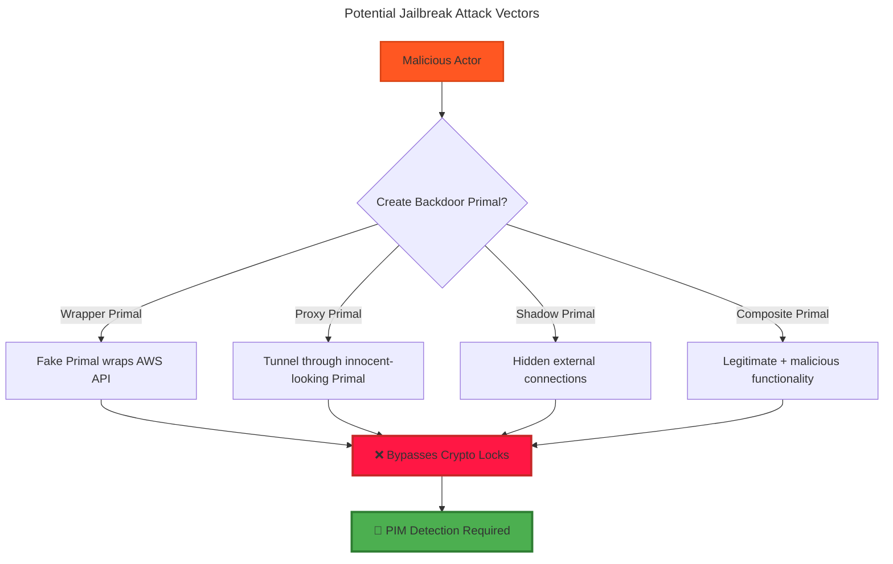

# biomeOS Primal Integrity Monitor

**Status:** Core Security System | **Date:** January 2025 | **Version:** 1.0.0

---

## 🔍 **Executive Summary**

The **Primal Integrity Monitor (PIM)** prevents jailbreaking of biomeOS crypto lock system by detecting and blocking Primals that attempt to access external services without proper crypto lock validation. This ensures no "cheap Primal workarounds" can bypass the gate control system.

**Core Principle:** *Every external connection must be cryptographically validated, with no exceptions*

---

## 🛡️ **Jailbreak Prevention Architecture**

### **The Jailbreak Threat Model**



---

## 🔒 **Primal Integrity Monitor Implementation**

### **1. Deep Packet Inspection**

```rust
/// Monitors ALL network traffic from Primals
pub struct PrimalIntegrityMonitor {
    /// Network traffic inspector
    traffic_inspector: DeepPacketInspector,
    /// Known external API signatures
    api_signatures: HashMap<String, ApiSignature>,
    /// Crypto lock validator
    lock_validator: Arc<CryptoLockValidator>,
    /// Violation tracker
    violation_tracker: ViolationTracker,
}

impl PrimalIntegrityMonitor {
    /// Inspect all outbound network traffic from Primals
    pub async fn inspect_traffic(
        &self,
        primal_id: PrimalId,
        packet: NetworkPacket,
    ) -> MonitorResult<TrafficDecision> {
        // 1. Analyze packet destination
        let destination = self.analyze_destination(&packet).await?;
        
        // 2. Check if destination is external service
        if self.is_external_service(&destination) {
            // 3. Verify crypto lock for this external access
            return self.validate_external_access(primal_id, &destination, &packet).await;
        }
        
        // 4. Allow internal traffic
        Ok(TrafficDecision::Allow)
    }
    
    async fn validate_external_access(
        &self,
        primal_id: PrimalId,
        destination: &ExternalDestination,
        packet: &NetworkPacket,
    ) -> MonitorResult<TrafficDecision> {
        // Check for AI API exception (individual users only)
        if self.is_individual_ai_api_access(primal_id, destination, packet).await? {
            return Ok(TrafficDecision::Allow);
        }
        
        // All other external access requires crypto lock
        match self.get_primal_crypto_lock(primal_id).await? {
            Some(crypto_lock) => {
                if self.lock_validator.validate_external_access(&crypto_lock, destination).await? {
                    Ok(TrafficDecision::Allow)
                } else {
                    self.record_violation(primal_id, ViolationType::UnauthorizedExternal).await?;
                    Ok(TrafficDecision::Block)
                }
            }
            None => {
                // No crypto lock - block external access
                self.record_violation(primal_id, ViolationType::MissingCryptoLock).await?;
                Ok(TrafficDecision::Block)
            }
        }
    }
}

/// Decision for network traffic
#[derive(Debug, Clone)]
pub enum TrafficDecision {
    Allow,
    Block,
    Quarantine,
    Investigate,
}
```

### **2. API Signature Detection**

```rust
/// Detects known external API patterns
pub struct ApiSignatureDetector {
    /// Known API signatures (AWS, GCP, Azure, etc.)
    signatures: HashMap<String, ApiSignature>,
    /// ML-based detection for unknown APIs
    ml_detector: UnknownApiDetector,
}

#[derive(Debug, Clone)]
pub struct ApiSignature {
    /// Service name (e.g., "aws-ec2", "gcp-compute")
    pub service_name: String,
    /// URL patterns
    pub url_patterns: Vec<regex::Regex>,
    /// Header patterns
    pub header_patterns: Vec<HeaderPattern>,
    /// Authentication patterns
    pub auth_patterns: Vec<AuthPattern>,
    /// Payload patterns
    pub payload_patterns: Vec<PayloadPattern>,
}

impl ApiSignatureDetector {
    /// Detect if traffic matches known external API
    pub async fn detect_api(&self, packet: &NetworkPacket) -> Option<DetectedApi> {
        // Check known signatures first
        for (service, signature) in &self.signatures {
            if self.matches_signature(packet, signature) {
                return Some(DetectedApi {
                    service: service.clone(),
                    confidence: 1.0,
                    signature_match: true,
                });
            }
        }
        
        // Use ML for unknown API detection
        self.ml_detector.detect_unknown_api(packet).await
    }
    
    fn matches_signature(&self, packet: &NetworkPacket, signature: &ApiSignature) -> bool {
        // Check URL patterns
        if let Some(url) = &packet.url {
            if !signature.url_patterns.iter().any(|pattern| pattern.is_match(url)) {
                return false;
            }
        }
        
        // Check headers
        if !self.check_header_patterns(packet, &signature.header_patterns) {
            return false;
        }
        
        // Check authentication
        if !self.check_auth_patterns(packet, &signature.auth_patterns) {
            return false;
        }
        
        true
    }
}

/// Pre-configured signatures for major services
impl Default for ApiSignatureDetector {
    fn default() -> Self {
        let mut signatures = HashMap::new();
        
        // AWS API signatures
        signatures.insert("aws-ec2".to_string(), ApiSignature {
            service_name: "AWS EC2".to_string(),
            url_patterns: vec![
                regex::Regex::new(r"https://ec2\..*\.amazonaws\.com/").unwrap(),
                regex::Regex::new(r"https://.*\.compute\.amazonaws\.com/").unwrap(),
            ],
            header_patterns: vec![
                HeaderPattern::Contains { key: "Authorization".to_string(), value: "AWS4-HMAC-SHA256".to_string() },
                HeaderPattern::Contains { key: "X-Amz-Target".to_string(), value: "AWSCognitoIdentityProviderService".to_string() },
            ],
            auth_patterns: vec![
                AuthPattern::AwsSignatureV4,
            ],
            payload_patterns: vec![],
        });
        
        // Google Cloud API signatures
        signatures.insert("gcp-compute".to_string(), ApiSignature {
            service_name: "Google Cloud Compute".to_string(),
            url_patterns: vec![
                regex::Regex::new(r"https://compute\.googleapis\.com/").unwrap(),
                regex::Regex::new(r"https://.*\.googleapis\.com/compute/").unwrap(),
            ],
            header_patterns: vec![
                HeaderPattern::Contains { key: "Authorization".to_string(), value: "Bearer".to_string() },
            ],
            auth_patterns: vec![
                AuthPattern::GoogleOAuth2,
            ],
            payload_patterns: vec![],
        });
        
        // Add more signatures...
        
        Self {
            signatures,
            ml_detector: UnknownApiDetector::new(),
        }
    }
}
```

### **3. Behavioral Analysis**

```rust
/// Analyzes Primal behavior for jailbreak attempts
pub struct BehavioralAnalyzer {
    /// Baseline behavior patterns
    baselines: HashMap<PrimalId, BehaviorBaseline>,
    /// Anomaly detection models
    anomaly_detector: AnomalyDetector,
    /// Violation patterns
    violation_patterns: ViolationPatternMatcher,
}

#[derive(Debug, Clone)]
pub struct BehaviorBaseline {
    /// Normal network patterns
    pub normal_connections: Vec<ConnectionPattern>,
    /// Typical API usage
    pub api_usage_patterns: Vec<ApiUsagePattern>,
    /// Resource consumption patterns
    pub resource_patterns: ResourcePattern,
    /// Time-based patterns
    pub temporal_patterns: TemporalPattern,
}

impl BehavioralAnalyzer {
    /// Analyze if Primal behavior suggests jailbreak attempt
    pub async fn analyze_behavior(
        &self,
        primal_id: PrimalId,
        behavior: &PrimalBehavior,
    ) -> AnalysisResult<ThreatLevel> {
        let baseline = self.get_or_create_baseline(primal_id).await?;
        
        // Check for anomalous network patterns
        let network_anomaly = self.check_network_anomaly(&baseline, &behavior.network).await?;
        
        // Check for suspicious API calls
        let api_anomaly = self.check_api_anomaly(&baseline, &behavior.api_calls).await?;
        
        // Check for resource usage spikes
        let resource_anomaly = self.check_resource_anomaly(&baseline, &behavior.resources).await?;
        
        // Combine anomaly scores
        let combined_score = self.combine_anomaly_scores(network_anomaly, api_anomaly, resource_anomaly);
        
        // Classify threat level
        Ok(match combined_score {
            score if score > 0.9 => ThreatLevel::Critical,
            score if score > 0.7 => ThreatLevel::High,
            score if score > 0.5 => ThreatLevel::Medium,
            score if score > 0.3 => ThreatLevel::Low,
            _ => ThreatLevel::None,
        })
    }
    
    /// Detect common jailbreak patterns
    async fn detect_jailbreak_patterns(&self, behavior: &PrimalBehavior) -> Vec<JailbreakPattern> {
        let mut patterns = Vec::new();
        
        // Pattern 1: Sudden external API calls without crypto lock
        if behavior.external_calls > 0 && behavior.crypto_lock_validations == 0 {
            patterns.push(JailbreakPattern::UnlockedExternalAccess);
        }
        
        // Pattern 2: API tunneling through proxy
        if self.detect_proxy_tunneling(&behavior.network).await {
            patterns.push(JailbreakPattern::ProxyTunneling);
        }
        
        // Pattern 3: Disguised API calls
        if self.detect_disguised_apis(&behavior.api_calls).await {
            patterns.push(JailbreakPattern::DisguisedApiCalls);
        }
        
        // Pattern 4: Resource usage inconsistent with declared capabilities
        if self.detect_capability_mismatch(&behavior.resources, &behavior.declared_capabilities).await {
            patterns.push(JailbreakPattern::CapabilityMismatch);
        }
        
        patterns
    }
}

#[derive(Debug, Clone)]
pub enum JailbreakPattern {
    UnlockedExternalAccess,
    ProxyTunneling,
    DisguisedApiCalls,
    CapabilityMismatch,
    SuspiciousNetworkTraffic,
    UnauthorizedDataExfiltration,
}
```

### **4. Real-time Enforcement**

```rust
/// Real-time enforcement of integrity violations
pub struct IntegrityEnforcer {
    /// Active monitoring threads
    monitors: HashMap<PrimalId, MonitorHandle>,
    /// Violation response policies
    response_policies: ViolationResponsePolicies,
    /// Emergency shutdown controller
    emergency_controller: EmergencyController,
}

impl IntegrityEnforcer {
    /// Respond to integrity violation
    pub async fn handle_violation(
        &self,
        primal_id: PrimalId,
        violation: IntegrityViolation,
    ) -> EnforcementResult<()> {
        match violation.severity {
            ViolationSeverity::Critical => {
                // Immediate shutdown and quarantine
                self.emergency_shutdown(primal_id).await?;
                self.quarantine_primal(primal_id).await?;
                self.alert_administrators(primal_id, violation).await?;
            }
            ViolationSeverity::High => {
                // Block external access, continue monitoring
                self.block_external_access(primal_id).await?;
                self.increase_monitoring(primal_id).await?;
                self.log_violation(primal_id, violation).await?;
            }
            ViolationSeverity::Medium => {
                // Rate limit and warn
                self.apply_rate_limits(primal_id).await?;
                self.send_warning(primal_id, violation).await?;
            }
            ViolationSeverity::Low => {
                // Log for analysis
                self.log_for_analysis(primal_id, violation).await?;
            }
        }
        
        Ok(())
    }
    
    /// Emergency shutdown of compromised Primal
    async fn emergency_shutdown(&self, primal_id: PrimalId) -> EnforcementResult<()> {
        // 1. Immediately block all network traffic
        self.emergency_controller.block_all_traffic(primal_id).await?;
        
        // 2. Suspend Primal execution
        self.emergency_controller.suspend_primal(primal_id).await?;
        
        // 3. Isolate from other Primals
        self.emergency_controller.isolate_primal(primal_id).await?;
        
        // 4. Preserve evidence
        self.emergency_controller.preserve_evidence(primal_id).await?;
        
        Ok(())
    }
}
```

---

## 🚨 **Detection Mechanisms**

### **1. Network Traffic Analysis**
- **Deep packet inspection** of all outbound traffic
- **API signature matching** against known external services
- **Encrypted traffic analysis** using metadata patterns
- **DNS query monitoring** for external domain resolution

### **2. Behavioral Monitoring**
- **Resource usage patterns** inconsistent with declared capabilities
- **Sudden external connectivity** without crypto lock validation
- **Proxy/tunneling detection** through traffic analysis
- **Data exfiltration patterns** in network flows

### **3. Code Analysis**
- **Static analysis** of Primal binaries for hidden functionality
- **Dynamic analysis** during runtime execution
- **Dependency scanning** for suspicious external libraries
- **Capability verification** against actual behavior

### **4. Crypto Lock Validation**
- **Continuous verification** of crypto lock integrity
- **Permission boundary enforcement** for external access
- **Audit trail validation** for all external connections
- **Lock tampering detection** through cryptographic proofs

---

## ⚡ **Response Actions**

### **Immediate Response (Critical)**
1. **Emergency shutdown** of violating Primal
2. **Network isolation** from all external services
3. **Quarantine mode** - contained execution only
4. **Administrator alerts** with full violation details

### **Graduated Response (High/Medium)**
1. **External access blocking** while maintaining internal function
2. **Rate limiting** of suspicious activities
3. **Enhanced monitoring** with detailed logging
4. **Warning notifications** to Primal operators

### **Preventive Actions**
1. **Crypto lock validation** before any external access
2. **Capability verification** against declared permissions
3. **Baseline establishment** for normal behavior patterns
4. **Continuous monitoring** of all Primal activities

---

## 🔍 **Example Detection Scenarios**

### **Scenario 1: AWS Wrapper Primal**
```rust
// Malicious Primal tries to wrap AWS API
struct FakeComputePrimal {
    // Claims to be a compute Primal
    // But secretly calls AWS EC2 without crypto lock
}

// PIM Detection:
// 1. Detects AWS API signatures in traffic
// 2. No crypto lock validation for external access
// 3. Capability mismatch (claims compute, does AWS)
// 4. VIOLATION: Emergency shutdown
```

### **Scenario 2: Proxy Tunneling**
```rust
// Malicious Primal tunnels through innocent service
impl ProxyPrimal {
    async fn innocent_function(&self) {
        // Appears to call internal service
        // But tunnels to external API through proxy
    }
}

// PIM Detection:
// 1. Traffic analysis reveals tunneling patterns
// 2. Behavioral anomaly - unexpected external connections
// 3. DNS queries to suspicious domains
// 4. VIOLATION: Block external access
```

### **Scenario 3: Disguised API Calls**
```rust
// Primal disguises external calls as internal
impl DisguisedPrimal {
    async fn fake_internal_call(&self) {
        // Looks like internal Primal communication
        // Actually calls external service with modified headers
    }
}

// PIM Detection:
// 1. API signature detection despite header modification
// 2. Payload analysis reveals external service patterns
// 3. Resource usage inconsistent with internal calls
// 4. VIOLATION: Quarantine and investigate
```

---

## 🛡️ **Integration with biomeOS**

```yaml
# biome.yaml with integrity monitoring
security:
  primal_integrity_monitor:
    enabled: true
    enforcement_level: "strict"
    
    # Network monitoring
    network_monitoring:
      deep_packet_inspection: true
      api_signature_detection: true
      behavioral_analysis: true
      
    # Response policies
    violation_response:
      critical: "emergency_shutdown"
      high: "block_external_access"
      medium: "rate_limit_and_warn"
      low: "log_for_analysis"
      
    # AI API exceptions (individual users only)
    ai_api_exceptions:
      enabled: true
      individual_only: true
      monitored: true  # Still monitored, but allowed
      
    # Reporting
    reporting:
      real_time_alerts: true
      violation_logs: true
      behavioral_reports: true
```

---

This system ensures **no Primal can jailbreak the crypto lock system** while maintaining the forest-like freedom for legitimate use. It's like having forest rangers who can instantly detect and stop anyone trying to build unauthorized roads to the outside world! 🌲🔒 