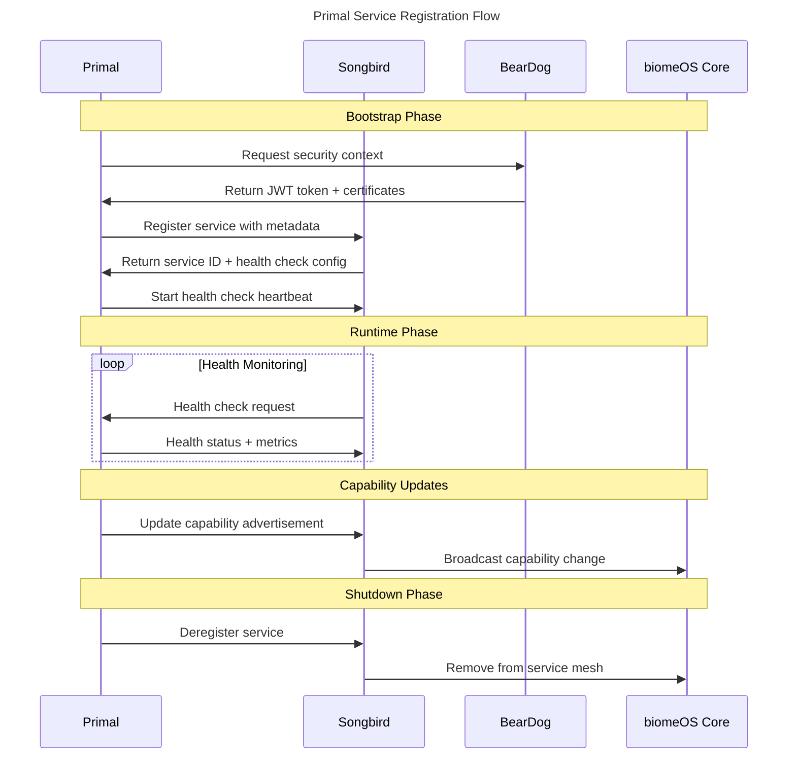

# Primal Service Registration Standards

**Version:** 1.0.0 | **Status:** Draft | **Date:** January 2025

---

## Overview

This specification defines the standardized service registration patterns for all five Primals within biomeOS. Each Primal must register with Songbird using consistent metadata formats, health check endpoints, and capability advertisements to enable proper service discovery and orchestration.

## Core Registration Framework

### Service Registration Lifecycle



## Standard Service Metadata

### Base Service Registration

All Primals must register using this base structure:

```json
{
  "service_id": "primal-{name}-{instance-id}",
  "primal_type": "beardog|songbird|nestgate|toadstool|squirrel",
  "biome_id": "biome-instance-uuid",
  "version": "1.0.0",
  "api_version": "biomeOS/v1",
  "registration_time": "2025-01-15T10:30:00Z",
  
  "endpoints": {
    "primary": "https://primal-host:8080",
    "health": "https://primal-host:8080/health",
    "metrics": "https://primal-host:8080/metrics",
    "admin": "https://primal-host:8081/admin"
  },
  
  "security": {
    "authentication_method": "beardog_jwt",
    "tls_enabled": true,
    "mtls_required": true,
    "trust_domain": "biome.local"
  },
  
  "capabilities": {
    "core": [],
    "extended": [],
    "integrations": []
  },
  
  "resource_requirements": {
    "cpu": "2",
    "memory": "4Gi",
    "storage": "10Gi",
    "network": "1Gbps"
  },
  
  "health_check": {
    "interval": "30s",
    "timeout": "10s",
    "retries": 3,
    "grace_period": "60s"
  },
  
  "tags": {
    "environment": "production",
    "zone": "us-west-2a",
    "role": "primary"
  }
}
```

## Primal-Specific Registration Patterns

### 🐕 BearDog - Security Framework

```json
{
  "service_id": "primal-beardog-001",
  "primal_type": "beardog",
  
  "capabilities": {
    "core": [
      "authentication",
      "authorization", 
      "secret_management",
      "certificate_management",
      "audit_logging"
    ],
    "extended": [
      "hsm_integration",
      "compliance_monitoring",
      "threat_detection",
      "key_rotation",
      "multi_party_approval"
    ],
    "integrations": [
      "songbird_security_provider",
      "nestgate_encryption",
      "toadstool_sandbox_security",
      "squirrel_agent_isolation"
    ]
  },
  
  "security_context": {
    "is_security_provider": true,
    "trust_anchor": true,
    "certificate_authority": true,
    "hsm_available": true,
    "compliance_standards": ["gdpr", "hipaa", "sox"]
  },
  
  "api_endpoints": {
    "token_service": "/auth/token",
    "certificate_service": "/pki/certificates", 
    "secret_service": "/secrets",
    "audit_service": "/audit",
    "compliance_service": "/compliance"
  }
}
```

### 🎼 Songbird - Service Mesh & Orchestration

```json
{
  "service_id": "primal-songbird-001",
  "primal_type": "songbird",
  
  "capabilities": {
    "core": [
      "service_discovery",
      "load_balancing",
      "health_monitoring",
      "traffic_routing",
      "circuit_breaking"
    ],
    "extended": [
      "federation",
      "multi_protocol_support",
      "advanced_routing",
      "canary_deployments",
      "traffic_splitting"
    ],
    "integrations": [
      "beardog_security_integration",
      "nestgate_volume_discovery",
      "toadstool_service_registration",
      "squirrel_agent_discovery"
    ]
  },
  
  "discovery_backends": [
    "consul",
    "etcd", 
    "memory",
    "kubernetes"
  ],
  
  "load_balancing_algorithms": [
    "round_robin",
    "health_based",
    "least_connections",
    "gpu_aware",
    "resource_aware"
  ],
  
  "protocols_supported": [
    "http",
    "https",
    "grpc",
    "websocket",
    "tcp",
    "udp"
  ],
  
  "api_endpoints": {
    "discovery": "/discovery",
    "registration": "/services",
    "health": "/health",
    "routing": "/routing",
    "federation": "/federation"
  }
}
```

### 🏰 NestGate - Sovereign Storage

```json
{
  "service_id": "primal-nestgate-001", 
  "primal_type": "nestgate",
  
  "capabilities": {
    "core": [
      "zfs_management",
      "volume_provisioning",
      "snapshot_management",
      "backup_orchestration",
      "tiered_storage"
    ],
    "extended": [
      "deduplication",
      "compression",
      "encryption_at_rest",
      "replication",
      "disaster_recovery"
    ],
    "integrations": [
      "songbird_volume_discovery",
      "toadstool_volume_mounting",
      "squirrel_mcp_volumes",
      "beardog_storage_encryption"
    ]
  },
  
  "storage_pools": [
    {
      "name": "nestpool",
      "type": "zfs",
      "total_capacity": "100Ti",
      "available_capacity": "75Ti",
      "tiers": ["hot", "warm", "cold"]
    }
  ],
  
  "protocols_supported": [
    "nfs",
    "smb", 
    "iscsi",
    "s3",
    "mcp"
  ],
  
  "storage_tiers": {
    "hot": {
      "media_type": "nvme",
      "capacity": "10Ti",
      "performance": "high"
    },
    "warm": {
      "media_type": "ssd", 
      "capacity": "40Ti",
      "performance": "medium"
    },
    "cold": {
      "media_type": "hdd",
      "capacity": "50Ti", 
      "performance": "low"
    }
  },
  
  "api_endpoints": {
    "volumes": "/volumes",
    "snapshots": "/snapshots",
    "pools": "/pools", 
    "backup": "/backup",
    "mcp": "/mcp"
  }
}
```

### 🍄 Toadstool - Universal Runtime

```json
{
  "service_id": "primal-toadstool-001",
  "primal_type": "toadstool",
  
  "capabilities": {
    "core": [
      "container_runtime",
      "process_management",
      "resource_isolation",
      "environment_management",
      "service_execution"
    ],
    "extended": [
      "wasm_runtime",
      "gpu_scheduling",
      "native_execution",
      "auto_scaling",
      "resource_optimization"
    ],
    "integrations": [
      "songbird_service_registration",
      "nestgate_volume_mounting", 
      "squirrel_agent_execution",
      "beardog_sandbox_security"
    ]
  },
  
  "runtimes_supported": [
    "container",
    "wasm",
    "native",
    "gpu",
    "serverless"
  ],
  
  "resource_pools": {
    "cpu": {
      "total_cores": 32,
      "available_cores": 24,
      "architecture": "x86_64"
    },
    "memory": {
      "total": "256Gi",
      "available": "192Gi",
      "type": "DDR4"
    },
    "gpu": {
      "total_devices": 8,
      "available_devices": 6,
      "types": ["nvidia-a100", "nvidia-h100"]
    }
  },
  
  "scheduling_policies": [
    "best_fit",
    "gpu_aware",
    "numa_aware",
    "power_efficient"
  ],
  
  "api_endpoints": {
    "services": "/services",
    "containers": "/containers",
    "processes": "/processes",
    "resources": "/resources",
    "scheduling": "/scheduling"
  }
}
```

### 🐿️ Squirrel - MCP Platform

```json
{
  "service_id": "primal-squirrel-001",
  "primal_type": "squirrel",
  
  "capabilities": {
    "core": [
      "mcp_protocol_server",
      "ai_agent_management",
      "plugin_platform",
      "multi_provider_routing",
      "sandbox_execution"
    ],
    "extended": [
      "cross_platform_plugins",
      "agent_orchestration",
      "workflow_automation",
      "context_management",
      "tool_integration"
    ],
    "integrations": [
      "songbird_agent_discovery",
      "toadstool_execution_delegation",
      "nestgate_data_access",
      "beardog_agent_security"
    ]
  },
  
  "ai_providers": [
    {
      "name": "openai",
      "models": ["gpt-4", "gpt-3.5-turbo"],
      "status": "available"
    },
    {
      "name": "anthropic", 
      "models": ["claude-3-sonnet", "claude-3-opus"],
      "status": "available"
    },
    {
      "name": "local",
      "models": ["llama-3-70b"],
      "status": "available"
    }
  ],
  
  "transport_protocols": [
    "stdio",
    "websocket",
    "sse",
    "grpc"
  ],
  
  "sandbox_types": [
    "strict",
    "relaxed", 
    "gpu_enabled",
    "network_isolated"
  ],
  
  "api_endpoints": {
    "mcp": "/mcp",
    "agents": "/agents",
    "plugins": "/plugins",
    "providers": "/providers",
    "tools": "/tools"
  }
}
```

## Health Check Standards

### Standard Health Check Response

```json
{
  "status": "healthy|degraded|unhealthy",
  "timestamp": "2025-01-15T10:30:00Z",
  "version": "1.0.0",
  "uptime": "24h30m15s",
  
  "checks": {
    "database": {
      "status": "healthy",
      "latency": "5ms",
      "last_check": "2025-01-15T10:29:30Z"
    },
    "storage": {
      "status": "healthy", 
      "usage": "75%",
      "last_check": "2025-01-15T10:29:30Z"
    },
    "external_dependencies": {
      "status": "healthy",
      "dependencies": ["beardog", "songbird"],
      "last_check": "2025-01-15T10:29:30Z"
    }
  },
  
  "metrics": {
    "cpu_usage": "45%",
    "memory_usage": "60%",
    "disk_usage": "75%",
    "network_throughput": "100Mbps",
    "request_rate": "150/min",
    "error_rate": "0.1%"
  },
  
  "capabilities_status": {
    "core": "fully_operational",
    "extended": "fully_operational", 
    "integrations": "degraded"
  }
}
```

### Primal-Specific Health Checks

#### BearDog Health Check
```json
{
  "security_context": {
    "hsm_status": "operational",
    "certificate_validity": "30d",
    "key_rotation_status": "current",
    "compliance_status": "compliant"
  },
  "active_sessions": 150,
  "audit_queue_size": 25
}
```

#### NestGate Health Check  
```json
{
  "storage_pools": {
    "nestpool": {
      "status": "online",
      "capacity_used": "75%",
      "scrub_status": "healthy"
    }
  },
  "active_volumes": 45,
  "backup_status": "current"
}
```

#### Toadstool Health Check
```json
{
  "resource_utilization": {
    "cpu": "45%",
    "memory": "60%", 
    "gpu": "30%"
  },
  "active_services": 12,
  "queued_tasks": 3
}
```

#### Squirrel Health Check
```json
{
  "ai_providers": {
    "openai": "available",
    "anthropic": "available",
    "local": "degraded"
  },
  "active_agents": 8,
  "plugin_status": "operational"
}
```

## Capability Advertisement

### Dynamic Capability Updates

Primals can update their capabilities dynamically:

```json
{
  "service_id": "primal-toadstool-001",
  "capability_update": {
    "type": "add|remove|modify",
    "capability": "gpu_scheduling",
    "details": {
      "new_gpu_types": ["nvidia-h100"],
      "scheduling_algorithms": ["numa_aware"]
    },
    "effective_time": "2025-01-15T10:35:00Z"
  }
}
```

### Capability Dependencies

```json
{
  "capability": "encrypted_storage",
  "dependencies": [
    {
      "primal": "beardog",
      "capability": "key_management",
      "version": ">=1.0.0"
    }
  ],
  "provides": [
    {
      "interface": "encrypted_volume_api",
      "version": "1.0.0"
    }
  ]
}
```

## Service Discovery Integration

### Discovery Query Patterns

```json
{
  "query_type": "capability_search",
  "filters": {
    "primal_type": "toadstool",
    "capabilities": ["gpu_scheduling"],
    "resource_requirements": {
      "gpu": ">=2",
      "memory": ">=16Gi"
    },
    "health_status": "healthy",
    "zone": "us-west-2a"
  }
}
```

### Discovery Response

```json
{
  "results": [
    {
      "service_id": "primal-toadstool-001",
      "endpoints": {
        "primary": "https://toadstool-1:8080"
      },
      "capabilities_match": ["gpu_scheduling"],
      "resource_availability": {
        "gpu": 4,
        "memory": "64Gi"
      },
      "load_metrics": {
        "cpu_usage": "45%",
        "memory_usage": "60%",
        "gpu_usage": "30%"
      }
    }
  ]
}
```

## Error Handling & Retry Logic

### Registration Failures

```json
{
  "error": {
    "code": "REGISTRATION_FAILED",
    "message": "Security context validation failed",
    "details": {
      "reason": "invalid_certificate",
      "retry_after": "30s",
      "contact": "beardog_admin"
    }
  },
  "retry_policy": {
    "max_attempts": 5,
    "backoff": "exponential",
    "base_delay": "1s",
    "max_delay": "60s"
  }
}
```

### Health Check Failures

```json
{
  "health_check_failure": {
    "consecutive_failures": 3,
    "last_success": "2025-01-15T10:25:00Z",
    "action": "mark_degraded",
    "escalation": {
      "after_failures": 5,
      "action": "remove_from_pool"
    }
  }
}
```

## Security Integration

### Authentication Flow

1. **Primal Startup**: Request security context from BearDog
2. **Token Acquisition**: Receive JWT token and mTLS certificates  
3. **Service Registration**: Register with Songbird using authenticated context
4. **Ongoing Authentication**: Refresh tokens according to rotation policy

### Authorization Model

```json
{
  "service_permissions": {
    "primal-nestgate-001": {
      "can_provision_volumes": true,
      "can_access_secrets": ["storage_encryption_key"],
      "can_register_services": true,
      "resource_limits": {
        "max_volume_size": "10Ti"
      }
    }
  }
}
```

## Monitoring & Observability

### Metrics Collection

All Primals must expose Prometheus-compatible metrics:

```
# HELP primal_registration_status Current registration status
# TYPE primal_registration_status gauge
primal_registration_status{primal_type="toadstool",service_id="primal-toadstool-001"} 1

# HELP primal_capability_count Number of capabilities advertised
# TYPE primal_capability_count gauge  
primal_capability_count{primal_type="toadstool",category="core"} 5

# HELP primal_health_check_duration Health check response time
# TYPE primal_health_check_duration histogram
primal_health_check_duration_bucket{le="0.1"} 95
```

### Distributed Tracing

All service registration and health check operations must include tracing headers:

```
X-Trace-ID: 550e8400-e29b-41d4-a716-446655440000
X-Span-ID: 6ba7b810-9dad-11d1-80b4-00c04fd430c8
X-Parent-Span-ID: 6ba7b811-9dad-11d1-80b4-00c04fd430c8
```

## Implementation Requirements

### Mandatory Endpoints

All Primals must implement:
- `GET /health` - Health check endpoint
- `GET /metrics` - Prometheus metrics
- `POST /capabilities` - Capability updates
- `GET /info` - Service information

### Configuration Management

Service registration configuration should be externalized:

```yaml
# primal-config.yaml
service_registration:
  songbird_endpoint: "https://songbird:8080"
  health_check_interval: 30s
  capability_refresh_interval: 300s
  retry_policy:
    max_attempts: 5
    backoff: exponential
```

### Startup Dependencies

Primals must respect the startup order:
1. BearDog (security context)
2. Songbird (service mesh)
3. NestGate, Toadstool, Squirrel (parallel)

## Validation & Testing

### Registration Validation

```bash
# Test service registration
curl -X POST https://songbird:8080/services \
  -H "Authorization: Bearer ${BEARDOG_TOKEN}" \
  -H "Content-Type: application/json" \
  -d @primal-registration.json

# Validate health check
curl -X GET https://primal:8080/health \
  -H "Authorization: Bearer ${BEARDOG_TOKEN}"

# Test capability discovery
curl -X GET "https://songbird:8080/discovery?capability=gpu_scheduling"
```

### Integration Testing

```python
# Test Primal registration flow
def test_primal_registration():
    # 1. Start BearDog
    beardog = start_beardog()
    
    # 2. Start Songbird
    songbird = start_songbird(beardog_endpoint=beardog.endpoint)
    
    # 3. Start Primal with registration
    primal = start_primal(
        songbird_endpoint=songbird.endpoint,
        beardog_endpoint=beardog.endpoint
    )
    
    # 4. Verify registration
    assert songbird.get_service(primal.service_id) is not None
    
    # 5. Test health checks
    assert primal.health_check().status == "healthy"
    
    # 6. Test capability discovery
    services = songbird.discover_services(capability="core_capability")
    assert primal.service_id in [s.service_id for s in services]
```

This specification provides the foundation for consistent service registration across all Primals, enabling proper orchestration and discovery within the biomeOS ecosystem. 