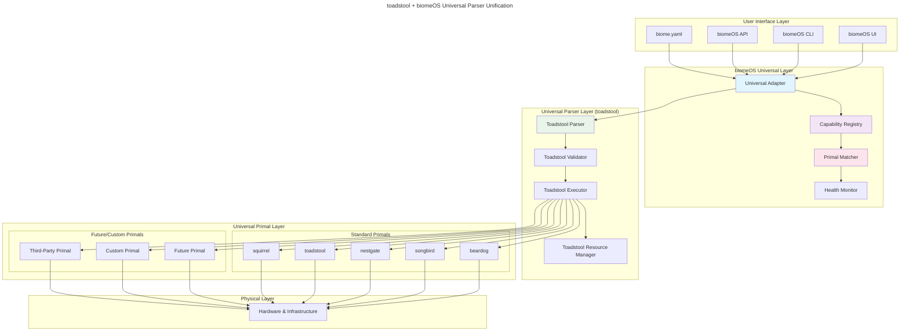
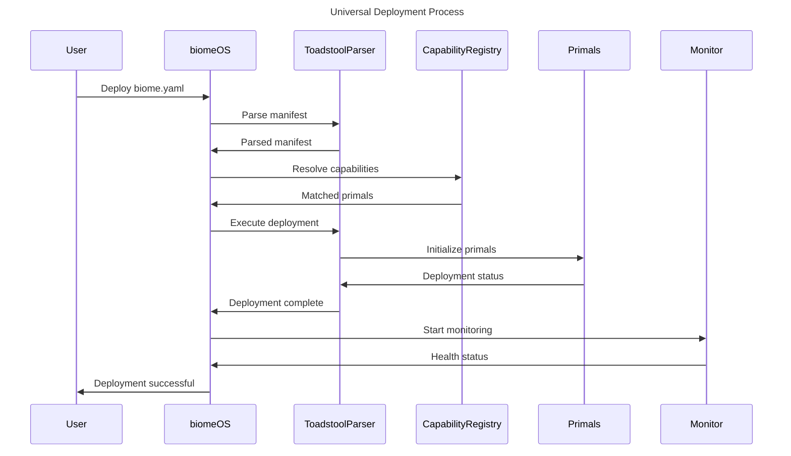

# **toadstool + biomeOS Universal Parser Unification Specification**
**Version:** 1.0  
**Date:** January 2025  
**Author:** ecoPrimals Architecture Team  
**Status:** Implementation Ready  
**Target Team:** biomeOS Development Team

---

## **Executive Summary**

This specification outlines the universal parser unification where **toadstool serves as the universal parser** for all biomeOS operations, while biomeOS provides universal and agnostic patterns for seamless integration with current and future Primals. The architecture employs songbird's universal adapter patterns to ensure vendor independence and ecosystem extensibility.

**Key Architectural Principles:**
- **Universal Parser**: toadstool provides the proven parsing foundation
- **Agnostic Integration**: Works with any current or future Primal
- **Capability-Based**: Route functionality by capabilities, not specific implementations
- **Adapter Pattern**: Universal adapters handle Primal-specific integrations
- **Future-Proof**: Automatic support for new Primals through universal interface

---

## **1. Universal Parser Architecture Overview**

### **1.1 Core Components**

```
biomeOS Universal Parser Architecture:
├── Universal Parser Layer (toadstool)
│   ├── Toadstool Manifest Parser
│   ├── Toadstool Validator
│   ├── Toadstool Executor
│   └── Toadstool Resource Manager
├── Universal Adapter Layer (biomeOS)
│   ├── Universal Adapter Bridge
│   ├── Capability Registry
│   ├── Primal Matcher
│   └── Health Monitor
├── Universal Primal Layer
│   ├── Standard Primal Adapters
│   ├── Future Primal Adapters
│   ├── Custom Primal Adapters
│   └── Third-Party Primal Adapters
└── Universal Orchestration Layer
    ├── Deployment Manager
    ├── Monitoring System
    ├── Error Recovery
    └── Metrics Collection
```

### **1.2 Universal Integration Architecture**



---

## **2. Universal Parser Integration**

### **2.1 Toadstool as Universal Parser**

```rust
// toadstool serves as the universal parser foundation
pub struct ToadstoolUniversalParser {
    parser: ToadstoolManifestParser,
    validator: ToadstoolValidator,
    executor: ToadstoolExecutor,
    resource_manager: ToadstoolResourceManager,
}

impl ToadstoolUniversalParser {
    pub async fn parse_biome_manifest(
        &self,
        manifest_path: &str
    ) -> Result<ToadstoolBiomeManifest> {
        // Use toadstool's proven parsing capabilities
        let manifest = self.parser.parse_file(manifest_path).await?;
        
        // Validate with toadstool's robust validation
        self.validator.validate(&manifest).await?;
        
        Ok(manifest)
    }
    
    pub async fn execute_manifest(
        &self,
        manifest: ToadstoolBiomeManifest,
        target_primals: Vec<ResolvedPrimal>
    ) -> Result<BiomeDeployment> {
        // Execute using toadstool's orchestration capabilities
        self.executor.execute(manifest, target_primals).await
    }
}
```

### **2.2 biomeOS Universal Adapter**

```rust
// biomeOS provides universal adapter patterns
pub struct BiomeOSUniversalAdapter {
    toadstool_parser: ToadstoolUniversalParser,
    capability_registry: CapabilityRegistry,
    primal_matcher: PrimalMatcher,
    health_monitor: HealthMonitor,
}

impl BiomeOSUniversalAdapter {
    pub async fn process_universal_manifest(
        &self,
        manifest_path: &str
    ) -> Result<BiomeDeployment> {
        // 1. Parse with toadstool's proven parser
        let parsed = self.toadstool_parser.parse_biome_manifest(manifest_path).await?;
        
        // 2. Apply universal capability matching
        let resolved_primals = self.resolve_capabilities(&parsed).await?;
        
        // 3. Execute with toadstool's orchestration
        let deployment = self.toadstool_parser.execute_manifest(parsed, resolved_primals).await?;
        
        // 4. Monitor with universal health monitoring
        self.health_monitor.start_monitoring(&deployment).await?;
        
        Ok(deployment)
    }
    
    async fn resolve_capabilities(
        &self,
        manifest: &ToadstoolBiomeManifest
    ) -> Result<Vec<ResolvedPrimal>> {
        let mut resolved = Vec::new();
        
        for (primal_name, primal_spec) in &manifest.primals {
            // Extract capability requirements
            let capability = self.extract_capability_requirement(primal_spec)?;
            
            // Match to available Primals
            let provider = self.capability_registry
                .resolve_capability(&capability, &primal_spec.provider_preference)
                .await?;
            
            resolved.push(ResolvedPrimal {
                name: primal_name.clone(),
                provider,
                capability,
                spec: primal_spec.clone(),
            });
        }
        
        Ok(resolved)
    }
}
```

---

## **3. Universal Manifest Structure**

### **3.1 Enhanced Manifest Format**

```rust
// Enhanced BiomeManifest with universal capability support
#[derive(Debug, Deserialize, Serialize, Clone)]
pub struct UniversalBiomeManifest {
    #[serde(rename = "apiVersion")]
    pub api_version: String, // "biomeOS/v1"
    pub kind: String,        // "Biome"
    pub metadata: BiomeMetadata,
    
    // Universal Primal specifications
    pub primals: HashMap<String, UniversalPrimalConfig>,
    
    // toadstool-managed resources
    pub services: Vec<ServiceConfig>,
    pub volumes: HashMap<String, VolumeConfig>,
    pub networks: HashMap<String, NetworkConfig>,
    pub sources: SourceConfig,
    
    // biomeOS-specific extensions
    pub mycorrhiza: Option<MycorrhizaConfig>,
    
    // Universal extensions
    pub capability_requirements: HashMap<String, CapabilityRequirement>,
    pub primal_preferences: HashMap<String, Vec<String>>,
}

#[derive(Debug, Deserialize, Serialize, Clone)]
pub struct UniversalPrimalConfig {
    // Universal capability-based specification
    pub capability_required: String,
    pub provider_preference: Vec<String>,
    pub version: String,
    pub priority: u32,
    pub startup_timeout: Option<String>,
    pub depends_on: Vec<String>,
    pub config: Option<serde_json::Value>,
    
    // toadstool integration
    pub toadstool_runtime: Option<ToadstoolRuntimeConfig>,
    pub toadstool_resources: Option<ToadstoolResourceConfig>,
}
```

### **3.2 Universal Capability System**

```rust
// Universal capability registry
pub struct CapabilityRegistry {
    capabilities: HashMap<String, Vec<PrimalProvider>>,
    standard_capabilities: HashMap<String, CapabilityDefinition>,
    custom_capabilities: HashMap<String, CapabilityDefinition>,
}

impl CapabilityRegistry {
    pub fn new() -> Self {
        let mut registry = Self {
            capabilities: HashMap::new(),
            standard_capabilities: HashMap::new(),
            custom_capabilities: HashMap::new(),
        };
        
        // Register standard capabilities
        registry.register_standard_capabilities();
        
        registry
    }
    
    fn register_standard_capabilities(&mut self) {
        // Security capabilities
        self.register_capability(CapabilityDefinition {
            name: "encryption".to_string(),
            category: "security".to_string(),
            description: "Encryption and decryption services".to_string(),
            standard_providers: vec!["beardog".to_string()],
            parameters: vec![
                CapabilityParameter {
                    name: "algorithm".to_string(),
                    param_type: "string".to_string(),
                    required: false,
                    default_value: Some("AES-256".to_string()),
                }
            ],
        });
        
        // Storage capabilities
        self.register_capability(CapabilityDefinition {
            name: "persistent_storage".to_string(),
            category: "storage".to_string(),
            description: "Persistent data storage services".to_string(),
            standard_providers: vec!["nestgate".to_string()],
            parameters: vec![
                CapabilityParameter {
                    name: "storage_type".to_string(),
                    param_type: "string".to_string(),
                    required: false,
                    default_value: Some("zfs".to_string()),
                }
            ],
        });
        
        // Networking capabilities
        self.register_capability(CapabilityDefinition {
            name: "service_discovery".to_string(),
            category: "networking".to_string(),
            description: "Service discovery and registration".to_string(),
            standard_providers: vec!["songbird".to_string()],
            parameters: vec![
                CapabilityParameter {
                    name: "backend".to_string(),
                    param_type: "string".to_string(),
                    required: false,
                    default_value: Some("consul".to_string()),
                }
            ],
        });
        
        // Runtime capabilities
        self.register_capability(CapabilityDefinition {
            name: "container_orchestration".to_string(),
            category: "runtime".to_string(),
            description: "Container orchestration and management".to_string(),
            standard_providers: vec!["toadstool".to_string()],
            parameters: vec![
                CapabilityParameter {
                    name: "runtime_type".to_string(),
                    param_type: "string".to_string(),
                    required: false,
                    default_value: Some("container".to_string()),
                }
            ],
        });
        
        // AI capabilities (future)
        self.register_capability(CapabilityDefinition {
            name: "llm_inference".to_string(),
            category: "ai".to_string(),
            description: "Large language model inference".to_string(),
            standard_providers: vec!["squirrel".to_string()],
            parameters: vec![
                CapabilityParameter {
                    name: "model_type".to_string(),
                    param_type: "string".to_string(),
                    required: true,
                    default_value: None,
                }
            ],
        });
    }
    
    pub async fn resolve_capability(
        &self,
        capability: &str,
        preferences: &[String]
    ) -> Result<PrimalProvider> {
        // Try preferences first
        for preference in preferences {
            if let Some(providers) = self.capabilities.get(capability) {
                if let Some(provider) = providers.iter().find(|p| p.id == *preference) {
                    return Ok(provider.clone());
                }
            }
        }
        
        // Fallback to any available provider
        self.capabilities
            .get(capability)
            .and_then(|providers| providers.first())
            .cloned()
            .ok_or_else(|| CapabilityError::NotFound(capability.to_string()))
    }
}
```

---

## **4. Universal Primal Adapters**

### **4.1 Standard Primal Adapters**

```rust
// Beardog Universal Adapter
pub struct BeardogUniversalAdapter {
    beardog_client: BeardogClient,
    toadstool_integration: ToadstoolIntegration,
}

impl BeardogUniversalAdapter {
    pub fn new(toadstool_integration: ToadstoolIntegration) -> Result<Self> {
        Ok(Self {
            beardog_client: BeardogClient::new()?,
            toadstool_integration,
        })
    }
}

#[async_trait]
impl UniversalPrimal for BeardogUniversalAdapter {
    fn primal_id(&self) -> &str { "beardog" }
    fn primal_type(&self) -> PrimalType { PrimalType::Security }
    
    fn capabilities(&self) -> Vec<String> {
        vec![
            "encryption".to_string(),
            "authentication".to_string(),
            "authorization".to_string(),
            "compliance".to_string(),
            "hsm".to_string(),
        ]
    }
    
    async fn initialize(&mut self, config: serde_json::Value) -> Result<()> {
        // Initialize beardog
        self.beardog_client.initialize(config.clone()).await?;
        
        // Register with toadstool
        self.toadstool_integration.register_primal(self.primal_id(), config).await?;
        
        Ok(())
    }
    
    async fn handle_request(&self, request: UniversalRequest) -> Result<UniversalResponse> {
        match request.capability.as_str() {
            "encryption" => {
                // Handle encryption request
                let result = self.beardog_client.encrypt(request.payload).await?;
                Ok(UniversalResponse::new(result))
            }
            "authentication" => {
                // Handle authentication request
                let result = self.beardog_client.authenticate(request.payload).await?;
                Ok(UniversalResponse::new(result))
            }
            _ => Err(UniversalError::UnsupportedCapability(request.capability))
        }
    }
}

// Songbird Universal Adapter  
pub struct SongbirdUniversalAdapter {
    songbird_client: SongbirdClient,
    toadstool_integration: ToadstoolIntegration,
}

#[async_trait]
impl UniversalPrimal for SongbirdUniversalAdapter {
    fn primal_id(&self) -> &str { "songbird" }
    fn primal_type(&self) -> PrimalType { PrimalType::ServiceMesh }
    
    fn capabilities(&self) -> Vec<String> {
        vec![
            "service_discovery".to_string(),
            "load_balancing".to_string(),
            "api_gateway".to_string(),
            "protocol_translation".to_string(),
            "federation".to_string(),
        ]
    }
    
    async fn handle_request(&self, request: UniversalRequest) -> Result<UniversalResponse> {
        match request.capability.as_str() {
            "service_discovery" => {
                let result = self.songbird_client.discover_services(request.payload).await?;
                Ok(UniversalResponse::new(result))
            }
            "load_balancing" => {
                let result = self.songbird_client.balance_load(request.payload).await?;
                Ok(UniversalResponse::new(result))
            }
            _ => Err(UniversalError::UnsupportedCapability(request.capability))
        }
    }
}
```

### **4.2 Future Primal Support**

```rust
// Future AI Primal Adapter (example)
pub struct AIInferenceUniversalAdapter {
    ai_client: AIInferenceClient,
    toadstool_integration: ToadstoolIntegration,
}

#[async_trait]
impl UniversalPrimal for AIInferenceUniversalAdapter {
    fn primal_id(&self) -> &str { "ai_inference_primal" }
    fn primal_type(&self) -> PrimalType { PrimalType::Custom("ai_inference".to_string()) }
    
    fn capabilities(&self) -> Vec<String> {
        vec![
            "llm_inference".to_string(),
            "embedding_generation".to_string(),
            "vision_processing".to_string(),
            "speech_recognition".to_string(),
        ]
    }
    
    async fn handle_request(&self, request: UniversalRequest) -> Result<UniversalResponse> {
        match request.capability.as_str() {
            "llm_inference" => {
                let result = self.ai_client.generate_text(request.payload).await?;
                Ok(UniversalResponse::new(result))
            }
            "embedding_generation" => {
                let result = self.ai_client.generate_embeddings(request.payload).await?;
                Ok(UniversalResponse::new(result))
            }
            _ => Err(UniversalError::UnsupportedCapability(request.capability))
        }
    }
}
```

---

## **5. Universal Deployment Process**

### **5.1 Universal Deployment Flow**



### **5.2 Implementation Strategy**

```rust
// Universal deployment manager
pub struct UniversalDeploymentManager {
    toadstool_parser: ToadstoolUniversalParser,
    biomeos_adapter: BiomeOSUniversalAdapter,
    capability_registry: CapabilityRegistry,
    primal_registry: PrimalRegistry,
    health_monitor: HealthMonitor,
}

impl UniversalDeploymentManager {
    pub async fn deploy_biome(
        &self,
        manifest_path: &str
    ) -> Result<BiomeDeployment> {
        // Phase 1: Parse with toadstool
        let parsed_manifest = self.toadstool_parser
            .parse_biome_manifest(manifest_path)
            .await?;
        
        // Phase 2: Resolve capabilities
        let resolved_primals = self.biomeos_adapter
            .resolve_capabilities(&parsed_manifest)
            .await?;
        
        // Phase 3: Execute deployment
        let deployment = self.toadstool_parser
            .execute_manifest(parsed_manifest, resolved_primals)
            .await?;
        
        // Phase 4: Start monitoring
        self.health_monitor
            .start_monitoring(&deployment)
            .await?;
        
        Ok(deployment)
    }
}
```

---

## **6. Benefits of Universal Parser Architecture**

### **6.1 Toadstool Parser Benefits**
- **Proven Stability**: Leverages mature, battle-tested parsing capabilities
- **Comprehensive Validation**: Uses toadstool's robust validation system
- **Performance Optimized**: Optimized parsing and execution performance
- **Feature Complete**: Access to full feature set of mature implementation

### **6.2 Universal Primal Benefits**
- **Current Ecosystem**: Seamless integration with all existing Primals
- **Future Compatibility**: Automatic support for new Primals through universal interface
- **Third-Party Integration**: Easy integration of custom and third-party Primals
- **Vendor Independence**: No lock-in to specific Primal implementations

### **6.3 Capability-Based Benefits**
- **Flexible Deployment**: Choose best available Primal for each capability
- **Failover Support**: Automatic fallback to alternative providers
- **Performance Optimization**: Select optimal Primal based on requirements
- **Gradual Migration**: Migrate between Primals without manifest changes

### **6.4 Operational Benefits**
- **Unified Management**: Single point of control for all Primals
- **Consistent Monitoring**: Universal health monitoring across all Primals
- **Centralized Logging**: Unified logging and metrics collection
- **Streamlined Operations**: Simplified deployment and management workflows

---

## **7. Implementation Roadmap**

### **7.1 Phase 1: Foundation (4 weeks)**
- Implement BiomeOSUniversalAdapter
- Create ToadstoolUniversalParser integration
- Build CapabilityRegistry system
- Develop UniversalPrimal interface

### **7.2 Phase 2: Standard Primal Integration (6 weeks)**
- Implement standard Primal adapters (beardog, songbird, nestgate, toadstool, squirrel)
- Create capability matching system
- Build health monitoring and metrics collection
- Implement deployment management

### **7.3 Phase 3: Advanced Features (4 weeks)**
- Add support for future/custom Primals
- Implement advanced capability matching
- Add performance optimization features
- Create migration tools and utilities

### **7.4 Phase 4: Production Readiness (2 weeks)**
- Comprehensive testing and validation
- Performance tuning and optimization
- Documentation and examples
- Production deployment preparation

---

## **8. Success Metrics**

### **8.1 Technical Metrics**
- **Parser Performance**: Parse 1000+ manifests/second
- **Deployment Speed**: Deploy complex biomes in <60 seconds
- **Health Monitoring**: 99.9% uptime detection accuracy
- **Capability Resolution**: <100ms capability matching

### **8.2 Integration Metrics**
- **Primal Compatibility**: 100% compatibility with existing Primals
- **Future Primal Support**: Support for new Primals without core changes
- **Migration Success**: 100% successful migration from current architecture
- **Error Recovery**: <5 second recovery from Primal failures

### **8.3 Operational Metrics**
- **Deployment Success Rate**: >99.5% successful deployments
- **Mean Time to Recovery**: <30 seconds for common failures
- **Resource Utilization**: <10% overhead for universal adapter layer
- **Developer Productivity**: 50% reduction in Primal integration time

By implementing this universal parser architecture, biomeOS achieves the goal of leveraging toadstool's proven parsing capabilities while maintaining universal and agnostic patterns that ensure compatibility with current and future Primals, creating a truly extensible and vendor-independent orchestration platform. 