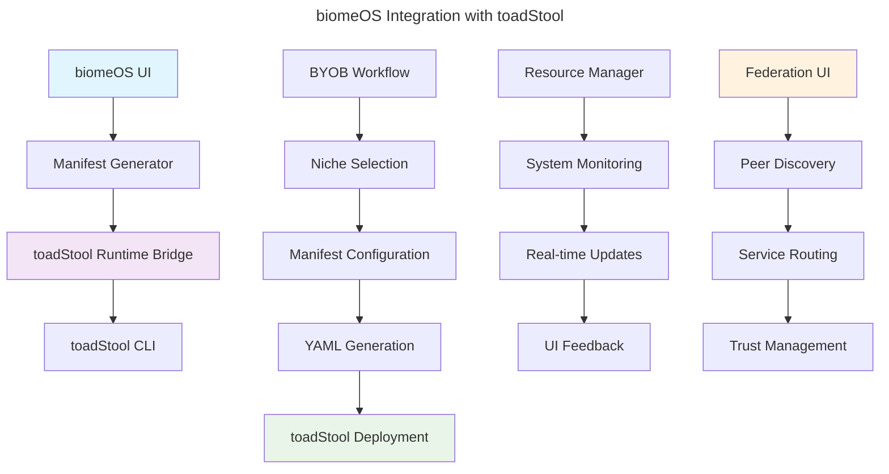

# **toadStool + biomeOS Unification Specification**
**Version:** 1.0  
**Date:** January 2025  
**Author:** ecoPrimals Architecture Team  
**Status:** Implementation Ready  
**Target Team:** biomeOS Development Team

---

## **Executive Summary**

This specification outlines the unification of `toadStool` (universal runtime) and `biomeOS` (declarative manifest system) into a Docker-free, sovereignty-focused container orchestration platform. The biomeOS team will focus on manifest system integration, UI enhancements, and system integration components.

**Key Principles:**
- **Sovereignty-first:** No external runtime dependencies
- **WASM-native:** WebAssembly as primary execution environment
- **Platform agnostic:** Single binary works on Windows/Linux/macOS
- **Security-focused:** Capability-based isolation with bearDog integration
- **Federation-ready:** Built-in peer-to-peer networking

---

## **1. biomeOS Architecture Overview**

### **1.1 Core Components**

```
biomeOS Integration Layer:
├── Manifest System (Updated)
│   ├── toadStool Manifest Parser
│   ├── Service Configuration
│   ├── Primal Configuration
│   └── Federation Configuration
├── UI Enhancement Layer
│   ├── Hierarchical BYOB Workflow
│   ├── Enhanced Niche Manager
│   ├── toadStool Integration
│   └── Real-time Monitoring
├── System Integration
│   ├── Runtime Bridge
│   ├── Resource Coordination
│   ├── Event Handling
│   └── Error Propagation
└── Federation Layer
    ├── Peer Management
    ├── Service Discovery
    ├── Trust Policies
    └── Mesh Networking
```

### **1.2 Integration Architecture**



---

## **2. biomeOS Manifest System Updates**

### **2.1 Enhanced Manifest Structure**

```rust
// crates/biomeos-manifest/src/lib.rs
use serde::{Deserialize, Serialize};
use std::collections::HashMap;

#[derive(Debug, Deserialize, Serialize, Clone)]
pub struct ToadStoolManifest {
    #[serde(rename = "apiVersion")]
    pub api_version: String, // "biomeOS/v1"
    pub kind: String,        // "Biome"
    pub metadata: BiomeMetadata,
    pub primals: HashMap<String, PrimalConfig>,
    pub services: Vec<ServiceConfig>,
    pub federation: Option<FederationConfig>,
    pub resources: Option<ResourceLimits>,
    pub health_checks: Option<Vec<HealthCheck>>,
}

#[derive(Debug, Deserialize, Serialize, Clone)]
pub struct ServiceConfig {
    pub name: String,
    pub source: String,
    pub runtime: RuntimeType,
    pub resources: ResourceRequirements,
    pub network: Option<Vec<NetworkConfig>>,
    pub volumes: Option<Vec<VolumeMount>>,
    pub environment: Option<Vec<EnvVar>>,
    pub capabilities: Option<Vec<String>>,
}

#[derive(Debug, Deserialize, Serialize, Clone)]
pub enum RuntimeType {
    #[serde(rename = "wasm")]
    Wasm,
    #[serde(rename = "container")]
    Container,
    #[serde(rename = "process")]
    Process,
}

#[derive(Debug, Deserialize, Serialize, Clone)]
pub struct PrimalConfig {
    pub enabled: bool,
    pub source: String,
    pub config: serde_yaml::Value,
}

#[derive(Debug, Deserialize, Serialize, Clone)]
pub struct FederationConfig {
    pub enabled: bool,
    pub trust_policy: String,
    pub allowed_peers: Vec<String>,
    pub shared_services: Vec<String>,
    pub discovery: Vec<String>,
}
```

### **2.2 Manifest Generation Pipeline**

```rust
// crates/biomeos-core/src/manifest_generator.rs
pub struct ManifestGenerator {
    template_manager: TemplateManager,
    resource_calculator: ResourceCalculator,
    security_validator: SecurityValidator,
}

impl ManifestGenerator {
    pub fn generate_from_byob(
        &self,
        team: &TeamWorkspace,
        niche: &NicheTemplate,
        resources: &ResourceAllocation,
    ) -> Result<ToadStoolManifest, ManifestError> {
        // Generate manifest from BYOB workflow
        let mut manifest = ToadStoolManifest {
            api_version: "biomeOS/v1".to_string(),
            kind: "Biome".to_string(),
            metadata: self.generate_metadata(team, niche)?,
            primals: self.generate_primal_config(team, niche)?,
            services: self.generate_services(niche, resources)?,
            federation: self.generate_federation_config(team)?,
            resources: Some(self.calculate_resource_limits(resources)?),
            health_checks: Some(self.generate_health_checks(niche)?),
        };

        self.validate_manifest(&manifest)?;
        Ok(manifest)
    }

    fn generate_primal_config(
        &self,
        team: &TeamWorkspace,
        niche: &NicheTemplate,
    ) -> Result<HashMap<String, PrimalConfig>, ManifestError> {
        let mut primals = HashMap::new();

        // bearDog configuration
        primals.insert("beardog".to_string(), PrimalConfig {
            enabled: true,
            source: "ecoprimals/beardog:v1.2.0".to_string(),
            config: serde_yaml::to_value(BearDogConfig {
                policy_file: format!("./policies/{}.bd", team.team_name),
                federation_mode: "team".to_string(),
                human_forged_key: true,
            })?,
        });

        // nestGate configuration
        primals.insert("nestgate".to_string(), PrimalConfig {
            enabled: true,
            source: "ecoprimals/nestgate:v1.1.0".to_string(),
            config: serde_yaml::to_value(NestGateConfig {
                storage_path: format!("/data/{}", team.team_name),
                default_pool: team.team_name.clone(),
                encryption: "aes-256-gcm".to_string(),
                auto_snapshot: true,
            })?,
        });

        // songBird configuration
        primals.insert("songbird".to_string(), PrimalConfig {
            enabled: niche.requires_networking,
            source: "ecoprimals/songbird:v1.3.0".to_string(),
            config: serde_yaml::to_value(SongBirdConfig {
                discovery_mode: "mdns".to_string(),
                federation_port: 8080,
                mesh_network: true,
            })?,
        });

        Ok(primals)
    }

    fn generate_services(
        &self,
        niche: &NicheTemplate,
        resources: &ResourceAllocation,
    ) -> Result<Vec<ServiceConfig>, ManifestError> {
        let mut services = Vec::new();

        for service_template in &niche.services {
            let service = ServiceConfig {
                name: service_template.name.clone(),
                source: service_template.source.clone(),
                runtime: RuntimeType::Wasm, // WASM-first
                resources: ResourceRequirements {
                    cpu: service_template.cpu_request.clone(),
                    memory: service_template.memory_request.clone(),
                    storage: service_template.storage_request.clone(),
                },
                network: service_template.network_config.clone(),
                volumes: self.generate_volume_mounts(service_template)?,
                environment: service_template.environment.clone(),
                capabilities: Some(service_template.capabilities.clone()),
            };
            services.push(service);
        }

        Ok(services)
    }
}
```

---

## **3. UI Enhancement Tasks**

### **3.1 BYOB Workflow Updates**

```rust
// ui/src/views/byob.rs - Enhanced for toadStool integration
impl ByobView {
    fn render_runtime_selection(&mut self, ui: &mut egui::Ui) {
        ui.heading("Runtime Configuration");
        
        ui.horizontal(|ui| {
            ui.label("Primary Runtime:");
            ui.radio_value(&mut self.selected_runtime, RuntimeType::Wasm, "WASM (Recommended)");
            ui.radio_value(&mut self.selected_runtime, RuntimeType::Container, "Container (Fallback)");
            ui.radio_value(&mut self.selected_runtime, RuntimeType::Process, "Process (Legacy)");
        });

        if self.selected_runtime == RuntimeType::Wasm {
            ui.label("✅ WASM provides maximum security and performance");
        } else {
            ui.colored_label(
                egui::Color32::YELLOW,
                "⚠️ Non-WASM runtimes have reduced security guarantees"
            );
        }
    }

    fn render_capability_configuration(&mut self, ui: &mut egui::Ui) {
        ui.heading("Security Capabilities");
        
        ui.group(|ui| {
            ui.label("Select required capabilities:");
            
            for capability in &mut self.available_capabilities {
                ui.checkbox(&mut capability.enabled, &capability.name);
                if capability.enabled {
                    ui.indent(format!("cap_{}", capability.name), |ui| {
                        ui.label(&capability.description);
                        if capability.security_impact == SecurityImpact::High {
                            ui.colored_label(
                                egui::Color32::RED,
                                "⚠️ High security impact"
                            );
                        }
                    });
                }
            }
        });
    }

    fn render_federation_settings(&mut self, ui: &mut egui::Ui) {
        ui.heading("Federation Configuration");
        
        ui.checkbox(&mut self.federation_enabled, "Enable Federation");
        
        if self.federation_enabled {
            ui.group(|ui| {
                ui.label("Trust Policy:");
                ui.radio_value(&mut self.trust_policy, "beardog_verified", "bearDog Verified");
                ui.radio_value(&mut self.trust_policy, "team_only", "Team Only");
                ui.radio_value(&mut self.trust_policy, "open", "Open Network");
                
                ui.separator();
                
                ui.label("Allowed Peers:");
                for peer in &mut self.allowed_peers {
                    ui.horizontal(|ui| {
                        ui.text_edit_singleline(&mut peer.name);
                        if ui.button("Remove").clicked() {
                            // Mark for removal
                        }
                    });
                }
                
                if ui.button("Add Peer").clicked() {
                    self.allowed_peers.push(FederationPeer::default());
                }
            });
        }
    }

    fn generate_toadstool_manifest(&self) -> Result<ToadStoolManifest, ManifestError> {
        let generator = ManifestGenerator::new();
        generator.generate_from_byob(
            &self.current_team,
            &self.selected_niche,
            &self.resource_allocation,
        )
    }
}
```

### **3.2 Enhanced Niche Manager**

```rust
// ui/src/views/niche_manager.rs - WASM-first templates
impl NicheManager {
    fn create_wasm_templates(&self) -> Vec<NicheTemplate> {
        vec![
            NicheTemplate {
                name: "WASM Web Service".to_string(),
                category: NicheCategory::WebDevelopment,
                description: "High-performance web service in WASM".to_string(),
                runtime_preference: RuntimeType::Wasm,
                services: vec![
                    ServiceTemplate {
                        name: "web-service".to_string(),
                        source: "ecoprimals/wasm-web-service:v1.0.0".to_string(),
                        capabilities: vec![
                            "network.client".to_string(),
                            "fs.read:/app/data".to_string(),
                        ],
                        cpu_request: "0.5".to_string(),
                        memory_request: "512MB".to_string(),
                        storage_request: Some("1GB".to_string()),
                        network_config: Some(vec![
                            NetworkConfig {
                                port: 8080,
                                protocol: "http".to_string(),
                                external: Some(true),
                            }
                        ]),
                        environment: Some(vec![
                            EnvVar {
                                name: "SERVICE_MODE".to_string(),
                                value: "production".to_string(),
                            }
                        ]),
                    }
                ],
                requires_networking: true,
                security_level: SecurityLevel::High,
                resource_requirements: ResourceRequirements::default(),
            },
            
            NicheTemplate {
                name: "WASM AI Agent".to_string(),
                category: NicheCategory::AIResearch,
                description: "Secure AI agent runtime in WASM".to_string(),
                runtime_preference: RuntimeType::Wasm,
                services: vec![
                    ServiceTemplate {
                        name: "ai-agent".to_string(),
                        source: "ecoprimals/wasm-ai-agent:v1.0.0".to_string(),
                        capabilities: vec![
                            "network.client".to_string(),
                            "crypto.sign".to_string(),
                            "fs.read:/app/models".to_string(),
                        ],
                        cpu_request: "2.0".to_string(),
                        memory_request: "4GB".to_string(),
                        storage_request: Some("10GB".to_string()),
                        network_config: Some(vec![
                            NetworkConfig {
                                port: 8081,
                                protocol: "grpc".to_string(),
                                external: Some(false),
                            }
                        ]),
                        environment: Some(vec![
                            EnvVar {
                                name: "MODEL_PATH".to_string(),
                                value: "/app/models".to_string(),
                            }
                        ]),
                    }
                ],
                requires_networking: true,
                security_level: SecurityLevel::Maximum,
                resource_requirements: ResourceRequirements::default(),
            },
        ]
    }
}
```

### **3.3 YAML Editor Integration**

```rust
// ui/src/views/yaml_editor.rs - toadStool manifest support
impl YamlEditor {
    fn validate_toadstool_manifest(&self, content: &str) -> Vec<ValidationError> {
        let mut errors = Vec::new();
        
        match serde_yaml::from_str::<ToadStoolManifest>(content) {
            Ok(manifest) => {
                // Validate API version
                if manifest.api_version != "biomeOS/v1" {
                    errors.push(ValidationError {
                        line: 1,
                        message: format!("Unsupported API version: {}", manifest.api_version),
                        severity: Severity::Error,
                    });
                }
                
                // Validate runtime types
                for service in &manifest.services {
                    if service.runtime == RuntimeType::Container {
                        errors.push(ValidationError {
                            line: 0, // TODO: Get actual line number
                            message: format!("Service '{}' uses container runtime - consider WASM for better security", service.name),
                            severity: Severity::Warning,
                        });
                    }
                }
                
                // Validate capabilities
                for service in &manifest.services {
                    if let Some(capabilities) = &service.capabilities {
                        for cap in capabilities {
                            if cap == "all" {
                                errors.push(ValidationError {
                                    line: 0,
                                    message: format!("Service '{}' requests 'all' capabilities - security risk", service.name),
                                    severity: Severity::Error,
                                });
                            }
                        }
                    }
                }
            }
            Err(e) => {
                errors.push(ValidationError {
                    line: 0,
                    message: format!("YAML parsing error: {}", e),
                    severity: Severity::Error,
                });
            }
        }
        
        errors
    }

    fn render_toadstool_export_options(&mut self, ui: &mut egui::Ui) {
        ui.group(|ui| {
            ui.label("Export Options:");
            
            if ui.button("📤 Deploy with toadStool").clicked() {
                self.deploy_with_toadstool();
            }
            
            if ui.button("💾 Save as Template").clicked() {
                self.save_as_template();
            }
            
            if ui.button("🔄 Convert to Legacy Format").clicked() {
                self.convert_to_legacy_format();
            }
        });
    }

    fn deploy_with_toadstool(&self) {
        // Integration with toadStool CLI
        let manifest_path = self.save_temporary_manifest();
        
        let command = std::process::Command::new("toadstool")
            .arg("run")
            .arg(&manifest_path)
            .spawn();
            
        match command {
            Ok(mut child) => {
                // Monitor deployment
                self.monitor_deployment(child);
            }
            Err(e) => {
                self.show_error(format!("Failed to start toadStool: {}", e));
            }
        }
    }
}
```

---

## **4. System Integration Components**

### **4.1 Runtime Bridge**

```rust
// crates/biomeos-core/src/runtime_bridge.rs
use std::process::{Command, Stdio};
use tokio::process::Command as TokioCommand;

pub struct ToadStoolBridge {
    toadstool_binary: String,
    working_directory: String,
}

impl ToadStoolBridge {
    pub fn new() -> Self {
        Self {
            toadstool_binary: "toadstool".to_string(),
            working_directory: std::env::current_dir()
                .unwrap()
                .to_string_lossy()
                .to_string(),
        }
    }

    pub async fn deploy_biome(&self, manifest: &ToadStoolManifest) -> Result<DeploymentHandle, BridgeError> {
        // Save manifest to temporary file
        let manifest_path = self.save_manifest(manifest).await?;
        
        // Execute toadStool run command
        let mut cmd = TokioCommand::new(&self.toadstool_binary);
        cmd.arg("run")
           .arg(&manifest_path)
           .arg("--detached")
           .stdout(Stdio::piped())
           .stderr(Stdio::piped());
        
        let child = cmd.spawn()?;
        
        Ok(DeploymentHandle {
            process: child,
            manifest_path,
            biome_name: manifest.metadata.name.clone(),
        })
    }

    pub async fn list_biomes(&self) -> Result<Vec<BiomeStatus>, BridgeError> {
        let output = TokioCommand::new(&self.toadstool_binary)
            .arg("ps")
            .arg("--json")
            .output()
            .await?;
        
        if output.status.success() {
            let biomes: Vec<BiomeStatus> = serde_json::from_slice(&output.stdout)?;
            Ok(biomes)
        } else {
            Err(BridgeError::CommandFailed(
                String::from_utf8_lossy(&output.stderr).to_string()
            ))
        }
    }

    pub async fn get_logs(&self, biome_name: &str) -> Result<String, BridgeError> {
        let output = TokioCommand::new(&self.toadstool_binary)
            .arg("logs")
            .arg(biome_name)
            .output()
            .await?;
        
        if output.status.success() {
            Ok(String::from_utf8_lossy(&output.stdout).to_string())
        } else {
            Err(BridgeError::CommandFailed(
                String::from_utf8_lossy(&output.stderr).to_string()
            ))
        }
    }

    pub async fn stop_biome(&self, biome_name: &str) -> Result<(), BridgeError> {
        let output = TokioCommand::new(&self.toadstool_binary)
            .arg("stop")
            .arg(biome_name)
            .output()
            .await?;
        
        if !output.status.success() {
            return Err(BridgeError::CommandFailed(
                String::from_utf8_lossy(&output.stderr).to_string()
            ));
        }
        
        Ok(())
    }
}
```

### **4.2 Real-time Monitoring**

```rust
// crates/biomeos-core/src/monitoring.rs
use tokio::sync::mpsc;
use std::time::Duration;

pub struct BiomeMonitor {
    bridge: ToadStoolBridge,
    status_tx: mpsc::Sender<BiomeEvent>,
}

impl BiomeMonitor {
    pub fn new(bridge: ToadStoolBridge) -> (Self, mpsc::Receiver<BiomeEvent>) {
        let (tx, rx) = mpsc::channel(100);
        
        (Self {
            bridge,
            status_tx: tx,
        }, rx)
    }

    pub async fn start_monitoring(&self, biome_names: Vec<String>) {
        let mut interval = tokio::time::interval(Duration::from_secs(5));
        
        loop {
            interval.tick().await;
            
            match self.bridge.list_biomes().await {
                Ok(biomes) => {
                    for biome in biomes {
                        if biome_names.contains(&biome.name) {
                            let event = BiomeEvent::StatusUpdate {
                                name: biome.name.clone(),
                                status: biome.status,
                                resources: biome.resources,
                            };
                            
                            let _ = self.status_tx.send(event).await;
                        }
                    }
                }
                Err(e) => {
                    let event = BiomeEvent::Error {
                        message: format!("Monitoring error: {}", e),
                    };
                    
                    let _ = self.status_tx.send(event).await;
                }
            }
        }
    }
}

#[derive(Debug, Clone)]
pub enum BiomeEvent {
    StatusUpdate {
        name: String,
        status: BiomeStatus,
        resources: ResourceUsage,
    },
    LogMessage {
        biome_name: String,
        message: String,
        timestamp: chrono::DateTime<chrono::Utc>,
    },
    Error {
        message: String,
    },
}
```

---

## **5. Implementation Timeline**

### **Phase 1: Foundation (Weeks 1-2)**
- [ ] **Manifest System Updates**
  - Update `ToadStoolManifest` structure
  - Implement manifest generation pipeline
  - Add validation for toadStool-specific fields
  - Create manifest conversion utilities

- [ ] **Core Integration**
  - Implement `ToadStoolBridge` for CLI integration
  - Create runtime bridge for process management
  - Add error handling and logging
  - Update core types and structures

### **Phase 2: UI Enhancement (Weeks 3-4)**
- [ ] **BYOB Workflow Updates**
  - Add runtime selection (WASM-first)
  - Implement capability configuration UI
  - Add federation settings panel
  - Create manifest preview and validation

- [ ] **Niche Manager Enhancement**
  - Create WASM-first templates
  - Add security-focused configurations
  - Implement capability-based templates
  - Add performance optimization guides

- [ ] **YAML Editor Integration**
  - Add toadStool manifest validation
  - Implement real-time syntax checking
  - Create export to toadStool format
  - Add deployment integration

### **Phase 3: System Integration (Weeks 5-6)**
- [ ] **Real-time Monitoring**
  - Implement biome status monitoring
  - Add log streaming capabilities
  - Create resource usage tracking
  - Add health check integration

- [ ] **Federation UI**
  - Create peer management interface
  - Add trust policy configuration
  - Implement service discovery UI
  - Add mesh network visualization

### **Phase 4: Testing & Documentation (Weeks 7-8)**
- [ ] **Integration Testing**
  - Test toadStool CLI integration
  - Validate manifest generation
  - Test deployment workflows
  - Performance benchmarking

- [ ] **Documentation & Examples**
  - Create user migration guide
  - Add example manifests
  - Document best practices
  - Create troubleshooting guide

---

## **6. Dependencies and Updates**

### **6.1 Cargo.toml Updates**

```toml
[workspace.dependencies]
# Add toadStool integration dependencies
wasmtime = "18.0"
wasmtime-wasi = "18.0"
seccomp = "0.4"
caps = "0.5"
nix = "0.28"

# Enhanced process management
tokio-process = "0.2"
which = "4.4"

# Improved validation
jsonschema = "0.17"
```

### **6.2 New Crate Structure**

```
biomeOS/
├── crates/
│   ├── biomeos-core/
│   ├── biomeos-manifest/          # Enhanced manifest system
│   ├── biomeos-runtime-bridge/    # toadStool integration
│   ├── biomeos-monitoring/        # Real-time monitoring
│   └── biomeos-federation/        # Federation management
├── ui/                            # Enhanced UI components
└── specs/                         # This specification
```

---

## **7. Success Criteria**

### **Technical Goals**
- [ ] Seamless toadStool CLI integration
- [ ] WASM-first manifest generation
- [ ] Real-time deployment monitoring
- [ ] Capability-based security configuration
- [ ] Federation-ready UI components

### **User Experience Goals**
- [ ] Intuitive BYOB → toadStool workflow
- [ ] One-click deployment from UI
- [ ] Real-time status and log monitoring
- [ ] Clear security capability selection
- [ ] Federation setup wizard

### **Integration Goals**
- [ ] Zero-downtime migration path
- [ ] Backward compatibility with existing biomes
- [ ] Performance optimization
- [ ] Cross-platform support
- [ ] Comprehensive error handling

---

This specification provides the complete technical foundation for implementing the biomeOS side of the toadStool + biomeOS unification. The biomeOS team can now proceed with implementation while maintaining clear integration points with the toadStool runtime.

**Next Steps:** Begin with Phase 1 implementation focusing on manifest system updates and core integration components. 