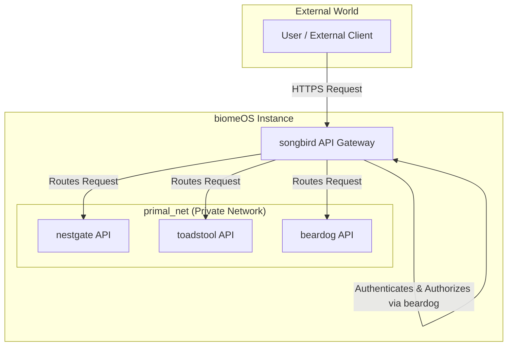

# `biomeOS` - Universal Connector Specification v1

**Status:** Draft | **Author:** The Architect & The Artisan AI | **Date:** July 2025

**Related Documents:** [ARCHITECTURE_OVERVIEW.md](./ARCHITECTURE_OVERVIEW.md)

---

## 1. Preamble: The Songbird Pattern

A `biomeOS` is a distributed system where sovereign Primals must communicate reliably and securely. To prevent architectural drift and ensure seamless integration, a standardized communication pattern is required.

Analysis of the `songbird` Primal and its accompanying documentation reveals a core design philosophy: **`songbird` itself is the "universal connector."** It is designed to be the single entry and exit point for the biome, handling all inbound requests and outbound communications.

This document codifies this "Songbird Pattern" as the official standard for inter-Primal and external communication within a `biomeOS`.

## 2. The Pattern Explained

Instead of having each Primal (e.g., `nestgate`, `toadstool`) expose its own public API and manage its own network security, they will:

1.  **Expose a Private, Local API:** Each Primal will run an internal-only API server, accessible only on the private `primal_net` virtual network.
2.  **Register with Songbird:** Upon startup, each Primal will register its internal API and capabilities with the `songbird` instance.
3.  **Delegate All External Communication:** All external traffic is routed through `songbird`. `songbird` acts as a unified **API Gateway** and **Service Mesh**.

## 3. Responsibilities Under This Pattern

### `songbird`'s Responsibilities (The Universal Connector)
- **Unified API Gateway:** Expose a single, public-facing HTTPS endpoint for the entire `biomeOS`.
- **Request Routing:** Receive external requests, inspect them, and route them to the correct internal Primal's API (e.g., a `/storage/...` request goes to `nestgate`).
- **Service Discovery:** Maintain a registry of all running Primals and their internal API locations.
- **Load Balancing:** If multiple instances of a Primal are running, balance traffic between them.
- **Security Enforcement:** Act as the primary security checkpoint. It will integrate directly with `beardog` to authenticate and authorize *every single request* before it is allowed onto the private `primal_net`.
- **Protocol Abstraction:** Handle various inbound protocols (IoT, gaming, etc.) and translate them into standardized internal API calls.

### Other Primals' Responsibilities (`nestgate`, `toadstool`, etc.)
- **No Public API:** They MUST NOT expose any ports or services to the public internet directly.
- **Internal gRPC/HTTP API:** They should expose their functionality via a simple, internal API server that only listens on the `primal_net`.
- **Startup Registration:** They must register themselves with `songbird` upon starting, announcing their services and health status.
- **Focus on Core Logic:** They are freed from the burden of managing TLS, authentication, routing, and other complex networking concerns, allowing them to focus purely on their core tasks (storage, compute, etc.).

## 4. Code Inoculum: The `songbird` Example

The existing `songbird` codebase provides the "starter culture" for this pattern. The key modules to be standardized and replicated are:

-   **`src/proxy.rs` & `src/http_server.rs`**: These modules contain the core logic for the API Gateway.
-   **`src/discovery.rs` & `src/registry/`**: These modules provide the service discovery mechanism.
-   **`src/security/`**: This module, which is deeply integrated with `beardog`, provides the authentication and authorization logic that must be applied at the gateway level.
-   **`src/basic_iot/` & `src/network/gaming`**: These serve as examples of the protocol abstraction layer, translating specialized external protocols into standard internal requests.

## 5. Adoption Strategy for Other Primals

For the next sprint, the following actions should be taken:

1.  **`nestgate` & `toadstool`:** Review their existing API modules. Ensure they are designed to be internal-only. Create a "registration" client within them that, on startup, sends a message to a well-known `songbird` endpoint to join the service mesh.
2.  **`beardog`:** Its API can remain internal, as `songbird` will be its primary client for policy decisions.
3.  **Standardization:** The registration process and the inter-Primal API call format (likely gRPC or a standardized REST-like convention) should be formalized, with the code from `songbird` serving as the reference implementation.

By adopting this pattern, the `biomeOS` becomes far more secure, manageable, and robust. It creates a single, hardened entry point and allows each Primal to excel at its specific role, creating a system that is greater than the sum of its parts. 