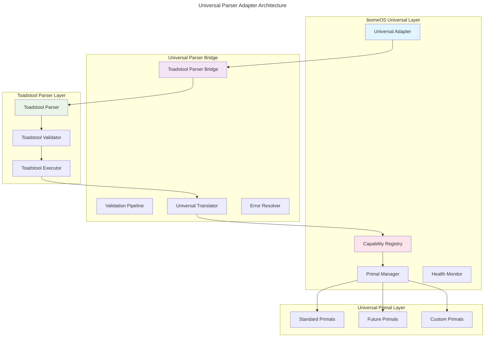

# biomeOS Universal Parser Adapter Specification

**Version:** 1.0.0 | **Status:** Implementation Ready | **Date:** January 2025

**Related Documents:** 
- [MANIFEST_SPEC_V1.md](./MANIFEST_SPEC_V1.md)
- [ARCHITECTURE_OVERVIEW.md](./ARCHITECTURE_OVERVIEW.md)
- [TOADSTOOL_BIOMEOS_UNIFICATION_SPEC.md](./TOADSTOOL_BIOMEOS_UNIFICATION_SPEC.md)

---

## Overview

This specification defines the **Universal Parser Adapter** that enables biomeOS to employ toadstool's proven parsing capabilities while maintaining universal and agnostic patterns for current and future Primals. The adapter is inspired by songbird's universal adapter architecture and serves as the bridge between biomeOS's universal orchestration layer and toadstool's mature manifest parsing system.

## Core Architecture

### Universal Parser Adapter Pattern



## Universal Adapter Implementation

### Core Adapter Structure

```rust
// Universal Parser Adapter (inspired by songbird's universal patterns)
pub struct BiomeOSUniversalAdapter {
    // Toadstool integration
    toadstool_parser: ToadstoolManifestParser,
    toadstool_validator: ToadstoolValidator,
    
    // Universal registries
    primal_registry: Arc<UniversalPrimalRegistry>,
    capability_registry: Arc<CapabilityRegistry>,
    
    // Matching and routing
    capability_matcher: CapabilityMatcher,
    primal_router: PrimalRouter,
    
    // Monitoring and health
    health_monitor: UniversalHealthMonitor,
    metrics_collector: UniversalMetricsCollector,
    
    // Configuration and state
    config: UniversalAdapterConfig,
    state: Arc<RwLock<AdapterState>>,
}

impl BiomeOSUniversalAdapter {
    pub fn new(config: UniversalAdapterConfig) -> Result<Self> {
        Ok(Self {
            toadstool_parser: ToadstoolManifestParser::new()?,
            toadstool_validator: ToadstoolValidator::new()?,
            primal_registry: Arc::new(UniversalPrimalRegistry::new()),
            capability_registry: Arc::new(CapabilityRegistry::new()),
            capability_matcher: CapabilityMatcher::new(),
            primal_router: PrimalRouter::new(),
            health_monitor: UniversalHealthMonitor::new(),
            metrics_collector: UniversalMetricsCollector::new(),
            config,
            state: Arc::new(RwLock::new(AdapterState::new())),
        })
    }
    
    /// Primary entry point for processing biome.yaml manifests
    pub async fn process_biome_manifest(
        &self,
        manifest_path: &str
    ) -> Result<BiomeDeployment> {
        let span = tracing::info_span!("process_biome_manifest", manifest = manifest_path);
        let _enter = span.enter();
        
        // Phase 1: Parse with toadstool (proven parser)
        let parsed_manifest = self.parse_with_toadstool(manifest_path).await?;
        
        // Phase 2: Apply universal transformations
        let universal_manifest = self.universalize_manifest(parsed_manifest).await?;
        
        // Phase 3: Validate with both toadstool and universal validators
        self.validate_universal_manifest(&universal_manifest).await?;
        
        // Phase 4: Match capabilities to available Primals
        let resolved_primals = self.resolve_capabilities(&universal_manifest).await?;
        
        // Phase 5: Route to appropriate Primals
        let deployment = self.deploy_to_primals(resolved_primals).await?;
        
        // Phase 6: Monitor and maintain
        self.start_monitoring(&deployment).await?;
        
        Ok(deployment)
    }
}
```

### Toadstool Parser Integration

```rust
impl BiomeOSUniversalAdapter {
    /// Delegate parsing to toadstool's proven parser
    async fn parse_with_toadstool(
        &self,
        manifest_path: &str
    ) -> Result<ToadstoolBiomeManifest> {
        tracing::info!("Parsing biome.yaml with toadstool parser");
        
        // Use toadstool's mature parsing capabilities
        let manifest = self.toadstool_parser.parse_file(manifest_path).await
            .map_err(|e| BiomeOSError::ToadstoolParseError(e))?;
        
        // Validate using toadstool's validation system
        self.toadstool_validator.validate(&manifest).await
            .map_err(|e| BiomeOSError::ToadstoolValidationError(e))?;
        
        tracing::info!("Successfully parsed manifest with toadstool");
        Ok(manifest)
    }
    
    /// Transform toadstool manifest into universal format
    async fn universalize_manifest(
        &self,
        toadstool_manifest: ToadstoolBiomeManifest
    ) -> Result<UniversalBiomeManifest> {
        tracing::info!("Applying universal transformations");
        
        let universal_manifest = UniversalBiomeManifest {
            api_version: toadstool_manifest.api_version,
            kind: toadstool_manifest.kind,
            metadata: self.transform_metadata(toadstool_manifest.metadata)?,
            
            // Transform primals to universal capability-based format
            primals: self.transform_primals(toadstool_manifest.primals).await?,
            
            // Pass through toadstool-managed resources
            sources: toadstool_manifest.sources,
            volumes: toadstool_manifest.volumes,
            networks: toadstool_manifest.networks,
            services: toadstool_manifest.services,
            
            // biomeOS-specific extensions
            mycorrhiza: toadstool_manifest.mycorrhiza,
            
            // Universal extensions
            capability_requirements: self.extract_capability_requirements(&toadstool_manifest)?,
            primal_preferences: self.extract_primal_preferences(&toadstool_manifest)?,
        };
        
        tracing::info!("Successfully applied universal transformations");
        Ok(universal_manifest)
    }
}
```

### Capability-Based Primal Resolution

```rust
impl BiomeOSUniversalAdapter {
    /// Resolve capabilities to available Primals
    async fn resolve_capabilities(
        &self,
        manifest: &UniversalBiomeManifest
    ) -> Result<Vec<ResolvedPrimal>> {
        tracing::info!("Resolving capabilities to available Primals");
        
        let mut resolved_primals = Vec::new();
        
        for (primal_name, primal_spec) in &manifest.primals {
            let resolved = self.resolve_single_primal(primal_name, primal_spec).await?;
            resolved_primals.push(resolved);
        }
        
        // Sort by priority for deployment order
        resolved_primals.sort_by_key(|p| p.priority);
        
        tracing::info!("Successfully resolved {} primals", resolved_primals.len());
        Ok(resolved_primals)
    }
    
    /// Resolve a single primal specification
    async fn resolve_single_primal(
        &self,
        primal_name: &str,
        primal_spec: &UniversalPrimalSpec
    ) -> Result<ResolvedPrimal> {
        tracing::debug!("Resolving primal: {}", primal_name);
        
        // Find Primal that can handle the required capability
        let provider = self.capability_registry
            .resolve_capability(
                &primal_spec.capability_required,
                &primal_spec.provider_preference
            )
            .await?;
        
        // Validate version compatibility
        if !self.check_version_compatibility(&provider, &primal_spec.version)? {
            return Err(BiomeOSError::VersionIncompatible {
                primal: provider.id.clone(),
                required: primal_spec.version.clone(),
                available: provider.version.clone(),
            });
        }
        
        // Check dependencies
        self.validate_dependencies(&primal_spec.depends_on).await?;
        
        Ok(ResolvedPrimal {
            name: primal_name.to_string(),
            provider,
            spec: primal_spec.clone(),
            resolved_at: chrono::Utc::now(),
        })
    }
}
```

### Universal Primal Registry

```rust
/// Universal registry for all Primal types
pub struct UniversalPrimalRegistry {
    /// Registered Primals by ID
    primals: HashMap<String, Arc<dyn UniversalPrimal>>,
    
    /// Capability index for fast lookup
    capability_index: HashMap<String, Vec<String>>,
    
    /// Health status of registered Primals
    health_status: HashMap<String, HealthStatus>,
    
    /// Metrics for each Primal
    metrics: HashMap<String, PrimalMetrics>,
}

impl UniversalPrimalRegistry {
    pub fn new() -> Self {
        Self {
            primals: HashMap::new(),
            capability_index: HashMap::new(),
            health_status: HashMap::new(),
            metrics: HashMap::new(),
        }
    }
    
    /// Register a new Primal (can be any type)
    pub async fn register_primal(
        &mut self,
        primal: Arc<dyn UniversalPrimal>
    ) -> Result<()> {
        let primal_id = primal.primal_id().to_string();
        let capabilities = primal.capabilities();
        
        tracing::info!("Registering primal: {} with capabilities: {:?}", 
                      primal_id, capabilities);
        
        // Register the primal
        self.primals.insert(primal_id.clone(), primal);
        
        // Index capabilities for fast lookup
        for capability in capabilities {
            self.capability_index
                .entry(capability)
                .or_insert_with(Vec::new)
                .push(primal_id.clone());
        }
        
        // Initialize health status
        self.health_status.insert(primal_id.clone(), HealthStatus::Unknown);
        
        // Initialize metrics
        self.metrics.insert(primal_id.clone(), PrimalMetrics::new());
        
        tracing::info!("Successfully registered primal: {}", primal_id);
        Ok(())
    }
    
    /// Find Primals that can handle a specific capability
    pub async fn find_primals_for_capability(
        &self,
        capability: &str
    ) -> Vec<Arc<dyn UniversalPrimal>> {
        let mut result = Vec::new();
        
        if let Some(primal_ids) = self.capability_index.get(capability) {
            for primal_id in primal_ids {
                if let Some(primal) = self.primals.get(primal_id) {
                    result.push(primal.clone());
                }
            }
        }
        
        result
    }
    
    /// Get health status of all registered Primals
    pub async fn get_health_status(&self) -> HashMap<String, HealthStatus> {
        let mut status = HashMap::new();
        
        for (primal_id, primal) in &self.primals {
            let health = primal.health_check().await;
            status.insert(primal_id.clone(), health);
        }
        
        status
    }
}
```

### Universal Primal Interface

```rust
/// Universal interface that any Primal can implement
#[async_trait]
pub trait UniversalPrimal: Send + Sync {
    /// Unique identifier for this Primal
    fn primal_id(&self) -> &str;
    
    /// Type of this Primal
    fn primal_type(&self) -> PrimalType;
    
    /// Capabilities this Primal provides
    fn capabilities(&self) -> Vec<String>;
    
    /// Version of this Primal
    fn version(&self) -> &str;
    
    /// Initialize the Primal with configuration
    async fn initialize(&mut self, config: serde_json::Value) -> Result<()>;
    
    /// Health check for this Primal
    async fn health_check(&self) -> HealthStatus;
    
    /// Shutdown the Primal gracefully
    async fn shutdown(&mut self) -> Result<()>;
    
    /// Handle a universal request
    async fn handle_request(&self, request: UniversalRequest) -> Result<UniversalResponse>;
    
    /// Check if this Primal can handle a specific capability
    async fn can_handle_capability(&self, capability: &str) -> bool;
    
    /// Get metadata for a specific capability
    async fn get_capability_metadata(&self, capability: &str) -> Option<CapabilityMetadata>;
    
    /// Get dynamic configuration for this Primal
    fn get_dynamic_config(&self) -> Option<serde_json::Value>;
}
```

### Standard Primal Adapters

```rust
/// Songbird Universal Adapter (example)
pub struct SongbirdUniversalAdapter {
    songbird_client: SongbirdClient,
    capabilities: Vec<String>,
    config: SongbirdConfig,
    health_status: Arc<RwLock<HealthStatus>>,
}

impl SongbirdUniversalAdapter {
    pub fn new(config: SongbirdConfig) -> Result<Self> {
        Ok(Self {
            songbird_client: SongbirdClient::new(config.clone())?,
            capabilities: vec![
                "service_discovery".to_string(),
                "load_balancing".to_string(),
                "api_gateway".to_string(),
                "protocol_translation".to_string(),
                "federation".to_string(),
            ],
            config,
            health_status: Arc::new(RwLock::new(HealthStatus::Unknown)),
        })
    }
}

#[async_trait]
impl UniversalPrimal for SongbirdUniversalAdapter {
    fn primal_id(&self) -> &str { "songbird" }
    
    fn primal_type(&self) -> PrimalType { 
        PrimalType::ServiceMesh 
    }
    
    fn capabilities(&self) -> Vec<String> { 
        self.capabilities.clone() 
    }
    
    fn version(&self) -> &str { 
        &self.config.version 
    }
    
    async fn initialize(&mut self, config: serde_json::Value) -> Result<()> {
        tracing::info!("Initializing songbird with config");
        
        // Initialize songbird with provided config
        self.songbird_client.initialize(config).await?;
        
        // Update health status
        *self.health_status.write().await = HealthStatus::Healthy;
        
        tracing::info!("Successfully initialized songbird");
        Ok(())
    }
    
    async fn health_check(&self) -> HealthStatus {
        // Perform songbird-specific health check
        match self.songbird_client.health_check().await {
            Ok(_) => HealthStatus::Healthy,
            Err(_) => HealthStatus::Unhealthy,
        }
    }
    
    async fn handle_request(&self, request: UniversalRequest) -> Result<UniversalResponse> {
        match request.capability.as_str() {
            "service_discovery" => self.handle_service_discovery(request).await,
            "load_balancing" => self.handle_load_balancing(request).await,
            "api_gateway" => self.handle_api_gateway(request).await,
            "protocol_translation" => self.handle_protocol_translation(request).await,
            "federation" => self.handle_federation(request).await,
            _ => Err(BiomeOSError::UnsupportedCapability {
                capability: request.capability,
                primal: self.primal_id().to_string(),
            })
        }
    }
    
    async fn can_handle_capability(&self, capability: &str) -> bool {
        self.capabilities.contains(&capability.to_string())
    }
    
    async fn get_capability_metadata(&self, capability: &str) -> Option<CapabilityMetadata> {
        match capability {
            "service_discovery" => Some(CapabilityMetadata {
                name: "service_discovery".to_string(),
                version: "1.0.0".to_string(),
                description: "Songbird service discovery capabilities".to_string(),
                parameters: vec![
                    CapabilityParameter {
                        name: "backend".to_string(),
                        param_type: "string".to_string(),
                        required: false,
                        default_value: Some("consul".to_string()),
                    }
                ],
            }),
            _ => None,
        }
    }
    
    fn get_dynamic_config(&self) -> Option<serde_json::Value> {
        Some(serde_json::json!({
            "endpoints": self.songbird_client.get_endpoints(),
            "status": self.songbird_client.get_status(),
            "metrics": self.songbird_client.get_metrics(),
        }))
    }
}
```

### Error Handling and Recovery

```rust
/// Universal error types for the adapter
#[derive(thiserror::Error, Debug)]
pub enum BiomeOSError {
    #[error("Toadstool parse error: {0}")]
    ToadstoolParseError(#[from] ToadstoolError),
    
    #[error("Toadstool validation error: {0}")]
    ToadstoolValidationError(#[from] ToadstoolValidationError),
    
    #[error("Capability '{capability}' not found")]
    CapabilityNotFound { capability: String },
    
    #[error("Version incompatible: primal '{primal}' requires '{required}', available '{available}'")]
    VersionIncompatible {
        primal: String,
        required: String,
        available: String,
    },
    
    #[error("Primal '{primal}' does not support capability '{capability}'")]
    UnsupportedCapability {
        primal: String,
        capability: String,
    },
    
    #[error("Dependency validation failed: {dependency}")]
    DependencyValidationFailed { dependency: String },
    
    #[error("Primal deployment failed: {primal} - {reason}")]
    PrimalDeploymentFailed {
        primal: String,
        reason: String,
    },
}
```

## Integration with Existing Primals

### Beardog Integration
```rust
pub struct BeardogUniversalAdapter {
    beardog_client: BeardogClient,
    capabilities: Vec<String>,
}

impl BeardogUniversalAdapter {
    pub fn new() -> Result<Self> {
        Ok(Self {
            beardog_client: BeardogClient::new()?,
            capabilities: vec![
                "encryption".to_string(),
                "authentication".to_string(),
                "authorization".to_string(),
                "compliance".to_string(),
                "hsm".to_string(),
            ],
        })
    }
}

#[async_trait]
impl UniversalPrimal for BeardogUniversalAdapter {
    fn primal_id(&self) -> &str { "beardog" }
    fn primal_type(&self) -> PrimalType { PrimalType::Security }
    fn capabilities(&self) -> Vec<String> { self.capabilities.clone() }
    fn version(&self) -> &str { "0.2.0" }
    
    async fn handle_request(&self, request: UniversalRequest) -> Result<UniversalResponse> {
        match request.capability.as_str() {
            "encryption" => self.handle_encryption(request).await,
            "authentication" => self.handle_authentication(request).await,
            "authorization" => self.handle_authorization(request).await,
            "compliance" => self.handle_compliance(request).await,
            "hsm" => self.handle_hsm(request).await,
            _ => Err(BiomeOSError::UnsupportedCapability {
                capability: request.capability,
                primal: self.primal_id().to_string(),
            })
        }
    }
    
    // ... implementation details
}
```

### Toadstool Integration (Dual Role)
```rust
pub struct ToadstoolUniversalAdapter {
    toadstool_client: ToadstoolClient,
    capabilities: Vec<String>,
}

impl ToadstoolUniversalAdapter {
    pub fn new() -> Result<Self> {
        Ok(Self {
            toadstool_client: ToadstoolClient::new()?,
            capabilities: vec![
                "container_orchestration".to_string(),
                "wasm_runtime".to_string(),
                "process_isolation".to_string(),
                "resource_management".to_string(),
            ],
        })
    }
}

#[async_trait]
impl UniversalPrimal for ToadstoolUniversalAdapter {
    fn primal_id(&self) -> &str { "toadstool" }
    fn primal_type(&self) -> PrimalType { PrimalType::Runtime }
    fn capabilities(&self) -> Vec<String> { self.capabilities.clone() }
    fn version(&self) -> &str { "0.4.0" }
    
    async fn handle_request(&self, request: UniversalRequest) -> Result<UniversalResponse> {
        match request.capability.as_str() {
            "container_orchestration" => self.handle_container_orchestration(request).await,
            "wasm_runtime" => self.handle_wasm_runtime(request).await,
            "process_isolation" => self.handle_process_isolation(request).await,
            "resource_management" => self.handle_resource_management(request).await,
            _ => Err(BiomeOSError::UnsupportedCapability {
                capability: request.capability,
                primal: self.primal_id().to_string(),
            })
        }
    }
    
    // ... implementation details
}
```

## Configuration and Deployment

### Universal Adapter Configuration
```rust
#[derive(Debug, Clone, Serialize, Deserialize)]
pub struct UniversalAdapterConfig {
    /// Toadstool parser configuration
    pub toadstool_config: ToadstoolConfig,
    
    /// Primal discovery configuration
    pub primal_discovery: PrimalDiscoveryConfig,
    
    /// Capability matching configuration
    pub capability_matching: CapabilityMatchingConfig,
    
    /// Health monitoring configuration
    pub health_monitoring: HealthMonitoringConfig,
    
    /// Metrics collection configuration
    pub metrics_collection: MetricsCollectionConfig,
    
    /// Universal adapter settings
    pub adapter_settings: AdapterSettings,
}

#[derive(Debug, Clone, Serialize, Deserialize)]
pub struct AdapterSettings {
    /// Maximum number of concurrent primal operations
    pub max_concurrent_operations: usize,
    
    /// Default timeout for primal operations
    pub default_operation_timeout: Duration,
    
    /// Retry configuration
    pub retry_config: RetryConfig,
    
    /// Caching configuration
    pub caching_config: CachingConfig,
}
```

### Deployment Process
```rust
impl BiomeOSUniversalAdapter {
    /// Deploy all resolved Primals
    async fn deploy_to_primals(
        &self,
        resolved_primals: Vec<ResolvedPrimal>
    ) -> Result<BiomeDeployment> {
        tracing::info!("Deploying {} primals", resolved_primals.len());
        
        let mut deployment = BiomeDeployment::new();
        
        // Deploy in priority order
        for resolved_primal in resolved_primals {
            tracing::info!("Deploying primal: {}", resolved_primal.name);
            
            // Wait for dependencies
            self.wait_for_dependencies(&resolved_primal.spec.depends_on, &deployment).await?;
            
            // Deploy the primal
            let deployed_primal = self.deploy_single_primal(resolved_primal).await?;
            deployment.add_primal(deployed_primal);
            
            tracing::info!("Successfully deployed primal: {}", deployed_primal.name);
        }
        
        tracing::info!("Successfully deployed all primals");
        Ok(deployment)
    }
    
    /// Deploy a single primal
    async fn deploy_single_primal(
        &self,
        resolved_primal: ResolvedPrimal
    ) -> Result<DeployedPrimal> {
        let primal = self.primal_registry
            .get_primal(&resolved_primal.provider.id)
            .await?;
        
        // Initialize the primal
        primal.initialize(resolved_primal.spec.config.clone()).await?;
        
        // Wait for startup
        self.wait_for_startup(&primal, resolved_primal.spec.startup_timeout).await?;
        
        // Verify health
        let health = primal.health_check().await;
        if !matches!(health, HealthStatus::Healthy) {
            return Err(BiomeOSError::PrimalDeploymentFailed {
                primal: resolved_primal.name,
                reason: format!("Health check failed: {:?}", health),
            });
        }
        
        Ok(DeployedPrimal {
            name: resolved_primal.name,
            provider: resolved_primal.provider,
            primal: primal,
            deployed_at: chrono::Utc::now(),
            health_status: health,
        })
    }
}
```

## Benefits and Advantages

### Leveraging Toadstool's Proven Parser
- **Mature Technology**: Uses toadstool's battle-tested parsing engine
- **Comprehensive Validation**: Benefits from toadstool's robust validation system
- **Performance Optimized**: Leverages optimized parsing performance
- **Feature Complete**: Access to full feature set of mature implementation

### Universal Primal Support
- **Current Ecosystem**: Seamless integration with all existing Primals
- **Future Compatibility**: Automatic support for new Primals through universal interface
- **Third-Party Integration**: Easy integration of custom and third-party Primals
- **Capability Focus**: Route based on capabilities, not specific implementations

### Songbird-Inspired Architecture
- **Proven Patterns**: Uses successful patterns from songbird's universal adapter
- **Consistent API**: Single interface for all Primal interactions
- **Easy Extension**: Simple addition of new capabilities and Primals
- **Clear Separation**: Clean separation between parsing, orchestration, and execution

### Operational Benefits
- **Simplified Management**: Single point of control for all Primals
- **Health Monitoring**: Universal health monitoring across all Primals
- **Performance Metrics**: Consistent metrics collection and reporting
- **Error Recovery**: Centralized error handling and recovery mechanisms

This Universal Parser Adapter specification enables biomeOS to leverage toadstool's proven parsing capabilities while maintaining universal and agnostic patterns that work with any current or future Primal implementation. 